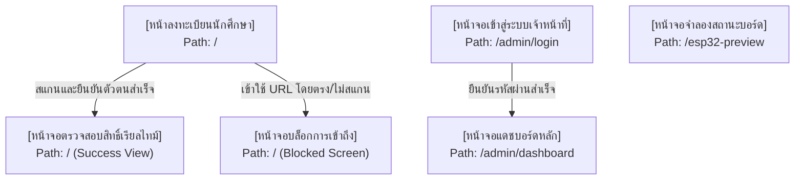
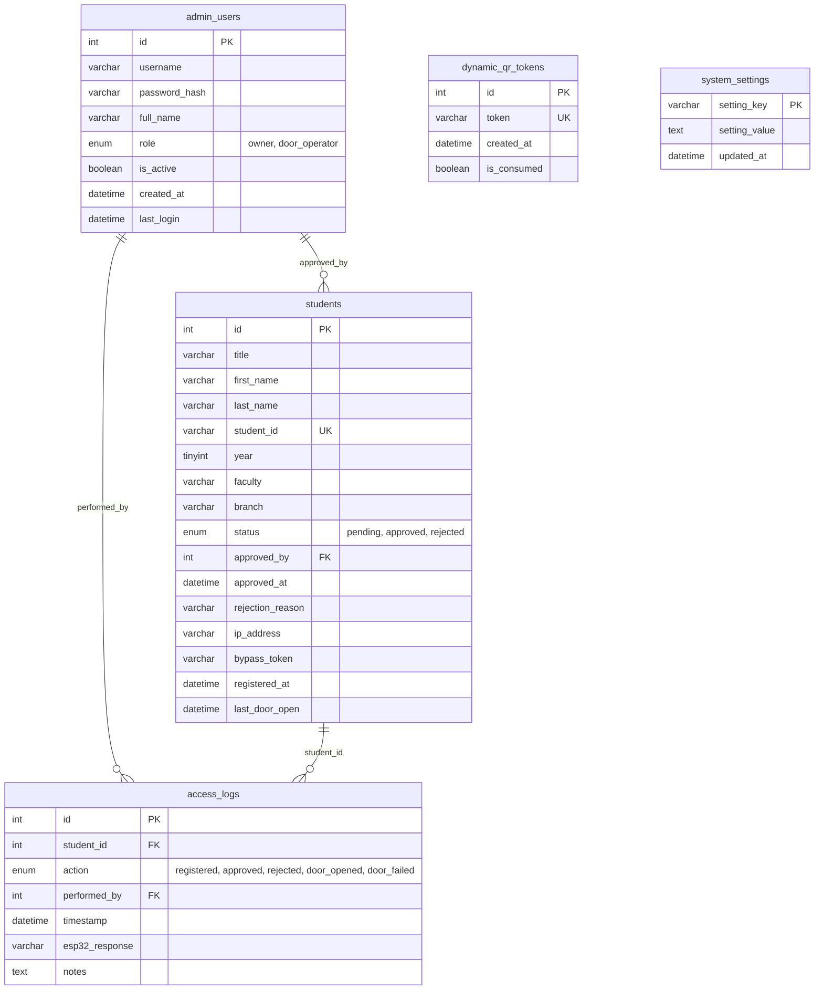
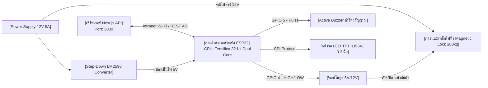

# รายงานวิจัยบทที่ 3 — วิธีดำเนินงานและออกแบบระบบควบคุมประตูอัจฉริยะ (RMUTP Door Access)

เอกสารวิชาการฉบับนี้จัดขึ้นตามโครงสร้างมาตรฐานวิทยานิพนธ์/โครงการวิจัย (Chapter 3: Research Methodology & System Design) สำหรับนำไปใช้ประกอบการรายงานผลการพัฒนาระบบควบคุมการเข้าใช้ห้องปฏิบัติการ คณะครุศาสตร์ มหาวิทยาลัยเทคโนโลยีราชมงคลพระนคร

---

## 📌 Ep.1: การออกแบบโครงสร้างหน้าจอของระบบ (System Interface Structure)

### 1. โครงสร้างหน้าจอของระบบ (System Interface Structure)
ระบบเว็บแอปพลิเคชันได้รับการจัดแบ่งหน้าจอตามสิทธิ์และประเภทการเข้าใช้งานของผู้ใช้ โดยมีการเชื่อมโยงหน้าจอหลักดังแผนภาพด้านล่าง:



* **รายละเอียดโครงสร้างหน้าจอแต่ละส่วน**:
  1. **หน้าลงทะเบียนขอกุญแจเข้าห้อง (`/`)**: หน้ารับข้อมูลและตรวจสิทธิ์สแกน QR Code สำหรับนักศึกษา
  2. **หน้าจอแดชบอร์ดควบคุมส่วนกลาง (`/admin/dashboard`)**: แผงควบคุมระบบ (Multi-tab) สำหรับผู้ดูแลระบบ/แอดมิน ประกอบด้วย:
     - **Tab 1: คำขอรออนุมัติ (Pending Requests)**: ตรวจรายชื่อนักศึกษาและกดอนุมัติ/ปฏิเสธพร้อมระบุเหตุผล
     - **Tab 2: รายชื่อ & ประวัติเข้าออก (Registry & Audit Trail)**: ดูรายชื่อนักศึกษาทั้งหมด ตารางข้อมูล PDPA และล้างประวัติการเข้าใช้งานตามกฎหมาย พ.ร.บ. คอมพิวเตอร์
     - **Tab 3: จัดการเจ้าหน้าที่ (Staff Management)**: เพิ่ม/ระงับเจ้าหน้าที่ควบคุมประตู
     - **Tab 4: ตั้งค่าระบบ & Discord Webhook (System Config)**: สวิตช์เปิด-ปิดระบบ Auto-fill, เลือกระบบยื่นส่ง auto/manual, ปรับตารางวันเวลาเปิดบริการอัตโนมัติ และเซ็ตลิงก์ webhook ส่งแจ้งเตือน
  3. **หน้าจำลองสถานะจอ LCD ของฮาร์ดแวร์ (`/esp32-preview`)**: หน้าจอสำหรับแสดงภาพจำลองโมดูลฮาร์ดแวร์และแผงวงจร 3.2 นิ้ว ILI9341

---

### 2. หน้าจอสิทธิ์ขอใช้ห้อง (Room Request & Authorization Interface)
หน้าจอฝั่งนักศึกษาออกแบบมาภายใต้หลักการความมั่นคงปลอดภัยสูง (Secure Gatekeeping) เพื่อไม่ให้สิทธิ์ลงทะเบียนรั่วไหล:

* **ขั้นตอนการยื่นขอสิทธิ์**:
  1. นักศึกษาต้องอยู่ในบริเวณหน้าห้องปฏิบัติการและทำการ **สแกน QR Code จากบอร์ด LCD จริง**
  2. เบราว์เซอร์บนสมาร์ตโฟนจะเปิดลิงก์แบบระบุรหัสไดนามิกครั้งเดียว เช่น `http://192.168.2.49:3000/?scan=TOKEN`
  3. หน้าจอจะทำการส่งรหัสไปตรวจสอบที่เซิร์ฟเวอร์แบบทันที (One-time check) เพื่อป้องกัน replay attacks หรือการแชร์ลิงก์ให้ผู้อื่นสแกน
  4. หากสแกนผ่าน ระบบจะทำเครื่องหมายไว้ในแท็บความจำเครื่อง (`sessionStorage.setItem("rmutp_qr_verified", "1")`) เพื่อให้ล้าง Parameter URL ด้านหลังออกได้โดยหน้าเว็บไม่บล็อก (Refresh-proof)
  5. แต่หากกรอกลิงก์ตรง ๆ โดยไม่มีคีย์ผ่านทางแท็บอื่น ระบบจะปิดกั้นทันทีและแสดงหน้าจอเตือน **"การเข้าถึงถูกจำกัด"**
* **แบบฟอร์มข้อมูลในการลงทะเบียน**:
  - คำนำหน้าชื่อ (ตัวเลือก: นาย, นางสาว, นาง)
  - ชื่อจริง และ นามสกุล
  - รหัสประจำตัวนักศึกษา (รูปแบบบังคับเช็คผ่าน Regex: `XXXXXXXXXXXX-X`)
  - **ตัวช่วยอำนวยความสะดวกกรอกประวัติเดิม (Auto-fill)**: หากเปิดใช้งานในแอดมิน เมื่อกรอก ชื่อ นามสกุล และรหัส ตรงกับประวัติเดิมที่เคยอนุมัติ ระบบจะช่วยเขียน ชั้นปี คณะ และสาขาวิชา ให้ทันที (แบบเด้งเอง หรือมีปุ่มให้คลิกตามตั้งค่าโหมด)
  - ข้อมูลชั้นปี (ปี 1-4)
  - คณะ และสาขาวิชา (ดรอปดาวน์แบบ Cascade ลิงก์ตามคณะอัตโนมัติเพื่อป้องกันข้อมูลคลาดเคลื่อน)

---

## 📊 Ep.2: การออกแบบฐานข้อมูล (Database Design)

ระบบฐานข้อมูลออกแบบโดยใช้โปรแกรมจัดการฐานข้อมูล **MySQL** บนมาตรฐานความเป็นส่วนตัวของข้อมูลผู้ใช้งาน (PDPA) และเก็บบันทึกประวัติเพื่อสอดคล้องกับ พ.ร.บ. คอมพิวเตอร์ 90 วัน ดังแผนภาพความสัมพันธ์เชิงสัมพันธ์ (Entity Relationship Diagram) ด้านล่าง:



---

## 📡 Ep.3: อุปกรณ์ควบคุมการใช้ห้อง (Room Control Hardware/Devices)

การควบคุมทางกายภาพ (Physical Access Control) ออกแบบขึ้นโดยการรวมเซนเซอร์และบอร์ดอิเล็กทรอนิกส์เข้าไว้ด้วยกันอย่างเป็นระบบ โดยมีส่วนประกอบดังนี้:



* **รายละเอียดหน้าที่ของอุปกรณ์หลัก**:
  1. **ESP32 MCU**: ประมวลผลและเชื่อมต่อ Wi-Fi ทำหน้าที่ดึงข้อมูลรูปภาพ QR Code มาแสดงบนจอ และยิง API ส่งสถานะล็อก รวมถึงรอรับสตรีมคำสั่งเปิดประตูจาก Admin
  2. **หน้าจอแสดงผล TFT LCD (ILI9341 3.2" 320x240 px)**: ใช้ต่อเข้าบอร์ดผ่านโปรโตคอล SPI เพื่อแสดงสถานะประตูปัจจุบัน คิวรอคอย และตัว QR Code
  3. **Relay Module (5V/12V)**: ทำหน้าที่เป็นสวิตช์อิเล็กทรอนิกส์ ตัดต่อกระแสไฟ 12V ที่วิ่งเข้ากลอนประตูแม่เหล็กเมื่อได้รับสัญญาณทริก GPIO จากบอร์ด ESP32
  4. **Buzzer สัญญาณเสียง**: ใช้แสดงระดับเสียงสั้นสะท้อนผลการลงทะเบียน (ดังสั้น 2 ครั้งเมื่อผ่านสำเร็จ / ดังยาว 3 ครั้งเมื่อถูกปฏิเสธ)
  5. **กลอนแม่เหล็กไฟฟ้า (Magnetic Lock 280kg / 600lbs)**: ยึดติดกับประตูและวงกบ ทำงานแบบ Fail-Secure/Fail-Safe เพื่อความปลอดภัย

---

## 💻 Ep.4: การพัฒนาระบบ (System Development)

### **ยืนยันสิทธิ์โครงสร้างส่วนของเว็บ (Confirmation):**
> [!IMPORTANT]
> **โครงสร้างระบบเว็บมีทั้งหมด 2 ส่วนหลักจริง** ได้แก่:
> 1. **ส่วนของผู้ใช้งานนักศึกษา (Student User Front-end)**: หน้าจอลงทะเบียนขอสิทธิ์และหน้าจอแสดงผลสิทธิ์แบบเรียลไทม์ ทำงานโดยไม่ต้องใช้อินเทอร์เน็ตภายนอก (ทำงานผ่านเครือข่ายแลนท้องถิ่น Intranet)
> 2. **ส่วนการให้บริการและผู้ดูแลระบบ (Admin Control Dashboard & Back-end)**: หน้าจอสำหรับอาจารย์หรือผู้ดูแลระบบเพื่อตรวจประวัติ อนุมัติการเปิดประตูจากทางไกล จัดการบุคลากรควบคุม และปรับการตั้งค่าระบบผ่านหน้าเว็บอย่างสมบูรณ์

* **ส่วนผู้ใช้งาน (Student Interface)**:
  - พัฒนาด้วย Next.js โหมด Client-side Rendering ผสมผสาน Real-time Polling API
  - ตรวจสอบความถูกต้องของสิทธิ์การสแกนผ่าน endpoint `/api/esp32/qr/verify`
  - ทำการส่งฟอร์มเพื่อบันทึกประวัติลงตาราง `students` และเข้าคิวคำขอรอตรวจ
  - มีระบบรักษาเซสชันระยะเวลา 5 นาที (Bypass Gate) เพื่ออำนวยความสะดวกหากต้องสแกนประตูซ้ำในระยะเวลาจำกัดโดยไม่ต้องกรอกข้อมูลฟอร์มใหม่
* **ส่วนการให้บริการ / ผู้ดูแลระบบ (Admin & Services)**:
  - ใช้สิทธิ์ของ Middleware และคุกกี้ JWT ในการกรองและแบ่งบทบาทหน้างาน (`owner` / `door_operator`)
  - เชื่อมโยงกับบอร์ด ESP32 โดยการส่งสัญญาณทริก HTTP Request ไปยังบอร์ดโดยตรงเมื่อผู้ดูแลระบบกดปุ่มอนุมัติผ่าน API `/api/students/[id]/approve`
  - ฝังระบบแจ้งเตือนแยกสตรีม Discord Webhook แบบจำแนกเหตุการณ์ เพื่อบันทึก log แบบเรียลไทม์บนคอมพิวเตอร์และโทรศัพท์ผู้ดูแลระบบ

---

## 🧪 Ep.5: การทดลองระบบ (System Testing)

การทดลองระบบได้รับการจำแนกออกเป็น **4 ส่วนหลัก** เพื่อครอบคลุมทั้งฮาร์ดแวร์ ซอฟต์แวร์ ความปลอดภัย และสิทธิ์ความเป็นส่วนตัว:

1. **การทดสอบความถูกต้องของซอฟต์แวร์ (Software Unit Testing)**:
   - ทดสอบฟังก์ชันเช็คข้อมูลฟอร์ม, รูปแบบรหัสนักศึกษา (Regex Pattern)
   - ทดสอบการดึงประวัติเก่า และตรวจสอบความปลอดภัยของการบันทึกรหัสผ่านด้วย `bcryptjs`
2. **การทดสอบความเข้ากันได้และการเชื่อมต่อ (Ecosystem Integration Testing)**:
   - ทดสอบความเร็วในการทำสัญญาร้องขอการสแกน QR Code ระหว่างเซิร์ฟเวอร์และตัวบอร์ดจริง
   - ทดสอบระบบแจ้งเตือน Discord Webhook จำแนกช่องสัญญาณ (คำขอรออนุมัติแยกกับประวัติการเปิดประตู)
   - ทดสอบระบบดึงสถานะเรียลไทม์ (Status Polling) ในหน้าลงทะเบียนหลังแอดมินกดสัญญาสั่งจากหลังบ้าน
3. **การทดสอบความปลอดภัยและการป้องกันภัยคุกคาม (Security & Penetration Testing)**:
   - ทดสอบการล็อกและการบล็อกเข้าลงทะเบียนโดยตรง (Direct URL Access Block)
   - ทดสอบระบบหน่วงการเดารหัสผ่าน (IP-based rate limiter) บนหน้า Login แอดมินและหน้า Bypass
   - ทดสอบสิทธิ์ข้ามบทบาท (IDOR Prevention) ของเจ้าหน้าที่ควบคุมชั่วคราว ไม่ให้ดึงคีย์ลับหรือประวัติ Log เชิง PDPA ได้
4. **การทดสอบการส่งคำสั่งบอร์ดและการควบคุมกลอนประตู (Hardware Connectivity Testing)**:
   - ทดสอบการยิง REST API เปิดปิดประตูและการรับส่งข้อมูล JSON บนบอร์ดจำลอง (Wokwi & Virtual LCD)
   - วัดระยะเวลาดีเลย์ของวงจรรีเลย์และการทำงานของบัซเซอร์เตือนภัยจริง

---

## ⚙️ Ep.6: การติดตั้งระบบ (System Installation Checklist)

การนำระบบไปประจำการจริงในพื้นที่ห้องปฏิบัติการแบ่งขั้นตอนการทำงานออกเป็น **3 ส่วนหลัก**:

### 1. การติดตั้งฝั่งเซิร์ฟเวอร์ส่วนกลาง (Server Deployment)
* ดำเนินการติดตั้ง **Node.js (เวอร์ชัน 18 ขึ้นไป)** และโปรแกรมจัดการฐานข้อมูล **MySQL** ลงบนคอมพิวเตอร์แม่ข่ายหลักของห้องปฏิบัติการ
* คัดลอกโฟลเดอร์ของโปรเจกต์ `my-app` ลงไปและสร้างฐานข้อมูลผ่านคำสั่งการเชื่อมต่อนิวเคลียส
* ทำการกำหนดค่าตัวแปรสิ่งแวดล้อม (Environment Variables) ในไฟล์ `.env.local`:
  ```ini
  MYSQL_HOST=localhost
  MYSQL_DATABASE=rmutp_access
  MYSQL_USER=root
  MYSQL_PASSWORD=รหัสผ่านของระบบฐานข้อมูลของคุณ
  JWT_SECRET=คีย์ลับสำหรับถอดรหัสความปลอดภัยของJWT
  DISCORD_WEBHOOK_URL=ลิงก์ webhook หลักสำหรับ logs
  ESP32_IP=192.168.2.49 (Static IP ของบอร์ด)
  ```
* รันคำสั่ง `npm install` และสร้างระบบโปรดักชันบิวด์ด้วย `npm run build` จากนั้นสั่งเปิดบริการแม่ข่ายส่วนแลนท้องถิ่นผ่าน `npm run start`

### 2. การติดตั้งฝั่งฮาร์ดแวร์ควบคุม (Hardware & Wiring Installation)
* นำซอร์สโค้ดในโฟลเดอร์ `esp32/esp32-door-controller.ino` อัปโหลดเบิร์นโปรแกรมลงชิป ESP32 ผ่านบอร์ดพัฒนาระบบ Arduino IDE โดยระบุ Static IP และ SSID/Password Wi-Fi ภายในพื้นที่ห้องเรียนให้เรียบร้อย
* ประกอบบอร์ดเข้ากับกล่องพิมพ์สามมิติ (3D Printed Bezel Case) และทำการเดินขั้วต่อตามตาราง SPI เข้าจอ LCD TFT 3.2 นิ้ว
* ติดตั้งชุดกลอนประตูแม่เหล็กไฟฟ้า (Magnetic Lock) และแผ่นรับแรงที่บานประตู ดึงสายสัญญาณ Relay GPIO 4 และ Buzzer GPIO 5 ซ่อนซุ่มตามแนวฝ้าเพดาน
* เสียบปลั๊ก Power Supply 12V จ่ายไฟเข้าแผงวงจรควบคุมและกลอนแม่เหล็ก ตรวจสอบความสว่างของไฟและเสียงบี๊บพร้อมใช้งาน!

### 3. การเข้าใช้งานแสดงผลหน้าห้องปฏิบัติการ (Virtual Panel Mounting Option)
* หากหน้างานใช้แท็บเล็ตแสดงผลแทนจอ LCD ให้ใช้แท็บเล็ตต่อ Wi-Fi ในวงแลนแล็บเดียวกัน
* เปิดเบราว์เซอร์ไปที่ลิงก์จำลองระบบเรียลไทม์: `http://192.168.2.49:3000/esp32-preview`
* ตั้งค่าเบราว์เซอร์ให้อยู่ในโหมดเต็มจอ (Kiosk Mode / Fullscreen) เพื่อเป็นจุดแสดงสถานะการสแกนและสลับหน้าจอเปิดประตูล่าสุดอย่างสมบูรณ์แบบ
