# คู่มือระบบควบคุมประตู RMUTP Door Access ฉบับละเอียด

วันที่จัดทำ: 26 พฤษภาคม 2026
อัปเดตล่าสุด: 2026-05-27 18:08:57 (+07:00)  
โปรเจกต์อ้างอิง: RMUTP Door Access System  
ขอบเขตคู่มือ: วิธีใช้งานเว็บ, วิธีใช้งานบอร์ด ESP32, วิธีต่อวงจร, วิธีทำชุดจำลองประตู, และคำอธิบายโค้ดรายฟังก์ชัน

> คู่มือนี้อธิบายจากโค้ดจริงในโปรเจกต์ปัจจุบัน โดยระบบเว็บอยู่ใน `my-app/` และเฟิร์มแวร์บอร์ดอยู่ใน `esp32/` กับ `esp32C1/`

---

<a id="%E0%B8%AA%E0%B8%B2%E0%B8%A3%E0%B8%9A%E0%B8%B1%E0%B8%8D"></a>
<a id="toc"></a>
## สารบัญ

- [1. ภาพรวมระบบ](#sec-1)
- [2. โครงสร้างไฟล์สำคัญ](#sec-2)
- [3. การติดตั้งและรันเว็บ](#sec-3)
- [4. วิธีใช้งานเว็บสำหรับนักศึกษา](#sec-4)
- [5. วิธีใช้งานเว็บสำหรับ Admin](#sec-5)
- [6. วิธีใช้งานบอร์ด ESP32](#sec-6)
- [7. วิธีเปิด Wokwi Simulator](#sec-7)
- [8. การต่อวงจรตาม Wokwi](#sec-8)
- [9. การต่อวงจรประตูจริง](#sec-9)
- [10. วิธีทำอุปกรณ์จำลองประตูติดกับบอร์ด](#sec-10)
- [11. ฐานข้อมูลและตารางสำคัญ](#sec-11)
- [12. อธิบายโค้ดฝั่ง ESP32 รายฟังก์ชัน](#sec-12)
- [13. อธิบายโค้ดฝั่งเว็บและ API รายฟังก์ชัน](#sec-13)
- [14. อธิบายหน้าเว็บหลัก](#sec-14)
- [15. อธิบาย API routes](#sec-15)
- [16. Flow สำคัญของการเปิดประตู](#sec-16)
- [17. Troubleshooting](#sec-17)
- [18. Checklist ก่อนสาธิตระบบ](#sec-18)
- [19. สรุปหน้าที่แต่ละชั้นของระบบ](#sec-19)
- [20. นิยามคำศัพท์พื้นฐาน (สำหรับมือใหม่)](#sec-20)
- [21. ภาพรวมสถาปัตยกรรมแบบ Layered (4 ชั้น)](#sec-21)
- [22. หน้าจอผู้ใช้งานนักศึกษา — เจาะลึกแต่ละ State](#sec-22)
- [23. หน้าจอ Admin — เจาะลึกทุก Tab พร้อมเหตุผลที่ออกแบบแบบนี้](#sec-23)
- [24. หน้าจอ TFT บน ESP32 — เจาะลึก State Machine](#sec-24)
- [25. อธิบายโค้ด `esp32.ino` แบบ "บรรทัดต่อบรรทัด" (ส่วนสำคัญ)](#sec-25)
- [26. อธิบายโค้ดเว็บแบบ "Request Lifecycle" — รับ request 1 ครั้งเกิดอะไรขึ้นบ้าง](#sec-26)
- [27. Supabase ทำอะไรในระบบนี้ (เจาะลึก)](#sec-27)
- [28. Vercel ทำอะไรกับ my-app (เจาะลึก)](#sec-28)
- [29. เปรียบเทียบ: ทำไมบางส่วนเร็ว / บางส่วนช้า](#sec-29)
- [30. อัลกอริทึมสำคัญ (Pseudocode)](#sec-30)
- [31. Network & Security Architecture](#sec-31)
- [32. Flowchart รวม "End-to-End" (สมัคร → เข้าห้อง)](#sec-32)
- [33. คำถามที่พบบ่อย (FAQ)](#sec-33)
- [34. สรุปแบบ "1 นาที"](#sec-34)
- [35. Schema DDL เต็มรูปแบบ (สร้างโดย `initDatabase()`)](#sec-35)
- [36. ESP32 — GPIO Timing และข้อจำกัดเชิงฮาร์ดแวร์](#sec-36)
- [37. รายการ Environment Variables ทุกตัว](#sec-37)
- [38. Deployment Runbook (ไป Production)](#sec-38)
- [39. Monitoring & Observability](#sec-39)
- [40. การ Migrate / เพิ่มฟีเจอร์ใหม่ (Future-proofing)](#sec-40)
- [41. Performance Profiling แบบลงรายละเอียด](#sec-41)
- [42. Code Smells ที่ควร refactor (Tech Debt)](#sec-42)
- [43. Glossary (ภาคผนวกศัพท์เทคนิคเพิ่มเติม)](#sec-43)
- [44. ทำไมหน้าจอ TFT บน ESP32 จึงเปลี่ยนสถานะ "ช้า" ไม่เรียลไทม์](#sec-44)

---

<a id="sec-1"></a>
## 1. ภาพรวมระบบ

ระบบนี้เป็นระบบควบคุมการเข้าใช้งานห้องผ่านเว็บและบอร์ด ESP32 โดยมีองค์ประกอบหลัก 4 ส่วน

1. เว็บ Next.js สำหรับนักศึกษาและผู้ดูแลระบบ
2. ฐานข้อมูล PostgreSQL สำหรับเก็บผู้ใช้, คำขอเข้าใช้งาน, log, token QR และค่าตั้งค่าระบบ
3. ESP32 พร้อมจอ ILI9341, relay, LED และ buzzer สำหรับแสดง QR และสั่งปลดล็อกประตู
4. Discord Webhook สำหรับแจ้งเตือนการลงทะเบียน, การอนุมัติ, การเปิดประตู และเหตุการณ์ระบบ

แนวคิดสำคัญของระบบปัจจุบันคือ ESP32 ไม่ได้รอรับคำสั่งแบบ local server เป็นหลัก แต่ใช้การ polling ขึ้นไปถามเว็บทุก 2 วินาทีที่ `/api/esp32/display?room=...` ถ้า server มีคำสั่ง `door_trigger: "open"` บอร์ดจะเปิด relay เพื่อปลดล็อกประตู แล้ว server จะเปลี่ยนคำสั่งในฐานข้อมูลเป็น consumed เพื่อไม่ให้เปิดซ้ำ

### ภาพที่ 1: สถาปัตยกรรมรวม

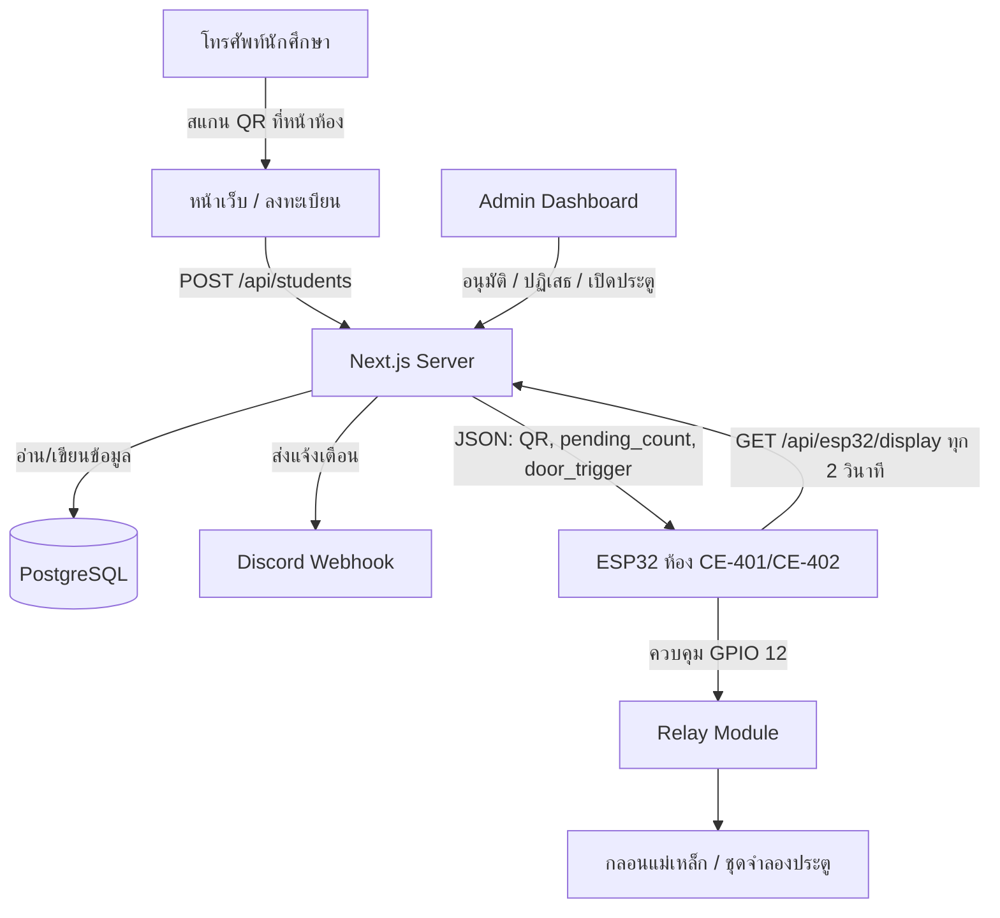

### ภาพที่ 2: ลำดับการใช้งานจริง

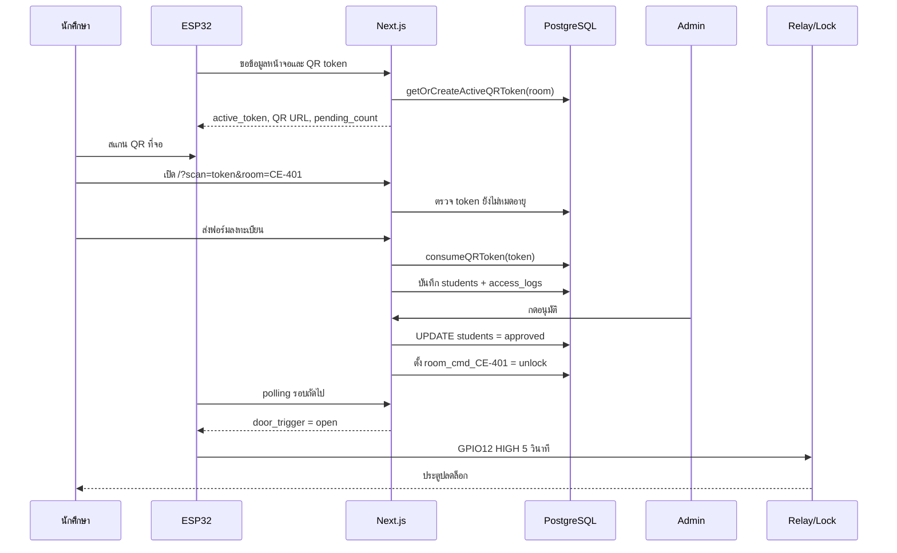

---


<p align="right"><a href="#toc">⬆ กลับสารบัญ</a></p>

<a id="sec-2"></a>
## 2. โครงสร้างไฟล์สำคัญ

```text
Project/
  my-app/
    app/
      page.tsx                         หน้าเว็บลงทะเบียนของนักศึกษา
      admin/login/page.tsx             หน้าเข้าสู่ระบบ Admin
      admin/dashboard/page.tsx         แดชบอร์ดผู้ดูแลระบบ
      esp32-preview/page.tsx           หน้าจำลองจอ ESP32
      api/                             API ทั้งหมดของระบบ
    lib/
      db.ts                            เชื่อม PostgreSQL และสร้างตาราง
      auth.ts                          JWT และ cookie session ของ Admin
      qr.ts                            สร้างและตรวจ token QR
      esp32.ts                         คิวคำสั่งเปิดประตูและสถานะ ESP32
      discord.ts                       ส่ง Discord webhook
      pdf.ts                           สร้าง PDF รายงาน
      rate-limit.ts                    จำกัดจำนวน request ด้วย PostgreSQL
      faculties.ts                     รายชื่อคณะและสาขา
    proxy.ts                           ป้องกันเส้นทาง /admin/dashboard
    next.config.ts                     security headers และ Next config
  esp32/
    esp32.ino                          เฟิร์มแวร์บอร์ดห้อง CE-402
    config.h.template                  template ตั้งค่า Wi-Fi/server/API key
    diagram.json                       วงจร Wokwi
    wokwi.toml                         ตั้งค่า Wokwi simulator
  esp32C1/
    esp32C1.ino                        เฟิร์มแวร์บอร์ดห้อง CE-401
    config.h.template                  template ตั้งค่าห้อง CE-401
```

---


<p align="right"><a href="#toc">⬆ กลับสารบัญ</a></p>

<a id="sec-3"></a>
## 3. การติดตั้งและรันเว็บ

### 3.1 เตรียม Node.js และ package

เข้าไปที่โฟลเดอร์เว็บ

```bash
cd my-app
npm install
```

รัน dev server

```bash
npm run dev
```

เปิดเว็บ

```text
http://localhost:3000
```

หน้า Admin

```text
http://localhost:3000/admin/login
```

หน้าจำลอง ESP32

```text
http://localhost:3000/esp32-preview
```

### 3.2 ตัวแปรสภาพแวดล้อมที่ควรตั้งค่า

สร้างไฟล์ `my-app/.env.local`

```env
POSTGRES_HOST=your-db-host
POSTGRES_PORT=5432
POSTGRES_USER=your-db-user
POSTGRES_PASSWORD=your-db-password
POSTGRES_DATABASE=postgres

JWT_SECRET=change-this-to-a-long-random-secret

NEXT_PUBLIC_APP_URL=http://localhost:3000

ESP32_API_KEY=change-this-to-the-same-key-in-config-h
ESP32_MOCK_MODE=false
ESP32_WOKWI=false
ESP32_IP=192.168.1.100
ESP32_PORT=80

DISCORD_WEBHOOK_URL=

ALLOW_DEV_SEED=true
INITIAL_ADMIN_USERNAME=admin
INITIAL_ADMIN_PASSWORD=admin123456
INITIAL_ADMIN_FULL_NAME=System Administrator
```

หมายเหตุสำคัญ:

- โค้ดปัจจุบันใช้ PostgreSQL ผ่านแพ็กเกจ `pg`
- ใน production ห้ามใช้ `JWT_SECRET` ค่า default
- ใน production ห้ามใช้ `ESP32_API_KEY` ค่า placeholder
- ถ้าใช้ Vercel/Supabase ให้ตั้งตัวแปรทั้งหมดใน Project Settings ของ Vercel
- `ALLOW_DEV_SEED=true` ใช้เฉพาะ development เพื่อสร้าง admin เริ่มต้น

---


<p align="right"><a href="#toc">⬆ กลับสารบัญ</a></p>

<a id="sec-4"></a>
## 4. วิธีใช้งานเว็บสำหรับนักศึกษา

### 4.1 เข้าใช้งานผ่าน QR เท่านั้น

หน้า `/` ถูกออกแบบให้เข้าใช้งานผ่านลิงก์ที่มี token เช่น

```text
/?scan=<token>&room=CE-401
```

ถ้าเปิด `/` ตรง ๆ โดยไม่มี `scan` ระบบจะแสดงหน้าว่าถูกจำกัดการเข้าถึง เพราะต้องสแกน QR ที่จอหน้าห้องก่อน

### 4.2 ขั้นตอนใช้งาน

1. ไปที่หน้าห้องที่มีบอร์ด ESP32
2. เปิดกล้องโทรศัพท์แล้วสแกน QR บนจอ
3. เว็บจะเปิดหน้าลงทะเบียนพร้อม room เช่น `CE-401`
4. กรอกคำนำหน้า, ชื่อ, นามสกุล, รหัสนักศึกษา, ชั้นปี, คณะ, สาขา
5. กดส่งข้อมูลขอเปิดประตู
6. ถ้าอยู่ในช่วง auto-approve ระบบจะอนุมัติและสั่งเปิดประตูทันที
7. ถ้าอยู่นอกช่วง auto-approve คำขอจะเข้า queue ให้ Admin ตรวจสอบ
8. หลังส่งสำเร็จ หน้าเว็บจะ polling สถานะทุก 3 วินาทีเพื่อตรวจว่า approved หรือ rejected แล้วหรือยัง

### 4.3 เงื่อนไข QR token

ระบบมี token 2 ชั้น

1. ตอนเปิดหน้าเว็บ: `/api/esp32/qr/verify` ตรวจว่า token ยัง valid แต่ยังไม่ consume
2. ตอนส่งฟอร์ม: `/api/students` เรียก `consumeQRToken()` เพื่อใช้ token จริงและกันการส่งซ้ำ

ค่าที่ใช้ในโค้ด:

- QR token rotation: 60 วินาที
- QR token expiry: 300 วินาที
- หน้าเว็บมีตัวจับเวลาฝั่ง client 120 วินาทีหลังผ่านการตรวจ token

### 4.4 ระบบ Auto-fill

ถ้านักศึกษาเคยลงทะเบียนมาก่อนและกรอกชื่อ, นามสกุล, รหัสนักศึกษาตรงกับประวัติ ระบบจะเรียก `/api/students/check-match` เพื่อดึงชั้นปี, คณะ, สาขาเดิมมาเติมให้

โหมด Auto-fill มี 2 แบบ:

- `auto`: เติมให้อัตโนมัติ
- `manual`: แสดงปุ่มให้ผู้ใช้กดยืนยันก่อนเติม

### 4.5 ระบบ Offline Queue

ถ้าอินเทอร์เน็ตหลุดระหว่างใช้งาน หน้าเว็บจะเก็บข้อมูลลง `localStorage` key `rmutp_offline_queue` แล้วพยายามส่งใหม่เมื่อ browser กลับมา online

ข้อควรระวัง: เพราะระบบใช้ QR token แบบใช้ครั้งเดียว ถ้า offline นานจน token หมดอายุ การส่งย้อนหลังอาจถูกปฏิเสธ ต้องสแกน QR ใหม่

### 4.6 ระบบ Bypass ภายใน 5 นาที

เมื่อผู้ใช้ได้รับอนุมัติแล้ว หน้าเว็บจะเก็บ session ใน `localStorage` key `rmutp_user_session` พร้อม `bypass_token`

ถ้ากลับมาสแกนซ้ำภายใน 5 นาที ระบบจะเรียก `/api/students/bypass` เพื่อเปิดประตูโดยไม่ต้องกรอกฟอร์มซ้ำ

---


<p align="right"><a href="#toc">⬆ กลับสารบัญ</a></p>

<a id="sec-5"></a>
## 5. วิธีใช้งานเว็บสำหรับ Admin

### 5.1 เข้าสู่ระบบ

เปิด

```text
http://localhost:3000/admin/login
```

กรอก username/password ที่มีในตาราง `admin_users`

เมื่อ login สำเร็จ ระบบจะสร้าง JWT และเก็บใน cookie ชื่อ `rmutp_admin_token`

### 5.2 บทบาทผู้ใช้

| Role | สิทธิ์หลัก |
|---|---|
| `owner` | เห็นข้อมูลทั้งหมด, อนุมัติ, ปฏิเสธ, เปิดประตู, ลบข้อมูล, export PDF, จัดการ admin, ตั้งค่าระบบ |
| `door_operator` | เข้า dashboard และใช้งานส่วนปฏิบัติการบางส่วน เช่นดู pending และสั่งเปิดประตูตามที่ UI เปิดให้ |

### 5.3 แท็บสำคัญใน Dashboard

| แท็บ | ใช้ทำอะไร |
|---|---|
| คิวรอตรวจสอบ | ดูคำขอใหม่, กดอนุมัติหรือปฏิเสธ |
| ทำเนียบและประวัติ | ค้นหานักศึกษา, เปิดประตูรายบุคคล, export PDF, ดู access logs |
| ผู้ดูแลระบบ | เพิ่มหรือลบ admin |
| ห้องเรียนและ ESP32 | เพิ่มห้อง, ตั้ง IP, ทดสอบบอร์ด, ปลดล็อกด่วน |
| ตั้งค่าระบบ | ตั้ง auto-approve, auto-fill, Discord webhook, การแสดงรหัสนักศึกษา |
| คู่มือ | คู่มือย่อใน dashboard |

### 5.4 อนุมัติคำขอ

เมื่อกดอนุมัติ ระบบจะทำงานดังนี้

1. เรียก `POST /api/students/{id}/approve`
2. ตรวจ cookie ว่าเป็น admin และต้องเป็น `owner`
3. อัปเดต `students.status = 'approved'`
4. เรียก `openDoor(student_id, requested_room)`
5. `openDoor()` เขียน `room_cmd_<room> = unlock` ลง `system_settings`
6. บอร์ด ESP32 polling มาเจอคำสั่งและเปิด relay
7. บันทึก `access_logs`
8. ส่ง Discord notification

### 5.5 ปฏิเสธคำขอ

เมื่อกดปฏิเสธ ระบบจะทำงานดังนี้

1. เรียก `POST /api/students/{id}/reject`
2. ตรวจสิทธิ์ `owner`
3. อัปเดตสถานะเป็น `rejected`
4. เก็บ `rejection_reason`
5. บันทึก log และแจ้ง Discord

### 5.6 ปลดล็อกด่วนทั้งห้อง

ในแท็บห้องเรียนและ ESP32 กดปุ่มปลดล็อกห้อง เช่น CE-401

ระบบจะเรียก

```text
POST /api/system/unlock-room
```

body

```json
{ "room": "CE-401" }
```

จากนั้น server จะเขียน `room_cmd_CE-401 = unlock` ลงฐานข้อมูล และบอร์ดห้องนั้นจะเปิด relay เมื่อ polling รอบถัดไป

### 5.7 Export PDF

Owner สามารถ export ได้ 2 แบบ

1. รายงานรวมตามช่วงวันที่และสถานะ
2. รายงานรายบุคคล

API ที่ใช้คือ

```text
GET /api/export/pdf
GET /api/export/pdf?id=<student_id>
```

---


<p align="right"><a href="#toc">⬆ กลับสารบัญ</a></p>

<a id="sec-6"></a>
## 6. วิธีใช้งานบอร์ด ESP32

### 6.1 อุปกรณ์ที่ใช้กับบอร์ด

| อุปกรณ์ | หน้าที่ |
|---|---|
| ESP32 DevKit V1 | ตัวควบคุมหลัก |
| ILI9341 TFT 320x240 | แสดง QR, สถานะห้อง, คิว, ผู้อนุมัติล่าสุด |
| Relay Module 5V | สวิตช์ไฟให้กลอนหรือชุดจำลองประตู |
| Buzzer | ส่งเสียงตอน boot, กำลังตรวจ, อนุมัติ |
| LED Wi-Fi | แสดงสถานะเชื่อมต่อ Wi-Fi |
| LED Reject | เตรียมไว้สำหรับสถานะ reject |
| LED Door หรือ solenoid/maglock | แสดงหรือทำหน้าที่เป็นประตู |

### 6.2 สร้างไฟล์ config.h

คัดลอก template

```bash
copy esp32\config.h.template esp32\config.h
```

แก้ค่าหลัก

```cpp
const char *ssid = "ชื่อ Wi-Fi";
const char *password = "รหัสผ่าน Wi-Fi";
const char *server_url = "https://your-domain.vercel.app/api/esp32/display?room=CE-402";
const char *room_code = "CE-402";
const char *api_key = "ค่าเดียวกับ ESP32_API_KEY บน server";
```

ถ้าใช้ `esp32C1/` ให้ตั้ง room เป็น `CE-401`

### 6.3 ติดตั้ง library ใน Arduino IDE

ต้องมี library ต่อไปนี้

- Adafruit GFX Library
- Adafruit ILI9341
- ArduinoJson เวอร์ชัน 6.x
- WiFi และ HTTPClient มากับ ESP32 Arduino Core
- `ricmoo_qrcode.c/.h` อยู่ในโปรเจกต์แล้ว

### 6.4 Upload firmware

1. เปิด Arduino IDE
2. เลือก board เป็น ESP32 Dev Module หรือ ESP32 DevKit
3. เปิด `esp32/esp32.ino`
4. ตรวจว่า `config.h` อยู่ในโฟลเดอร์เดียวกับ `.ino`
5. กด Verify
6. กด Upload
7. เปิด Serial Monitor ที่ 115200 baud

### 6.5 การทำงานตอนเปิดบอร์ด

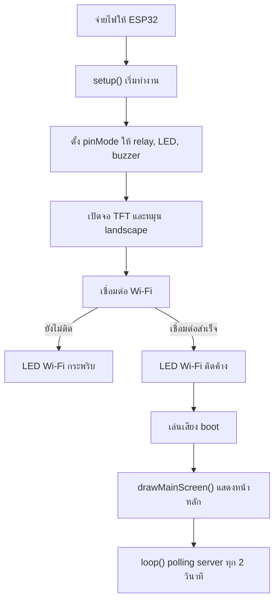

### 6.6 การทำงานใน loop()

ทุก 2 วินาทีบอร์ดจะทำงานนี้

1. ตรวจว่า Wi-Fi ยังเชื่อมอยู่หรือไม่
2. สร้างเวลาปัจจุบันจาก `millis()` หรือใช้ `server_time_text` จาก server
3. เปิด HTTP/HTTPS ไปที่ `server_url`
4. ส่ง header `x-api-key`
5. อ่าน JSON จาก `/api/esp32/display`
6. ดึงค่า `pending_count`, `last_approved`, `active_token`, `register_url`, `door_trigger`
7. สร้าง URL สำหรับ QR เป็น `/?scan=<active_token>&room=<requested_room>`
8. ถ้า `door_trigger == "open"` ให้เปิด relay 5 วินาที
9. ถ้าข้อมูลเปลี่ยน ให้ redraw ทั้งหน้าจอ
10. ถ้าไม่มีข้อมูลเปลี่ยน ให้ redraw เฉพาะนาฬิกาเพื่อลดจอกะพริบ

---


<p align="right"><a href="#toc">⬆ กลับสารบัญ</a></p>

<a id="sec-7"></a>
## 7. วิธีเปิด Wokwi Simulator

ไฟล์ที่เกี่ยวข้อง:

- `esp32/diagram.json`
- `esp32/wokwi.toml`
- `esp32/build_wokwi.bat`

ขั้นตอน

1. ติดตั้ง VS Code
2. ติดตั้ง extension Wokwi Simulator
3. ติดตั้ง Arduino CLI
4. เปิดโฟลเดอร์โปรเจกต์ใน VS Code
5. เปิดไฟล์ `esp32/diagram.json`
6. รัน `esp32/build_wokwi.bat` เพื่อ compile firmware
7. กด `F1`
8. เลือก `Wokwi: Start Simulator`

ถ้าต้องการให้ Next.js เชื่อมกับ Wokwi ให้ตั้งใน `.env.local`

```env
ESP32_WOKWI=true
ESP32_WOKWI_URL=http://localhost:8180
```

หมายเหตุ: `wokwi.toml` มี port forwarding จาก `localhost:8180` ไปที่ simulated ESP32 port 80 แต่ firmware ปัจจุบันใช้ cloud polling เป็นหลัก ไม่ได้เปิด endpoint `/door/open` บน ESP32 ดังนั้นสถานะและคำสั่งเปิดประตูหลักจะยังอ้างอิงฐานข้อมูลผ่าน `/api/esp32/display`

---


<p align="right"><a href="#toc">⬆ กลับสารบัญ</a></p>

<a id="sec-8"></a>
## 8. การต่อวงจรตาม Wokwi

### 8.1 ตารางต่อจอ ILI9341

| ILI9341 | ESP32 | สีสายตาม diagram | หน้าที่ |
|---|---|---|---|
| VCC | 3V3 | แดง | ไฟเลี้ยงจอ |
| GND | GND | ดำ | กราวด์ |
| CS | D15 / GPIO15 | ส้ม | เลือกอุปกรณ์ SPI |
| RST | D4 / GPIO4 | เทา | reset จอ |
| D/C | D2 / GPIO2 | เขียว | data/command |
| MOSI | D23 / GPIO23 | น้ำเงิน | ส่งข้อมูลจาก ESP32 ไปจอ |
| SCK | D18 / GPIO18 | เหลือง | clock SPI |
| MISO | D19 / GPIO19 | ม่วง | อ่านข้อมูลกลับ |
| LED | 3V3 | แดง | backlight |

### 8.2 ตารางต่อ relay

| Relay Module | ESP32 | หน้าที่ |
|---|---|---|
| VCC | VIN | ไฟเลี้ยง relay module 5V |
| GND | GND | กราวด์ร่วม |
| IN | D12 / GPIO12 | สัญญาณควบคุมจากโค้ด `RELAY_PIN` |
| COM | VIN ใน Wokwi | จุด common ของสวิตช์ relay |
| NO | LED door ผ่าน resistor | ปลายสวิตช์ที่ต่อเมื่อตัว relay ทำงาน |

### 8.3 ตารางต่อ LED และ buzzer

| อุปกรณ์ | ขาแรก | ขาที่สอง | หน้าที่ |
|---|---|---|---|
| LED Door สีเขียว | relay NO -> resistor 220 ohm -> anode | cathode -> GND | จำลองกลอน/ประตู |
| LED Wi-Fi สีน้ำเงิน | GPIO14 -> resistor 220 ohm -> anode | cathode -> GND | แสดง Wi-Fi |
| LED Reject สีแดง | GPIO26 -> resistor 220 ohm -> anode | cathode -> GND | แสดง reject |
| Buzzer | GPIO27 | GND | เสียงแจ้งเตือน |

### ภาพที่ 3: วงจรจำลองใน Wokwi

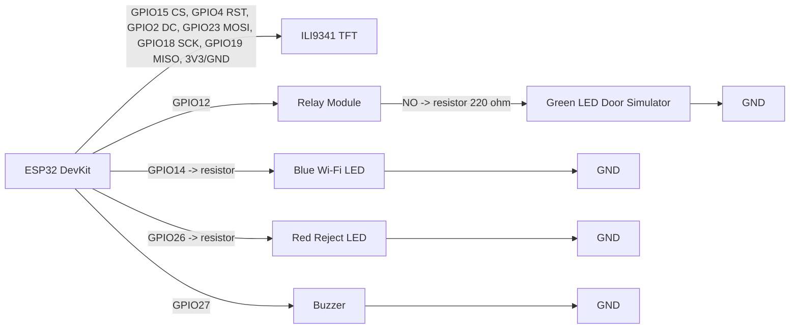

---


<p align="right"><a href="#toc">⬆ กลับสารบัญ</a></p>

<a id="sec-9"></a>
## 9. การต่อวงจรประตูจริง

คำเตือนสำคัญ:

- ห้ามต่อ 12V เข้าขา GPIO ของ ESP32 เด็ดขาด
- ห้ามใช้ ESP32 จ่ายไฟให้กลอนแม่เหล็กโดยตรง
- กลอนแม่เหล็กหรือ solenoid ต้องใช้แหล่งจ่ายไฟแยกตามสเปก เช่น 12V 2A หรือ 12V 5A
- ถ้าใช้ solenoid หรือ magnetic lock ที่เป็นขดลวด ควรใส่ diode กันไฟย้อน เช่น 1N4007 ถ้า module/lock ไม่มีวงจรป้องกันในตัว
- ก่อนต่อ ESP32 ให้ปรับ buck converter ให้ได้ 5V ด้วย multimeter ก่อน

### 9.1 อุปกรณ์สำหรับประตูจริง 1 ชุด

| อุปกรณ์ | จำนวน | หมายเหตุ |
|---|---:|---|
| ESP32 DevKit | 1 | ตัวควบคุม |
| Relay Module 5V | 1 | ควรใช้แบบ optocoupler ถ้ามี |
| Power supply 12V | 1 | เลือกกระแสตาม lock เช่น 2A ถึง 5A |
| Buck converter 12V to 5V | 1 | ลดไฟให้ ESP32/relay |
| Magnetic lock หรือ electric strike/solenoid | 1 | เลือกชนิดตามงาน |
| Diode 1N4007 | 1 | คร่อม coil ถ้าจำเป็น |
| สายไฟและ terminal block | ตามจริง | แยกสายสัญญาณกับสายไฟกำลัง |

### 9.2 แบบ A: Magnetic lock แบบ fail-safe

Magnetic lock ทั่วไปจะล็อกเมื่อมีไฟ 12V และปลดล็อกเมื่อไฟถูกตัด ดังนั้นต้องใช้ขา NC ของ relay

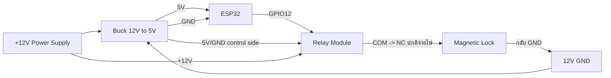

สถานะ:

- ปกติ relay ไม่ทำงาน: COM ต่อกับ NC, magnetic lock ได้ไฟ, ประตูล็อก
- ตอนเปิดประตู `RELAY_PIN = HIGH`: relay สลับจาก NC ไป NO, ไฟ lock ถูกตัด, ประตูปลดล็อก 5 วินาที
- หลัง 5 วินาที `RELAY_PIN = LOW`: lock ได้ไฟกลับมาและล็อกอีกครั้ง

### 9.3 แบบ B: Electric strike หรือ solenoid ที่จ่ายไฟเพื่อปลดล็อก

ถ้าอุปกรณ์ปลดล็อกเมื่อได้รับไฟ 12V ให้ใช้ขา NO

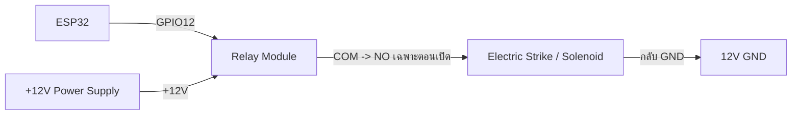

สถานะ:

- ปกติ relay ไม่ทำงาน: NO เปิดวงจร, strike ไม่ได้ไฟ
- ตอนเปิดประตู: relay ทำงาน, NO ปิดวงจร, strike ได้ไฟและปลดล็อก
- หลัง 5 วินาที: relay ปิด, strike ไม่ได้ไฟ

### 9.4 การต่อกราวด์

ฝั่งควบคุม relay ต้องมีกราวด์ร่วมกับ ESP32

```text
ESP32 GND ------------- Relay GND
Buck 5V GND ----------- ESP32 GND
```

ฝั่งโหลด 12V ของ lock สามารถแยกตามรูปแบบ module แต่ในงานทั่วไปมักมีกราวด์ร่วมผ่าน power supply และ buck converter

---


<p align="right"><a href="#toc">⬆ กลับสารบัญ</a></p>

<a id="sec-10"></a>
## 10. วิธีทำอุปกรณ์จำลองประตูติดกับบอร์ด

มี 2 แบบที่แนะนำ

### 10.1 แบบง่าย: ใช้ LED จำลองประตู

เหมาะสำหรับนำเสนอในห้องเรียนหรือทดสอบ logic โดยไม่ใช้ไฟ 12V

อุปกรณ์:

- LED สีเขียว 1 ดวง
- Resistor 220 ohm 1 ตัว
- Relay module 1 ตัว
- Breadboard และสาย jumper

วิธีทำ:

1. ต่อ ESP32 GPIO12 ไปที่ relay IN
2. ต่อ relay VCC ไปที่ VIN ของ ESP32 หรือ 5V จาก buck
3. ต่อ relay GND ไปที่ ESP32 GND
4. ต่อ relay COM ไปที่ 5V
5. ต่อ relay NO ไปที่ resistor 220 ohm
6. ต่อ resistor ไปที่ anode ของ LED
7. ต่อ cathode ของ LED ไป GND
8. เมื่อระบบเปิดประตู LED จะติด 5 วินาที แปลว่าประตูถูกปลดล็อก

### 10.2 แบบสมจริง: ทำประตูจำลองขนาดเล็ก

อุปกรณ์:

| อุปกรณ์ | แนะนำ |
|---|---|
| แผ่นโฟมบอร์ดหรืออะคริลิก | ฐาน 30 x 20 cm |
| แผ่นทำบานประตู | 12 x 18 cm |
| บานพับเล็ก | 1 ถึง 2 ตัว |
| กลอน solenoid 12V หรือ mini magnetic lock | 1 ตัว |
| เหล็กรับกลอนหรือแผ่น strike plate | 1 ชิ้น |
| Relay module | 1 ตัว |
| Power supply 12V | 1 ตัว |
| Buck converter | 1 ตัว |
| กล่องพลาสติกใส่ ESP32/relay | 1 กล่อง |
| สกรู, กาวร้อน, cable tie | ตามจำเป็น |

ขั้นตอนทำโครง:

1. ตัดแผ่นฐานประมาณ 30 x 20 cm
2. ตัดแผ่นแนวตั้งเป็นกรอบประตูสูงประมาณ 20 cm
3. ติดกรอบประตูลงบนฐานด้วยกาวร้อนหรือสกรู
4. ตัดบานประตูขนาดประมาณ 12 x 18 cm
5. ติดบานพับด้านซ้ายของบานประตูเข้ากับกรอบ
6. ทดลองเปิดปิดให้ไม่ฝืดและไม่ติดพื้น
7. ติด solenoid หรือ magnetic lock ที่กรอบด้านขวา
8. ติดแผ่นรับกลอนที่บานประตูให้ตรงตำแหน่ง lock
9. ติดกล่อง ESP32 และ relay ไว้ด้านหลังฐานหรือด้านข้าง
10. เจาะรูเล็กสำหรับเดินสายให้เรียบร้อย
11. ติดป้ายชื่อสาย เช่น 12V, GND, GPIO12, LOCK

ขั้นตอนต่อไฟ:

1. ต่อ power supply 12V เข้า terminal block
2. ต่อ 12V เข้า buck converter
3. ปรับ buck output ให้ได้ 5.0V ก่อนเสียบ ESP32
4. ต่อ 5V จาก buck เข้า VIN ของ ESP32
5. ต่อ GND จาก buck เข้า GND ของ ESP32
6. ต่อ GPIO12 เข้า relay IN
7. ต่อ relay VCC/GND เข้าฝั่ง 5V/GND
8. เลือกต่อ lock ผ่าน NC หรือ NO ตามชนิด lock ตามหัวข้อ 9.2 หรือ 9.3
9. ใส่ diode คร่อมขดลวด solenoid ถ้า lock ไม่มีวงจรป้องกัน
10. เปิดไฟและทดสอบด้วยการกดปลดล็อกใน dashboard

### ภาพที่ 4: โครงประตูจำลอง

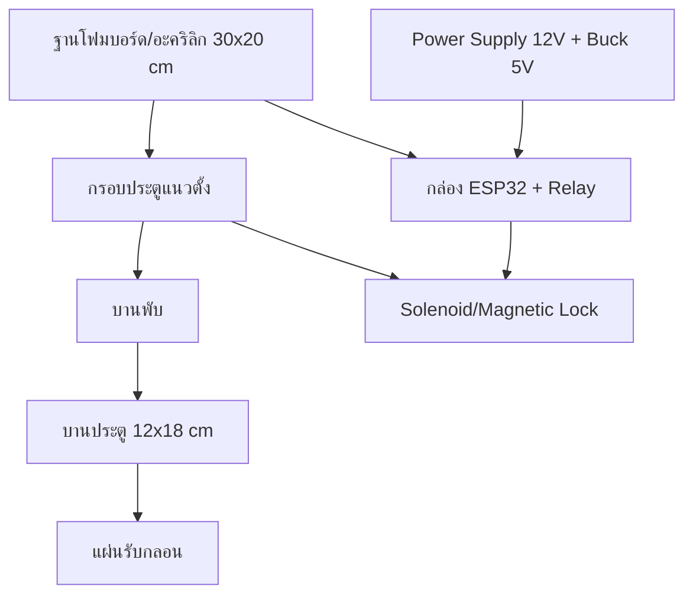

---


<p align="right"><a href="#toc">⬆ กลับสารบัญ</a></p>

<a id="sec-11"></a>
## 11. ฐานข้อมูลและตารางสำคัญ

ระบบสร้างตารางใน `initDatabase()` ของ `my-app/lib/db.ts`

| ตาราง | หน้าที่ |
|---|---|
| `admin_users` | เก็บบัญชี admin, password hash, role, last_login |
| `students` | เก็บผู้ลงทะเบียน, สถานะ, ห้อง, token bypass, เวลาการเปิดประตู |
| `access_logs` | เก็บ audit log ทุกเหตุการณ์ |
| `dynamic_qr_tokens` | เก็บ QR token แยกตามห้องและสถานะ consumed |
| `system_settings` | เก็บ config เช่น auto approve, room IP, webhook, command queue |
| `rate_limits` | เก็บตัวนับ rate limit แบบ serverless-safe |

### ภาพที่ 5: ความสัมพันธ์ข้อมูลหลัก

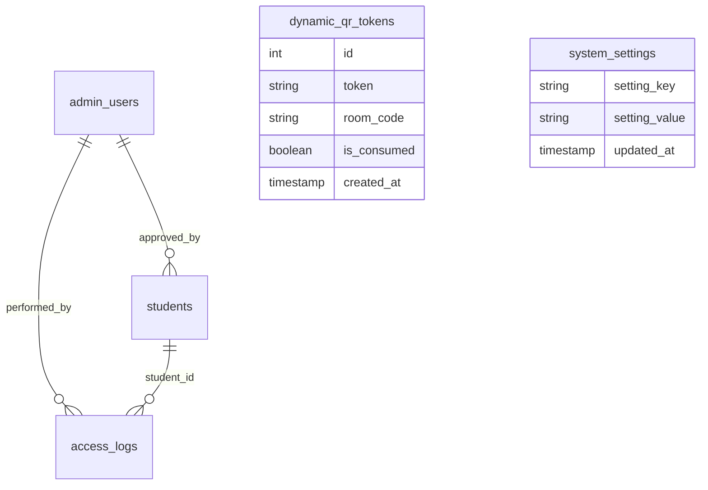

---


<p align="right"><a href="#toc">⬆ กลับสารบัญ</a></p>

<a id="sec-12"></a>
## 12. อธิบายโค้ดฝั่ง ESP32 รายฟังก์ชัน

ไฟล์หลัก:

- `esp32/esp32.ino`: ใช้กับห้อง CE-402 ตาม template
- `esp32C1/esp32C1.ino`: ใช้กับห้อง CE-401

โครงสร้างทั้งสองไฟล์เหมือนกัน ต่างที่ `config.h` และ room target

### 12.1 ตัวแปรและ pin

| ชื่อ | ค่า | หน้าที่ |
|---|---:|---|
| `TFT_CS` | 15 | ขา CS ของจอ ILI9341 |
| `TFT_RST` | 4 | reset จอ |
| `TFT_DC` | 2 | data/command |
| `RELAY_PIN` | 12 | สั่ง relay เปิดประตู |
| `LED_WIFI` | 14 | LED สถานะ Wi-Fi |
| `LED_REJECT` | 26 | LED สถานะปฏิเสธ |
| `BUZZER_PIN` | 27 | buzzer |
| `polling_delay` | 2000 ms | หน่วงเวลา polling server |
| `last_queue_count` | -1 | เก็บคิวล่าสุดเพื่อลด redraw |
| `last_approved_name` | empty | เก็บ student id ล่าสุด |
| `last_active_token` | empty | เก็บ token ล่าสุด |
| `ip_address_str` | `0.0.0.0` | แสดง IP ของบอร์ด |

### 12.2 `drawQRCode(String qrText, int startX, int startY, int boxSize)`

หน้าที่: สร้าง QR code จากข้อความ URL แล้ววาดลงจอ TFT

การทำงานละเอียด:

1. สร้าง object `QRCode qrcode`
2. เลือก QR version 7 ถ้าข้อความไม่ยาวเกิน 154 ตัวอักษร
3. ถ้ายาวเกิน 154 ตัวอักษรใช้ version 9
4. จอง buffer ด้วย `qrcode_getBufferSize(qrVersion)`
5. เรียก `qrcode_initText()` เพื่อแปลงข้อความเป็น matrix QR
6. กำหนด `scale = 2` เพื่อขยายจุด QR ให้มือถือสแกนง่าย
7. คำนวณ `paddingX` และ `paddingY` เพื่อจัด QR ให้อยู่กลางกรอบ
8. วาดพื้นหลังสีขาวด้วย `tft.fillRect()`
9. วน loop ทุกตำแหน่งของ QR matrix
10. ถ้า module เป็นสีดำ ให้ใช้ `tft.fillRect()` วาดจุดสีดำ

### 12.3 `drawMainScreen(int queueCount, String lastApprovedName, String timeStr, String qrText)`

หน้าที่: วาดหน้าจอปกติของบอร์ด

สิ่งที่วาด:

- แถบหัวจอ RMUTP DOOR ACCESS และสถานะ ACTIVE
- เวลา
- กรอบ QR ทางซ้าย
- ข้อความ SCAN FOR ACCESS
- ห้องจากตัวแปร `room_code`
- จำนวนคิวรออนุมัติ
- student id ล่าสุดที่อนุมัติ
- IP ของบอร์ดด้านล่าง

เงื่อนไขสำคัญ:

- ถ้า `qrText.length() > 0` จะเรียก `drawQRCode()`
- ถ้าไม่มี QR จะวาดกล่องขาวและข้อความ Loading QR
- ถ้ามี `lastApprovedName` จะวาดกล่อง LATEST APPROVED
- ถ้าไม่มี จะวาดข้อความ NO RECENT ACCESS

### 12.4 `drawScanningScreen()`

หน้าที่: แสดงหน้าจอกำลังตรวจสอบ

ใช้ตอนบอร์ดได้รับคำสั่งเปิดประตูแล้วแต่ก่อนแสดง approved เพื่อให้ผู้ใช้เห็นว่าระบบกำลังประมวลผล

องค์ประกอบ:

- พื้นหลังสีน้ำเงินเข้ม
- วงกลมจำลองการ scan
- ข้อความ PROCESSING
- ข้อความ VERIFYING REQUEST WITH SERVER

### 12.5 `drawUnlockedScreen(String approvedName, String studentId)`

หน้าที่: แสดงหน้าจออนุมัติและปลดล็อกสำเร็จ

การทำงาน:

1. ล้างจอด้วยพื้นหลังสีเขียวเข้ม
2. วาดวงกลมสีเขียวตรงกลาง
3. แสดงเครื่องหมายถูกด้วยตัวอักษร `v`
4. แสดง ACCESS GRANTED
5. แสดง DOOR UNLOCKED
6. แสดงข้อความ VERIFIED MEMBER
7. แสดง `studentId`

หมายเหตุ: ฟังก์ชันรับ `approvedName` แต่โค้ดเลือกแสดง status ภาษาอังกฤษเพื่อลดปัญหาฟอนต์ไทยบนจอ

### 12.6 `drawRejectedScreen()`

หน้าที่: วาดหน้าจอปฏิเสธการเข้าใช้งาน

โค้ดปัจจุบันมีฟังก์ชันนี้ไว้แสดงกรณี denied แต่ flow หลักใน `loop()` ยังไม่ได้เรียกจาก JSON โดยตรง เพราะ server ส่ง `door_trigger` เป็น open หรือ idle เป็นหลัก

### 12.7 `setup()`

หน้าที่: เตรียมบอร์ดทั้งหมดตอนเปิดเครื่อง

ลำดับละเอียด:

1. เปิด Serial ที่ 115200
2. ตั้ง `RELAY_PIN`, `LED_WIFI`, `LED_REJECT`, `BUZZER_PIN` เป็น output
3. ตั้ง relay เป็น LOW เพื่อให้ประตูอยู่สถานะล็อกตอนเริ่มต้น
4. ปิด LED Wi-Fi และ LED Reject
5. เริ่มจอ TFT ด้วย `tft.begin()`
6. หมุนจอเป็นแนวนอนด้วย `tft.setRotation(1)`
7. วาดหน้าจอ CONNECTING WIFI
8. เรียก `WiFi.begin(ssid, password)`
9. ระหว่างรอ Wi-Fi ให้ LED Wi-Fi กระพริบทุก 400 ms
10. เมื่อเชื่อมต่อสำเร็จให้ LED Wi-Fi ติดค้าง
11. เก็บ IP ลง `ip_address_str`
12. เล่นเสียง boot melody ด้วย `tone()`
13. วาดหน้าจอหลักด้วย `drawMainScreen(0, "", "12:00:00", "")`

### 12.8 `loop()`

หน้าที่: เป็นวงจรหลักของบอร์ด

ลำดับละเอียด:

1. ตรวจ `WiFi.status()`
2. ถ้า Wi-Fi ต่ออยู่ ให้ LED Wi-Fi ติดค้าง
3. คำนวณเวลาแบบง่ายจาก `millis()`
4. สร้าง `HTTPClient`
5. ถ้า `server_url` เป็น HTTPS ให้ใช้ `WiFiClientSecure`
6. ตั้ง CA certificate ด้วย `client->setCACert(root_ca_cert)`
7. เรียก `http.begin()`
8. ตั้ง timeout 1200 ms
9. เพิ่ม header `Content-Type: application/json`
10. เพิ่ม header `x-api-key: api_key`
11. ยิง `GET`
12. ถ้า HTTP 200 ให้อ่าน JSON
13. parse ด้วย `StaticJsonDocument<768>`
14. อ่าน `door_trigger`, `pending_count`, `server_time_text`, `last_approved`, `active_token`, `register_url`, `requested_room`
15. สร้าง `qrText` เป็นลิงก์ `/?scan=<token>&room=<room>`
16. ถ้า `door_trigger == "open"` ให้เข้าลำดับปลดล็อก
17. ถ้าข้อมูลเปลี่ยน ให้วาดหน้าจอหลักใหม่
18. ถ้าข้อมูลไม่เปลี่ยน ให้อัปเดตเฉพาะเวลา
19. ถ้า Wi-Fi หลุด ให้กระพริบ LED Wi-Fi
20. หน่วงเวลา `polling_delay`

ลำดับปลดล็อกใน `loop()`:

1. เรียก `drawScanningScreen()`
2. ส่งเสียง 1500 Hz 100 ms
3. หน่วง 1200 ms
4. เรียก `drawUnlockedScreen()`
5. ตั้ง `RELAY_PIN` เป็น HIGH
6. เล่นเสียง 1000, 1500, 2000 Hz
7. วาด countdown bar ประมาณ 3.8 วินาที
8. ตั้ง `RELAY_PIN` เป็น LOW
9. เล่นเสียงปิด 800 Hz
10. reset cache state เพื่อบังคับ redraw รอบถัดไป

---


<p align="right"><a href="#toc">⬆ กลับสารบัญ</a></p>

<a id="sec-13"></a>
## 13. อธิบายโค้ดฝั่งเว็บและ API รายฟังก์ชัน

### 13.1 `my-app/lib/db.ts`

| ฟังก์ชัน | หน้าที่ | รายละเอียด |
|---|---|---|
| `readEnv(name)` | อ่านค่า env | trim ค่า, ลบ quote รอบนอกถ้ามี, คืน `undefined` ถ้าว่าง |
| `readCaCert()` | อ่าน CA cert | อ่าน `SUPABASE_CA_CERT`, แปลง `\n`, กันค่า placeholder |
| `getPool()` | สร้าง PostgreSQL pool | ใช้ singleton บน `globalThis`, parse `POSTGRES_URL` หรือ env แยก, ตั้ง SSL, max pool, timeout และ keepAlive |
| `initDatabase()` | สร้าง schema และ seed | สร้างตาราง, index, default settings, seed admin ตาม env, ป้องกัน seed default ใน production |
| `clearSystemSettingsCache()` | ล้าง settings cache | ทำให้การอ่าน settings ครั้งถัดไปดึง DB ใหม่ |
| `getSystemSettings(options)` | อ่าน setting ทั้งหมด | cache 30 วินาทีเพื่อลด query จาก ESP32 polling |
| `updateSystemSetting(key, value)` | บันทึก setting เดี่ยว | upsert ลง `system_settings` และล้าง cache |
| `updateSystemSettings(settings)` | บันทึกหลาย setting | ใช้ `UNNEST` กับ `ON CONFLICT` เพื่อ update หลาย key ในครั้งเดียว |

Interface สำคัญ:

- `StudentRow`: shape ของข้อมูลนักศึกษา
- `AdminRow`: shape ของ admin
- `AccessLogRow`: shape ของ log

### 13.2 `my-app/lib/auth.ts`

| ฟังก์ชัน | หน้าที่ | รายละเอียด |
|---|---|---|
| `verifyJwtSecretSecurity()` | ตรวจความปลอดภัย JWT | ใน production ถ้าใช้ secret default จะ throw error |
| `signToken(payload)` | สร้าง JWT | ใช้ HS256 ผ่าน `jsonwebtoken`, หมดอายุใน 8 ชั่วโมง |
| `verifyToken(token)` | ตรวจ JWT | คืน payload ถ้าถูกต้อง, คืน null ถ้าหมดอายุหรือผิด |
| `getAdminFromCookie()` | อ่าน admin จาก cookie | อ่าน `rmutp_admin_token`, verify แล้วคืนข้อมูล admin |
| `setAuthCookie(token)` | สร้าง options cookie | ตั้ง `httpOnly`, `sameSite=lax`, `secure` เฉพาะ production, maxAge 8 ชั่วโมง |

### 13.3 `my-app/lib/qr.ts`

| ฟังก์ชัน | หน้าที่ | รายละเอียด |
|---|---|---|
| `generateQRCodeBuffer(text)` | สร้าง PNG buffer | ใช้กับ endpoint QR ให้ ESP32/preview โหลดเป็นภาพ |
| `generateQRCodeDataURL(text, size)` | สร้าง Data URL | ใช้กับเว็บที่ต้องแสดง QR แบบ base64 |
| `generateQRCodeSVG(text)` | สร้าง SVG string | ใช้ preview หรือ export ที่ต้องเป็น vector |
| `generateSecureToken()` | สร้าง token | ใช้ `crypto.randomBytes(16).toString("hex")`, ได้ 32 hex chars |
| `getOrCreateActiveQRToken(roomCode)` | คืน token ปัจจุบันหรือสร้างใหม่ | ลบ token หมดอายุทุก 5 นาทีต่อห้อง, ใช้ token ที่ยังไม่ consume และไม่เกิน 60 วินาที, ถ้าไม่มีให้ insert ใหม่ |
| `consumeQRToken(token)` | ใช้ token แบบ atomic | ตรวจ format 32 hex, update `is_consumed = TRUE` ด้วยเงื่อนไขยังไม่หมดอายุ, ป้องกันหลายคนใช้ token เดียวกัน |
| `validateQRToken(token)` | ตรวจ token โดยไม่ consume | ใช้ตอนเปิดหน้าหลัง scan เพื่อให้ token ยังถูก consume ตอน submit จริง |

### 13.4 `my-app/lib/esp32.ts`

| ฟังก์ชัน | หน้าที่ | รายละเอียด |
|---|---|---|
| `verifyApiKeySecurity()` | ตรวจ API key | production ห้ามใช้ placeholder |
| `getESP32Mode()` | บอกโหมดเชื่อมต่อ | คืน `mock`, `wokwi` หรือ `physical` |
| `getESP32BaseUrl()` | คืน base URL | ใช้ `WOKWI_URL` หรือ `http://ESP32_IP:ESP32_PORT` |
| `isPrivateLanUrl(url)` | ตรวจ LAN/private IP | ใช้แยก localhost, 192.168, 10, 172.16-31 |
| `isCloudEnvironment()` | ตรวจ cloud runtime | ตรวจ env ของ Vercel/AWS/GCP |
| `getESP32Url(roomCode)` | หา URL บอร์ดตามห้อง | อ่าน `room_ip_<room>` จาก settings, fallback ไป `BASE_URL` |
| `fetchWithTimeout(url, options, timeoutMs)` | fetch พร้อม timeout | ใช้ `AbortController` กัน request ค้าง |
| `tryLanDirectBackground(url, studentId, roomCode)` | ยิงตรงไป ESP32 แบบ background | ใช้เป็น fast path เฉพาะ LAN แต่ firmware ปัจจุบันยังใช้ polling เป็นหลัก |
| `openDoor(studentId, roomCode)` | สั่งเปิดประตู | เขียน `room_cmd_<room> = unlock` ลง DB, mock mode ตอบสำเร็จทันที, ถ้าไม่ใช่ cloud อาจยิงตรงใน background |
| `getESP32Status(roomCode)` | ตรวจสถานะบอร์ด | mock ตอบ online, physical/wokwi ลอง ping โดยตรงถ้าทำได้, ถ้าอยู่ cloud กับ LAN IP จะใช้ heartbeat `room_last_seen_<room>` |
| `updateESP32Display(payload, roomCode)` | ส่งข้อมูล display ไป ESP32 | เตรียมไว้สำหรับ endpoint `/display` บนบอร์ด แต่ firmware ปัจจุบันยังไม่ได้เปิด endpoint นี้ |

### 13.5 `my-app/lib/discord.ts`

| ฟังก์ชัน | หน้าที่ | รายละเอียด |
|---|---|---|
| `sendDiscordNotification(eventType, data)` | ส่ง Discord embed | เลือก webhook ตามห้องและ event, fallback ไป global env, สร้าง embed ตามประเภท event, ส่งไป target webhook และ log webhook |

Event ที่รองรับ:

- `student_registered`
- `student_approved`
- `student_rejected`
- `door_opened`
- `door_failed`
- `esp32_offline`

### 13.6 `my-app/lib/rate-limit.ts`

| ฟังก์ชัน | หน้าที่ | รายละเอียด |
|---|---|---|
| `rateLimit(options)` | จำกัดจำนวน request | ใช้ตาราง `rate_limits`, query เดียวแบบ `INSERT ... ON CONFLICT DO UPDATE`, race-condition safe สำหรับ serverless |

### 13.7 `my-app/lib/pdf.ts`

| ฟังก์ชัน | หน้าที่ | รายละเอียด |
|---|---|---|
| `setupFonts(doc)` | โหลดฟอนต์ไทย | ใช้ `public/fonts/tahoma.ttf` หรือ Windows Tahoma, fallback Helvetica |
| `safeText(value, fonts)` | แปลงข้อความให้ปลอดภัยต่อ PDF | ถ้าไม่มีฟอนต์ไทยจะแทน non-ASCII ด้วย `?` |
| `formatThaiDateTime(date)` | format วันเวลาไทย | แปลงเป็น พ.ศ. และรูปแบบ `dd/mm/yyyy hh:mm น.` |
| `formatThaiDate(dateStr)` | format วันที่ | ใช้กับช่วงวันที่ export |
| `roomLabel(room)` | แสดงชื่อห้อง | คืน room หรือ `default` |
| `studentName(student)` | รวมชื่อเต็ม | รวมคำนำหน้า ชื่อ นามสกุล |
| `truncate(text, length)` | ตัดข้อความยาว | ใช้ในตาราง PDF |
| `addFooter(doc, fonts, margin)` | ใส่ footer ทุกหน้า | แสดงชื่อระบบและเลขหน้า |
| `header(doc, fonts, title, subtitle, margin)` | วาดหัวรายงาน | แถบสีเข้ม ชื่อมหาวิทยาลัย และชื่อรายงาน |
| `infoBox(doc, fonts, x, y, w, label, value)` | วาดกล่องข้อมูล | ใช้แสดงผู้จัดทำ วันที่ ตัวกรอง ช่วงวันที่ |
| `generateStudentsPDF(students, exportedBy, filter, startDate, endDate)` | สร้าง PDF รายงานรวม | วาด summary, ตารางรายชื่อ, สถานะ, ห้อง, วันเวลา |
| `generateSingleStudentPDF(student, exportedBy)` | สร้าง PDF รายบุคคล | วาดบัตรข้อมูล, รายละเอียด, หมายเหตุ และช่องลายเซ็น |

### 13.8 `my-app/lib/faculties.ts`

| ชื่อ | หน้าที่ |
|---|---|
| `RMUTP_FACULTIES` | object รายชื่อคณะและสาขาที่ใช้ validate ฟอร์มนักศึกษา |
| `FACULTY_NAMES` | array ชื่อคณะ ใช้สร้าง dropdown |

### 13.9 `my-app/proxy.ts`

| ฟังก์ชัน | หน้าที่ | รายละเอียด |
|---|---|---|
| `proxy(request)` | ป้องกัน route admin | ถ้าเข้า `/admin/dashboard` โดยไม่มี JWT จะ redirect ไป login, ถ้า token invalid จะลบ cookie |
| `config.matcher` | ระบุ route ที่ proxy ทำงาน | ใช้กับ `/admin`, `/admin/`, `/admin/dashboard/:path*` |

---


<p align="right"><a href="#toc">⬆ กลับสารบัญ</a></p>

<a id="sec-14"></a>
## 14. อธิบายหน้าเว็บหลัก

### 14.1 `app/page.tsx`

หน้าที่: หน้าแรกสำหรับนักศึกษาลงทะเบียน

Component และฟังก์ชันหลัก:

| ชื่อ | หน้าที่ |
|---|---|
| `QRAccessBlockedScreen()` | แสดงหน้าปฏิเสธถ้าไม่เข้าจาก QR token |
| `RegistrationPageInner()` | component หลักของฟอร์มลงทะเบียน |
| `applyManualAutoFill()` | เติมข้อมูลประวัติเดิมเมื่อ user กดยืนยัน |
| `getOfflineQueue()` | อ่าน queue offline จาก localStorage |
| `saveOfflineQueue(q)` | บันทึก queue offline และจำนวนคิว |
| `flushOfflineQueue()` | ส่งข้อมูล offline ที่ค้างอยู่เมื่อ online |
| `triggerBypass(session)` | เรียก `/api/students/bypass` เพื่อเปิดประตูซ้ำใน 5 นาที |
| `handleFacultyChange(faculty)` | เปลี่ยนคณะและรีเซ็ตสาขา |
| `handleStudentIdInput(raw)` | กรอง input รหัสนักศึกษาให้มีเฉพาะตัวเลขและขีด |
| `handleSubmit(e)` | validate ฟอร์ม, ส่ง API, จัดการ offline, เก็บ bypass token |
| `UserRegistrationPage()` | wrapper ที่ใส่ `Suspense` สำหรับ `useSearchParams()` |

useEffect สำคัญ:

- ตรวจ QR token และ session bypass ตอนโหลดหน้า
- จับเวลาหมดอายุ 120 วินาที
- debounce ตรวจประวัติ Auto-fill
- อัปเดตนาฬิกา
- ตรวจ online/offline
- polling status หลังส่งฟอร์ม
- เก็บ session เมื่อสถานะเปลี่ยนเป็น approved

### 14.2 `app/admin/login/page.tsx`

| ชื่อ | หน้าที่ |
|---|---|
| `AdminLoginPage()` | หน้า login admin |
| `handleLogin(e)` | ส่ง username/password ไป `/api/auth/login`, ถ้าสำเร็จ redirect dashboard |
| `KeyholeShieldIcon`, `EyeOpenIcon`, `EyeClosedIcon`, `CrownIcon`, `DoorKeyIcon`, `AlertIcon`, `ArrowLeftIcon`, `UnlockIcon` | SVG icon สำหรับ UI ไม่มี business logic |

### 14.3 `app/admin/dashboard/page.tsx`

หน้าที่: dashboard ผู้ดูแลระบบ

ฟังก์ชันหลัก:

| ชื่อ | หน้าที่ |
|---|---|
| `formatDateTime(dt)` | แปลงวันที่เป็นรูปแบบไทย พ.ศ. |
| `renderLogNotes(notes)` | แสดง notes ใน access log ให้อ่านง่าย |
| `AdminDashboard()` | component หลักของ dashboard |
| `playSoftChime()` | เล่นเสียงเมื่อคิว pending เพิ่ม |
| `fetchSettings()` | โหลด system settings |
| `handleOpenRoomDetails(room, ip)` | เปิด panel รายละเอียดห้อง |
| `handleSaveRoomWebhook()` | บันทึก webhook เฉพาะห้อง |
| `handleTestWebhook(webhookUrl, type, room)` | ทดสอบส่ง Discord webhook |
| `copyToClipboard(text)` | copy ข้อความผ่าน Clipboard API |
| `fallbackCopyToClipboard(text)` | copy แบบ fallback ด้วย textarea |
| `getConfigCode(roomCode, origin)` | สร้างตัวอย่าง `config.h` ตามห้อง |
| `getArduinoCode(roomCode, origin)` | สร้างตัวอย่าง firmware ตามห้อง |
| `highlightArduinoCode(code)` | ทำ syntax highlight แบบ HTML string |
| `saveSettings(e)` | บันทึก setting และรายการห้อง |
| `handleTestConnection(roomCode)` | เรียก `/api/esp32/status` เพื่อตรวจบอร์ด |
| `handleDirectUnlockRoom(roomCode)` | สั่งปลดล็อกห้องผ่าน `/api/system/unlock-room` |
| `handleAddRoom(e)` | เพิ่มห้องในรายการชั่วคราว |
| `handleRemoveRoom(roomCode)` | ลบห้องจากรายการชั่วคราว |
| `fetchSystemStatus()` | โหลดสถานะระบบรวม |
| `showToast(msg, type)` | แสดง toast |
| `fetchPending()` | โหลดคำขอ pending |
| `fetchAll()` | โหลดรายชื่อนักศึกษาทั้งหมด |
| `fetchLogs()` | โหลด access logs |
| `fetchAdmins()` | โหลดบัญชี admin |
| `handleApprove(id)` | กดอนุมัติคำขอ |
| `handleReject()` | กดปฏิเสธพร้อมเหตุผล |
| `handleOpenDoor(id)` | เปิดประตูให้ student ที่ approved |
| `handleDelete(id, name)` | ลบข้อมูลนักศึกษา |
| `handleDeleteAdmin(id)` | ลบ admin |
| `handleCreateAdmin(e)` | สร้าง admin ใหม่ |
| `handleExportPDFWithDateRange(filterType, start, end)` | ดาวน์โหลด PDF รายงานรวม |
| `handleExportSingleStudentPDF(id, name)` | ดาวน์โหลด PDF รายบุคคล |
| `handleLogout()` | logout และ redirect login |

Icon components ในไฟล์นี้ เช่น `ClockIcon`, `UsersIcon`, `SettingsIcon`, `TVIcon`, `LogoutIcon`, `LockIcon`, `UnlockIcon`, `TrashIcon`, `CheckIcon`, `CrossIcon`, `SaveIcon`, `FileTextIcon`, `CalendarIcon`, `PlusIcon`, `AlertIcon`, `TerminalIcon`, `CrownIcon`, `KeyIcon`, `SuccessBadgeIcon`, `IdCardIcon`, `GraduationIcon`, `FacultyIcon`, `BranchIcon`, `MenuIcon` มีหน้าที่วาด SVG เพื่อใช้ในปุ่มและหัวข้อ ไม่มี logic ด้านข้อมูล

### 14.4 `app/esp32-preview/page.tsx`

| ชื่อ | หน้าที่ |
|---|---|
| `ESP32Screen()` | จำลองหน้าจอ TFT 320x240 ใน browser |
| `ESP32PreviewPageInner()` | หน้า preview หลัก |
| `fetchDisplay(roomCode)` | โหลด JSON จาก `/api/esp32/display` |
| `fetchESP32Status(roomCode)` | โหลดสถานะจาก `/api/esp32/status` |
| `simulateApprove()` | จำลองหน้าจอ scanning -> approved -> idle |
| `simulateReject()` | จำลองหน้าจอ scanning -> rejected -> idle |
| `ESP32PreviewPage()` | wrapper พร้อม Suspense |

---


<p align="right"><a href="#toc">⬆ กลับสารบัญ</a></p>

<a id="sec-15"></a>
## 15. อธิบาย API routes

### 15.1 Auth

| Endpoint | ฟังก์ชัน | รายละเอียด |
|---|---|---|
| `POST /api/auth/login` | `POST()` | rate limit 5 ครั้ง/นาที/IP, ตรวจ bcrypt, สร้าง JWT, set cookie |
| `GET /api/auth/me` | `GET()` | อ่าน admin จาก cookie แล้วคืน user |
| `POST /api/auth/logout` | `POST()` | ลบ cookie `rmutp_admin_token` |

### 15.2 Admin users

| Endpoint | ฟังก์ชัน | รายละเอียด |
|---|---|---|
| `GET /api/admin-users` | `GET()` | owner เท่านั้น, คืน admin ทั้งหมด |
| `POST /api/admin-users` | `POST()` | owner เท่านั้น, validate role/password, hash password, insert admin |
| `DELETE /api/admin-users/{id}` | `DELETE()` | owner เท่านั้น, ห้ามลบบัญชีตัวเอง |

### 15.3 Students

| Endpoint | ฟังก์ชัน | รายละเอียด |
|---|---|---|
| `GET /api/students` | `GET()` | owner เท่านั้น, filter status/faculty/search/limit |
| `POST /api/students` | `POST()` | public register, rate limit, sanitize, validate, consume QR token, auto approve หรือ pending |
| `GET /api/students/pending` | `GET()` | admin ที่ login เห็น pending list |
| `GET /api/students/{id}` | `GET()` | admin เห็นตาม role, public ต้องใช้ bypass token |
| `DELETE /api/students/{id}` | `DELETE()` | owner เท่านั้น, ลบ logs และ student |
| `POST /api/students/{id}/approve` | `POST()` | owner เท่านั้น, approve และเรียก `openDoor()` |
| `POST /api/students/{id}/reject` | `POST()` | owner เท่านั้น, reject และเก็บเหตุผล |
| `POST /api/students/{id}/door` | `POST()` | admin ที่ login เปิดประตูให้ student ที่ approved |
| `POST /api/students/bypass` | `POST()` | public แต่ต้องมี id/student_id/bypass_token และไม่เกิน 5 นาที |
| `POST /api/students/check-match` | `POST()` | หา history สำหรับ auto-fill |

### 15.4 ESP32

| Endpoint | ฟังก์ชัน | รายละเอียด |
|---|---|---|
| `GET /api/esp32/display` | `GET()` | ให้ JSON สำหรับบอร์ด polling, สร้าง QR token, ส่ง heartbeat, ส่ง door_trigger |
| `POST /api/esp32/display` | `POST()` | รับ status update จาก ESP32 แบบง่าย |
| `GET /api/esp32/qr` | `GET()` | คืน QR เป็น PNG |
| `POST /api/esp32/qr/verify` | `POST()` | ตรวจ QR token โดยไม่ consume, rate limit 10 ครั้ง/นาที/IP |
| `GET /api/esp32/status` | `GET()` | คืนสถานะบอร์ดตาม room |

### 15.5 System

| Endpoint | ฟังก์ชัน | รายละเอียด |
|---|---|---|
| `GET /api/system/status` | `GET()` | admin เท่านั้น, ตรวจ DB, Discord, rooms, ESP32 devices, log retention |
| `GET /api/system/settings` | `GET()` | owner เท่านั้น, คืน settings |
| `POST /api/system/settings` | `POST()` | owner เท่านั้น, validate และบันทึก settings/custom rooms |
| `POST /api/system/unlock-room` | `POST()` | admin เท่านั้น, ปลดล็อกด่วนรายห้อง |
| `POST /api/system/test-webhook` | `POST()` | owner เท่านั้น, ทดสอบ Discord webhook เฉพาะ URL discord.com |
| `POST /api/system/logs/cleanup` | `POST()` | owner เท่านั้น, ลบ log หมดอายุหรือทั้งหมดโดยยืนยัน password |

### 15.6 Logs และ PDF

| Endpoint | ฟังก์ชัน | รายละเอียด |
|---|---|---|
| `GET /api/logs` | `GET()` | owner เท่านั้น, คืน access logs พร้อมชื่อ student/admin |
| `GET /api/export/pdf` | `GET()` | owner เท่านั้น, export รายงานรวมหรือรายบุคคล |

---


<p align="right"><a href="#toc">⬆ กลับสารบัญ</a></p>

<a id="sec-16"></a>
## 16. Flow สำคัญของการเปิดประตู

### ภาพที่ 6: Command queue ผ่านฐานข้อมูล

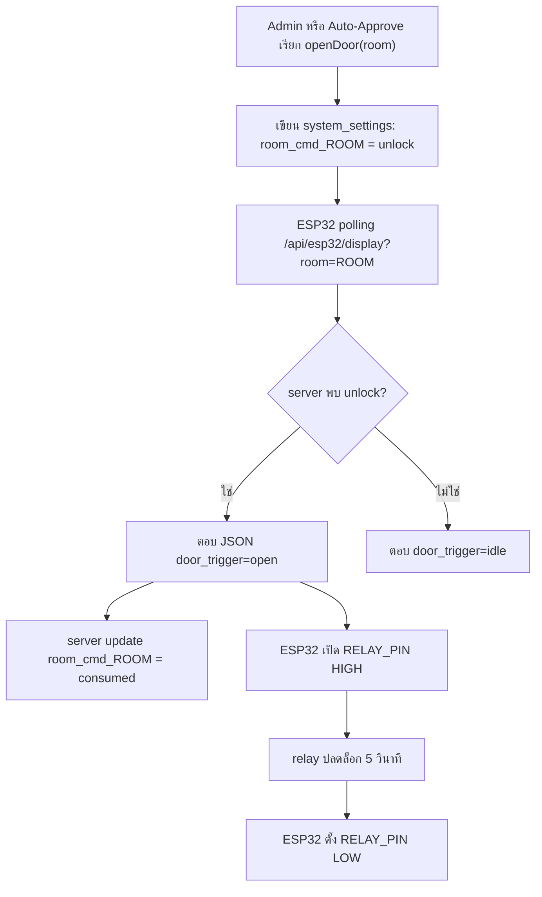

---


<p align="right"><a href="#toc">⬆ กลับสารบัญ</a></p>

<a id="sec-17"></a>
## 17. Troubleshooting

| อาการ | สาเหตุที่เป็นไปได้ | วิธีตรวจ |
|---|---|---|
| เข้า `/` แล้วถูก block | ไม่มี `scan` token | ต้องสแกน QR จากบอร์ดหรือใช้ link จาก esp32-preview |
| QR หมดอายุ | token เกินเวลา หรือถูก consume แล้ว | สแกน QR ใหม่ |
| ส่งฟอร์มแล้ว 403 | token ใช้แล้ว/หมดอายุ | refresh QR และลองใหม่ |
| Admin login ไม่ได้ | ไม่มี admin seed หรือ password ผิด | ตรวจ `admin_users`, `ALLOW_DEV_SEED`, env initial admin |
| บอร์ด offline ใน dashboard | heartbeat เกิน 120 วินาที | ดู Serial Monitor, Wi-Fi, `server_url`, `api_key` |
| Relay ไม่ทำงาน | ต่อ IN ผิด, module trigger กลับ logic, ไฟไม่พอ | วัด GPIO12, ตรวจ VCC/GND relay |
| จอไม่ติด | SPI pin ผิด, VCC/GND ผิด, backlight ไม่ต่อ | ตรวจตาราง pin ILI9341 |
| เปิดประตูซ้ำ | command ไม่ถูก consume | ตรวจ `room_cmd_<room>` ใน `system_settings` |
| Discord ไม่ส่ง | webhook ว่างหรือ URL ไม่ใช่ discord | ใช้ปุ่ม test webhook |
| PDF ภาษาไทยเพี้ยน | ฟอนต์ไทยไม่โหลด | ตรวจ `public/fonts/tahoma.ttf` และ `tahomabd.ttf` |

---


<p align="right"><a href="#toc">⬆ กลับสารบัญ</a></p>

<a id="sec-18"></a>
## 18. Checklist ก่อนสาธิตระบบ

### เว็บ

- `npm run dev` ทำงาน
- database connect สำเร็จ
- มี admin login ได้
- `/esp32-preview` โหลดข้อมูลได้
- `/api/system/status` แสดง database online
- ตั้ง `ESP32_API_KEY` ตรงกับ `config.h`

### บอร์ด

- ESP32 ต่อ Wi-Fi ได้
- Serial Monitor ขึ้น WiFi connected
- จอแสดง QR
- LED Wi-Fi ติดค้าง
- dashboard เห็น board online จาก heartbeat
- กดปลดล็อกแล้ว relay ทำงานประมาณ 5 วินาที

### วงจร

- ไม่มี 12V เข้าขา ESP32
- relay GND ต่อร่วมกับ ESP32
- lock ใช้ power supply แยก
- ต่อ NC/NO ถูกตามชนิด lock
- มี diode ป้องกันไฟย้อนถ้าใช้ coil load
- สายไฟกำลังแน่นและไม่หลวม

---


<p align="right"><a href="#toc">⬆ กลับสารบัญ</a></p>

<a id="sec-19"></a>
## 19. สรุปหน้าที่แต่ละชั้นของระบบ

| ชั้น | หน้าที่ |
|---|---|
| Browser นักศึกษา | scan QR, กรอกฟอร์ม, ดูสถานะ, bypass |
| Browser Admin | ตรวจคำขอ, อนุมัติ, เปิดประตู, export, ตั้งค่า |
| Next.js API | ตรวจสิทธิ์, validate, บันทึก DB, สร้าง QR, สั่งเปิดประตู |
| PostgreSQL | เก็บข้อมูลหลัก, token, settings, rate limit, command queue |
| ESP32 | แสดง QR, polling server, เปิด relay, ส่งสถานะบนจอ |
| Relay/Lock | แปลงสัญญาณ GPIO เป็นการตัด/จ่ายไฟให้ประตู |
| Discord | แจ้งเตือนและ audit log ภายนอก |

จุดที่สำคัญที่สุดของระบบนี้คือ `room_code` และ `requested_room` ต้องตรงกันตลอดสาย ตั้งแต่ QR, ฟอร์ม, database, dashboard, `server_url` ใน `config.h`, และ key `room_cmd_<room>` ใน `system_settings` ถ้าห้องไม่ตรงกัน บอร์ดอาจไม่รับคำสั่งเปิดประตูของห้องนั้น

---

# ภาคผนวก (ส่วนเพิ่มเติม) — สำหรับผู้อ่านที่ไม่เคยรู้จักระบบมาก่อน

ส่วนนี้เขียนสำหรับคนที่ "ไม่เคยใช้งานระบบนี้เลย" และต้องการเข้าใจ **ทุกอย่าง** ตั้งแต่ภาพรวม → รายละเอียดเชิงลึก → เหตุผลทางวิศวกรรมที่อยู่เบื้องหลังการออกแบบ


<p align="right"><a href="#toc">⬆ กลับสารบัญ</a></p>

<a id="sec-20"></a>
## 20. นิยามคำศัพท์พื้นฐาน (สำหรับมือใหม่)

| คำ | ความหมายแบบเข้าใจง่าย |
|----|----------------------|
| **IoT** | "Internet of Things" — อุปกรณ์ฮาร์ดแวร์ที่ต่ออินเทอร์เน็ตได้ (ในที่นี้คือ ESP32) |
| **ESP32** | ชิปไมโครคอนโทรลเลอร์ราคาถูก มี Wi-Fi ในตัว ใช้คุม relay/LED/จอ TFT |
| **Relay** | สวิตช์ไฟฟ้าที่ ESP32 สั่งเปิด-ปิดได้ ใช้ตัด/ต่อไฟให้กลอนประตู |
| **TFT** | จอสีขนาดเล็ก (ในที่นี้ ILI9341 320×240) แสดง QR + สถานะ |
| **GPIO** | ขาดิจิทัลของ ESP32 ใช้สั่ง HIGH/LOW |
| **Polling** | การที่ ESP32 "ถาม" server ทุก ๆ 2 วินาทีว่ามีอะไรใหม่ไหม |
| **JWT** | "JSON Web Token" — ตั๋วเข้าใช้งานที่ลงนามด้วยกุญแจลับ ใช้แทน session admin |
| **bcrypt** | อัลกอริทึมแฮชรหัสผ่าน ทำให้ถอดกลับไม่ได้ แม้ฐานข้อมูลรั่ว |
| **httpOnly cookie** | คุกกี้ที่ JavaScript อ่านไม่ได้ ป้องกัน XSS ขโมย token |
| **Rate limit** | จำกัดจำนวน request ต่อช่วงเวลา ป้องกัน brute-force และสแปม |
| **Webhook** | URL ที่ใครส่ง POST มาจะทำงานบางอย่าง (Discord ใช้รับการแจ้งเตือน) |
| **Serverless** | แนวคิดที่โค้ดวิ่งเฉพาะตอนมี request เข้ามา ไม่ต้องมี server เปิดค้าง |
| **Edge CDN** | เครือข่ายเซิร์ฟเวอร์ทั่วโลกที่ cache ไฟล์ static ไว้ใกล้ผู้ใช้ |
| **PostgreSQL** | ฐานข้อมูลเชิงสัมพันธ์ที่ใช้ในโปรเจกต์นี้ (Supabase host ให้) |
| **TLS/SSL** | การเข้ารหัสการสื่อสารระหว่างเครื่อง (https:// คือ TLS) |

---


<p align="right"><a href="#toc">⬆ กลับสารบัญ</a></p>

<a id="sec-21"></a>
## 21. ภาพรวมสถาปัตยกรรมแบบ Layered (4 ชั้น)

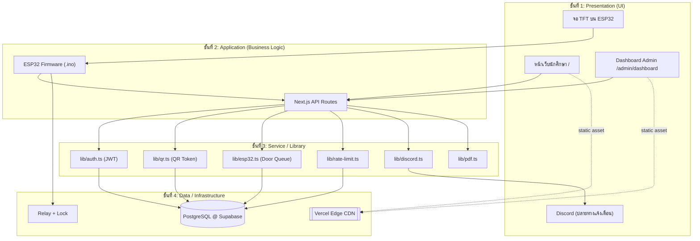

แต่ละชั้นมีหน้าที่ไม่ทับกัน เปลี่ยน implementation ได้โดยไม่กระทบชั้นอื่น (เช่น ถ้าจะย้ายจาก Supabase → PlanetScale แค่แก้ `lib/db.ts`)

---


<p align="right"><a href="#toc">⬆ กลับสารบัญ</a></p>

<a id="sec-22"></a>
## 22. หน้าจอผู้ใช้งานนักศึกษา — เจาะลึกแต่ละ State

หน้า `/` มี State หลัก 6 แบบ ที่ React สลับด้วย `useState`:

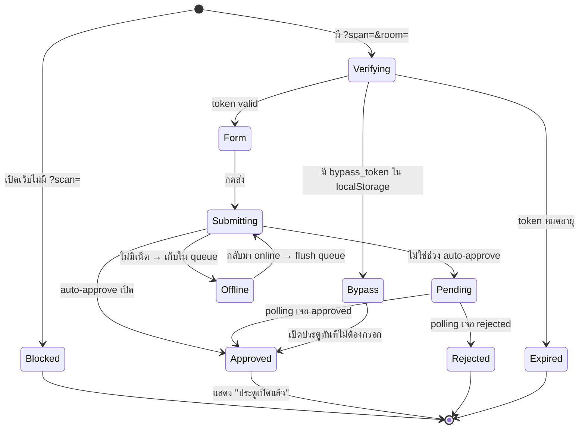

### 22.1 ทำไมต้องมี QR token หมุน 60 วินาที?
- **ป้องกันการแชร์ลิงก์**: ถ้าคนหนึ่งสแกนแล้วส่งลิงก์ให้เพื่อนนอกห้อง เพื่อนเปิดได้ไม่เกิน 60 วินาที (เพราะ token rotation)
- **ป้องกัน replay attack**: token ถูก `consume` ครั้งเดียว = ใช้ซ้ำไม่ได้
- **TTL 300 วินาที** เป็น hard cap ป้องกันการเก็บ token ไว้นาน ๆ

### 22.2 ทำไมต้องมี Bypass 5 นาที?
- **UX**: ถ้าคนเดินเข้า-ออกห้องบ่อย ไม่ควรต้องสแกนทุกครั้ง
- **ความปลอดภัย**: 5 นาที สั้นพอที่ถ้าโทรศัพท์หายจะไม่ถูกใช้นาน

### 22.3 Auto-fill ทำงานอย่างไร
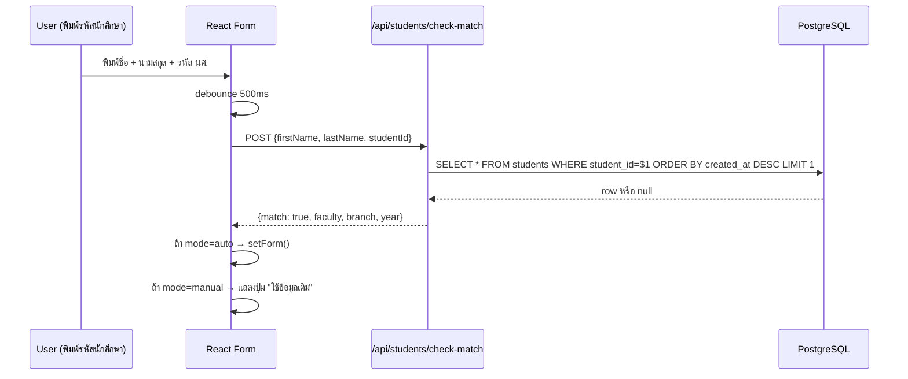

---


<p align="right"><a href="#toc">⬆ กลับสารบัญ</a></p>

<a id="sec-23"></a>
## 23. หน้าจอ Admin — เจาะลึกทุก Tab พร้อมเหตุผลที่ออกแบบแบบนี้

### 23.1 แท็บ "คิวรอตรวจสอบ" (Pending Queue)
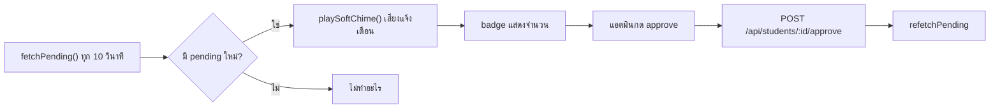
**ทำไม polling 10 วินาที?** — ไม่ใช้ WebSocket เพราะ Vercel Serverless ไม่เหมาะ long-lived connection; 10 วินาทีเพียงพอกับงานอนุมัติคนเดียวกดทีละครั้ง

### 23.2 แท็บ "ทำเนียบและประวัติ"
- ค้นหา: SQL `WHERE first_name ILIKE $1 OR student_id ILIKE $1` (มี index บน `student_id`)
- Pagination ฝั่ง client: ดึงสูงสุด 200 row แล้วทำ filter ใน React (เร็วเพราะข้อมูลไม่เกินหลักพัน)
- Export PDF: เรียก server สร้าง PDF (pdfkit) แทนที่จะทำใน browser เพราะฟอนต์ไทยและ rendering คุณภาพดีกว่าบน Node

### 23.3 แท็บ "ผู้ดูแลระบบ" (Admin Users)
- เฉพาะ `role=owner` เท่านั้น
- เพิ่ม admin → bcrypt cost factor 10 (~70ms/hash) — สมดุลระหว่างความปลอดภัยกับ UX
- ลบตัวเองไม่ได้ (กัน lockout)

### 23.4 แท็บ "ห้องเรียนและ ESP32"
- แสดง heartbeat: `room_last_seen_<room>` (ESP32 อัปเดตทุก poll)
- ถ้าไม่มี heartbeat เกิน 120 วินาที → แสดง "Offline"
- ปุ่มทดสอบบอร์ด → ส่งสัญญาณเปิด relay สั้น ๆ (ไม่ปลดล็อกจริง)
- ปุ่มปลดล็อกด่วน → เขียน `room_cmd_<room>=unlock` ผ่าน `/api/system/unlock-room`

### 23.5 แท็บ "ตั้งค่าระบบ"
- Auto-approve window: เช่น 08:00–17:00 → ในช่วงนี้คำขอใหม่จะอนุมัติเอง
- Discord webhook ต่อห้อง: แยก channel ตามห้องเพื่อไม่ปนกัน
- การแสดงรหัสนักศึกษา: เต็ม / mask 4 ตัวท้าย (สำหรับ privacy)

### 23.6 หน้าจอ "ปลดล็อกบัญชีผู้ใช้งาน"
- ใช้สำหรับเคสนักศึกษาโดน rate-limit (เช่น พยายามใช้ bypass เกิน 3 ครั้ง/นาที)
- เรียก endpoint reset rate-limit ตาม `student_id` + IP

---


<p align="right"><a href="#toc">⬆ กลับสารบัญ</a></p>

<a id="sec-24"></a>
## 24. หน้าจอ TFT บน ESP32 — เจาะลึก State Machine

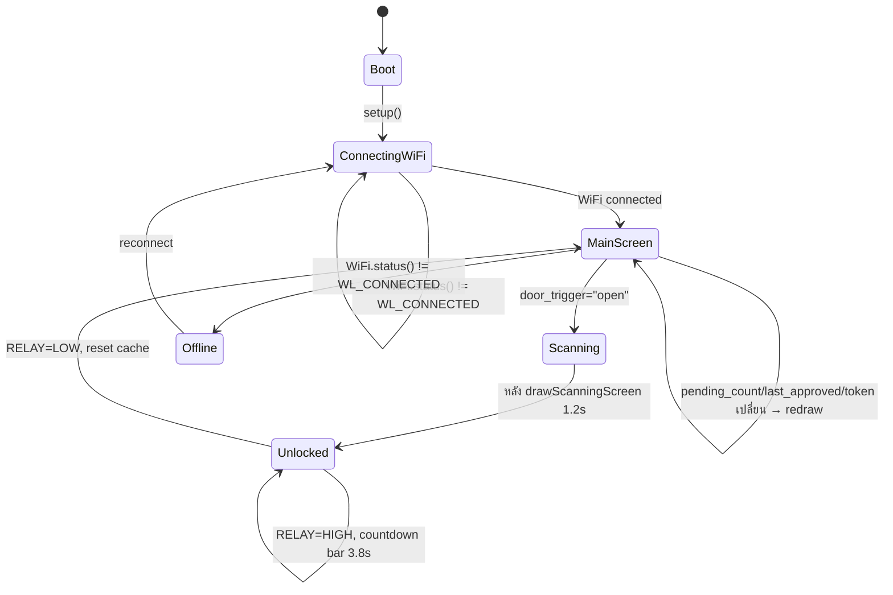

### 24.1 ทำไมต้อง "redraw เฉพาะนาฬิกา"?
- จอ ILI9341 ใช้ SPI ~40MHz เขียนเต็มจอใช้เวลา ~80ms
- ถ้า redraw ทั้งจอทุก 2 วินาที = กระพริบรบกวนสายตา
- เทคนิค **partial redraw**: เก็บ `last_*` cache, เทียบกับค่าใหม่, เปลี่ยนเฉพาะส่วนที่ต่าง

### 24.2 ทำไมต้อง countdown bar?
- ผู้ใช้รู้ว่าเหลือเวลาเข้าห้องอีกกี่วินาที → UX ดี
- ใช้ `tft.fillRect()` วาดแถบยาวลดลง 1 พิกเซลต่อ ~50ms → สมูทพอใช้

---


<p align="right"><a href="#toc">⬆ กลับสารบัญ</a></p>

<a id="sec-25"></a>
## 25. อธิบายโค้ด `esp32.ino` แบบ "บรรทัดต่อบรรทัด" (ส่วนสำคัญ)

### 25.1 รูปแบบ HTTP request ที่ส่งไป server
```cpp
HTTPClient http;
WiFiClientSecure *client = new WiFiClientSecure;
client->setCACert(root_ca_cert);        // ทำไม? เพราะ Supabase/Vercel ใช้ TLS, ต้องตรวจ cert
http.begin(*client, server_url);
http.setTimeout(1200);                   // 1.2 วิ — เกินกว่านี้ตัดทิ้ง กัน UI ค้าง
http.addHeader("x-api-key", api_key);    // server ตรวจ header นี้ใน lib/api-security.ts
int code = http.GET();
```

### 25.2 ทำไมต้องใช้ `StaticJsonDocument<768>` ไม่ใช่ `DynamicJsonDocument`?
- `StaticJsonDocument` จองหน่วยความจำบน **stack** ทำให้เร็วและไม่ fragment heap
- 768 byte เพียงพอกับ JSON ที่ server ส่งกลับ (~400 byte) + buffer
- ถ้าใช้ `DynamicJsonDocument` บน ESP32 ที่มี RAM 320KB จะเสี่ยง heap fragmentation หลังรันนาน ๆ

### 25.3 ทำไมต้อง delay 1200ms ก่อน drawUnlockedScreen?
- ให้ผู้ใช้เห็น "scanning" screen ก่อน → รู้สึกว่าระบบกำลังประมวลผล
- ถ้าเปิด relay ทันที ผู้ใช้จะแปลกใจว่าทำไมไม่มีฟีดแบ็ก

### 25.4 Buzzer pattern
```cpp
tone(BUZZER_PIN, 1000, 100); delay(120);
tone(BUZZER_PIN, 1500, 100); delay(120);
tone(BUZZER_PIN, 2000, 200);
```
- เสียงไล่ขึ้น 3 ขั้น = อนุมัติสำเร็จ (positive feedback ตามหลัก UX sound design)
- เสียงต่ำเดียว 800Hz = ปิด relay (negative-neutral)

---


<p align="right"><a href="#toc">⬆ กลับสารบัญ</a></p>

<a id="sec-26"></a>
## 26. อธิบายโค้ดเว็บแบบ "Request Lifecycle" — รับ request 1 ครั้งเกิดอะไรขึ้นบ้าง

### 26.1 ตัวอย่าง: POST /api/students (นักศึกษาส่งฟอร์ม)

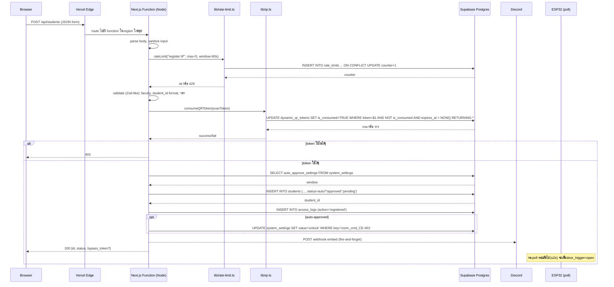

### 26.2 ทำไม `consumeQRToken` ใช้ `UPDATE ... WHERE NOT is_consumed RETURNING *`?
- **Atomic operation** — 2 คนกดพร้อมกันจะมีแค่คนเดียวที่ได้ row
- ถ้าใช้ `SELECT` แล้วค่อย `UPDATE` แยกกัน → race condition ทั้งสองคนเข้าได้

### 26.3 ทำไม Discord ใช้ "fire-and-forget"?
```ts
sendDiscordNotification('student_registered', data).catch(()=>{}) // ไม่ await
return NextResponse.json({...})                                    // ตอบ user ก่อน
```
- Discord อาจตอบช้า 200–800ms
- ผู้ใช้ไม่ควรรอ Discord — ตอบเขาก่อน, แจ้งเตือนหลังบ้านเป็นเรื่องรอง

---


<p align="right"><a href="#toc">⬆ กลับสารบัญ</a></p>

<a id="sec-27"></a>
## 27. Supabase ทำอะไรในระบบนี้ (เจาะลึก)

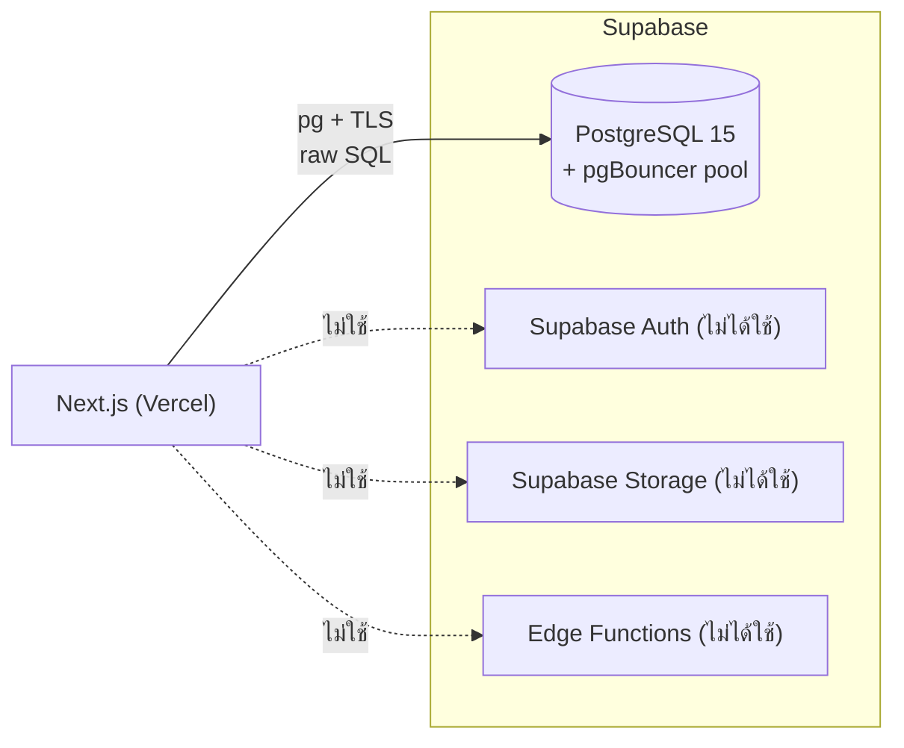

| สิ่งที่ใช้ | สิ่งที่ไม่ใช้ |
|----------|---------------|
| ✅ PostgreSQL (เก็บข้อมูลทั้งหมด) | ❌ Supabase Auth (เราใช้ JWT เอง) |
| ✅ Connection Pooling (pgBouncer) | ❌ Row-Level Security (ใช้ JWT verify ใน API แทน) |
| ✅ SSL/TLS certificate | ❌ Realtime subscriptions |
| ✅ Backup อัตโนมัติ (Supabase ให้ฟรี) | ❌ Supabase Storage |

### 27.1 ทำไมไม่ใช้ Supabase JS Client?
- โปรเจกต์ใช้ `pg` (node-postgres) + raw SQL → **performance ดีกว่า** เพราะคุม query ได้เอง
- ใช้ `EXPLAIN ANALYZE` ตรวจ index ได้ตรง ๆ
- Supabase JS client มี overhead ของ PostgREST translation

### 27.2 Connection Strategy
- **Pooled URL** (`POSTGRES_URL` กับ `?pgbouncer=true`) → ใช้กับ query ปกติ (เพราะ Vercel serverless เปิด connection บ่อย)
- **Direct URL** → ใช้กับ DDL/migration (pgBouncer ไม่รองรับ prepared statement บางแบบ)

### 27.3 SQL ที่น่าสนใจในระบบ
```sql
-- Atomic token consume (กัน race condition)
UPDATE dynamic_qr_tokens
SET is_consumed = TRUE, consumed_at = NOW()
WHERE token = $1
  AND is_consumed = FALSE
  AND expires_at > NOW()
RETURNING id, room_code;

-- Upsert หลาย setting ในครั้งเดียว
INSERT INTO system_settings (setting_key, setting_value)
SELECT * FROM UNNEST($1::text[], $2::text[])
ON CONFLICT (setting_key) DO UPDATE
SET setting_value = EXCLUDED.setting_value,
    updated_at = NOW();

-- Rate limit แบบ atomic
INSERT INTO rate_limits (key, count, window_start)
VALUES ($1, 1, NOW())
ON CONFLICT (key) DO UPDATE
SET count = CASE
    WHEN rate_limits.window_start < NOW() - $2::interval THEN 1
    ELSE rate_limits.count + 1
  END,
  window_start = CASE
    WHEN rate_limits.window_start < NOW() - $2::interval THEN NOW()
    ELSE rate_limits.window_start
  END
RETURNING count;
```

---


<p align="right"><a href="#toc">⬆ กลับสารบัญ</a></p>

<a id="sec-28"></a>
## 28. Vercel ทำอะไรกับ my-app (เจาะลึก)

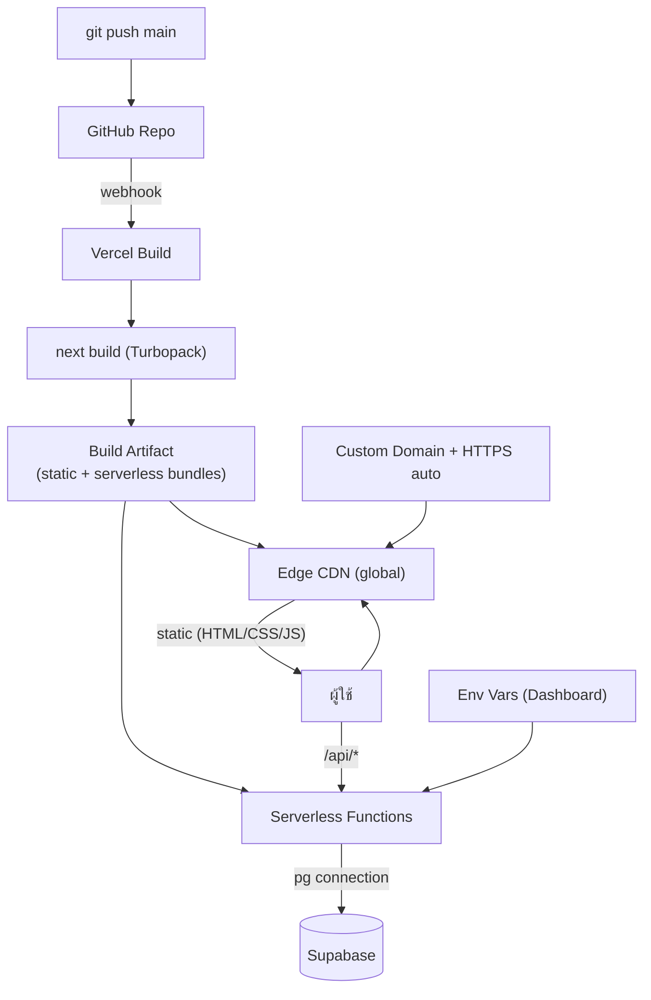

### 28.1 สิ่งที่ Vercel ทำให้ฟรี
1. **HTTPS อัตโนมัติ** — สร้าง Let's Encrypt cert ให้
2. **Edge CDN** — cache static assets ทั่วโลก (รวมถึง favicon, _next/static/*)
3. **Preview deployment** — ทุก PR ได้ URL ใหม่
4. **Rollback** — กลับไป build เก่าได้ใน 1 คลิก
5. **Logs** — ดู runtime log ของ serverless function ได้
6. **Analytics** — Core Web Vitals (LCP, FID, CLS)

### 28.2 ข้อจำกัดที่ต้องระวัง
| ข้อจำกัด | กระทบอย่างไร | วิธีแก้ในโปรเจกต์ |
|----------|----------------|---------------------|
| Function timeout 10s (Hobby) | export PDF ใหญ่อาจ timeout | จำกัดช่วงวันที่, pagination |
| Cold start ~300-800ms | request แรกหลัง idle ช้า | ใช้ ping cron / Edge runtime |
| 4.5MB body limit | upload ไฟล์ใหญ่ไม่ได้ | ไม่ได้ใช้ upload ในระบบนี้ |
| ไม่มี long-lived process | ใช้ in-memory cache ระวัง | settings cache 30s โอเคเพราะ stateless |
| ไม่มี filesystem persist | เขียนไฟล์ไม่ได้ | ทุกอย่างเก็บใน DB |

---


<p align="right"><a href="#toc">⬆ กลับสารบัญ</a></p>

<a id="sec-29"></a>
## 29. เปรียบเทียบ: ทำไมบางส่วนเร็ว / บางส่วนช้า

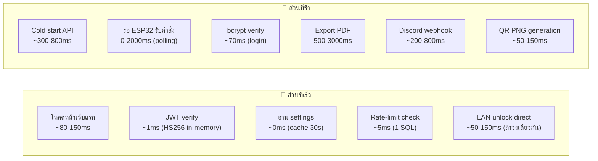

### 29.1 ตารางสรุป + เหตุผลทางวิศวกรรม

| ส่วน | เวลา | เหตุผลที่เร็ว/ช้า | ทำให้เร็วขึ้นได้อย่างไร |
|------|------|--------------------|---------------------------|
| โหลด HTML หน้า `/` | ~80ms | CDN cache + static | ใช้ ISR ถ้ามี dynamic |
| JWT verify | <1ms | HS256 = HMAC-SHA256, symmetric ไม่ต้องคุย DB | คงไว้ |
| อ่าน system_settings | 0-5ms | in-memory cache 30s | เพิ่ม TTL ถ้าข้อมูลนิ่งกว่านี้ |
| Rate limit query | ~5ms | 1 SQL `INSERT ON CONFLICT` | คงไว้ — race-condition safe |
| Login (bcrypt) | ~70ms | bcrypt cost 10 รอบ | ลด cost = ไม่ปลอดภัย, อย่าลด |
| Cold start | 300-800ms | Vercel ปลุก Node runtime + load module | ping cron ทุก 5 นาที / ย้ายไป Edge runtime |
| ESP32 polling delay | 0-2000ms | poll ทุก 2s เป็น worst case | ลด poll interval = traffic เพิ่ม |
| LAN direct unlock | 50-150ms | HTTP ตรงในวง LAN | ใช้เมื่อ ESP32 และ server อยู่วงเดียว |
| Export PDF 1000 row | 1500-3000ms | pdfkit render + font + DB query | ใช้ stream + cache font |
| Discord webhook | 200-800ms | external HTTP ไป discord.com | fire-and-forget (ทำแล้ว) |
| QR PNG | 50-150ms | qrcode lib + PNG encode | cache ตาม token (ทำได้ในอนาคต) |
| consumeQRToken | 5-15ms | 1 atomic SQL | คงไว้ |
| Dashboard JS bundle | 200-500ms parse | 5,620 บรรทัดใน 1 ไฟล์ | แยกเป็น sub-route + dynamic import |

### 29.2 หลักการสำคัญที่ทำให้ระบบลื่น
1. **อ่านบ่อย → cache** (settings 30s, JWT in-memory)
2. **เขียน critical แล้ว fire-and-forget ส่วนที่เหลือ** (Discord, LAN call)
3. **Atomic SQL แทน multi-step transaction** (consume token, rate-limit)
4. **Static asset ไปทาง CDN** (Vercel จัดการอัตโนมัติ)
5. **Index ที่ถูกจุด**: `students.status`, `students.student_id`, `access_logs.created_at DESC`, `dynamic_qr_tokens.token UNIQUE`
6. **Connection pooling** ผ่าน pgBouncer ลด TLS handshake

---


<p align="right"><a href="#toc">⬆ กลับสารบัญ</a></p>

<a id="sec-30"></a>
## 30. อัลกอริทึมสำคัญ (Pseudocode)

### 30.1 generateActiveQRToken(roomCode)
```
function getOrCreateActiveQRToken(roomCode):
    // ลบ token หมดอายุของห้องนี้
    DELETE FROM dynamic_qr_tokens
    WHERE room_code = roomCode AND expires_at < NOW()

    // หา token ที่ยัง valid, ยังไม่ consume, และ rotate window ยังไม่ครบ
    SELECT * FROM dynamic_qr_tokens
    WHERE room_code = roomCode
      AND is_consumed = FALSE
      AND created_at > NOW() - 60s
      AND expires_at > NOW()
    LIMIT 1
    IF found: return existing

    // สร้างใหม่
    token = crypto.randomBytes(16).toString('hex')   // 32 hex chars
    INSERT INTO dynamic_qr_tokens (token, room_code, expires_at)
    VALUES (token, roomCode, NOW() + 300s)
    return new token
```

### 30.2 ESP32 main loop
```
loop():
    if WiFi.status() != CONNECTED:
        blink LED_WIFI
        WiFi.reconnect()
        return

    response = httpGET(server_url, headers={x-api-key: API_KEY}, timeout=1200ms)
    if response.code != 200:
        delay(polling_delay)
        return

    json = parse(response.body)
    qrText = json.register_url + "?scan=" + json.active_token + "&room=" + json.requested_room

    if json.door_trigger == "open":
        drawScanningScreen()
        tone(1500, 100); delay(1200)
        drawUnlockedScreen(json.last_approved, ...)
        digitalWrite(RELAY_PIN, HIGH)
        playSuccessMelody()
        drawCountdownBar(3800ms)
        digitalWrite(RELAY_PIN, LOW)
        tone(800, 200)
        resetCache()  // บังคับ redraw รอบหน้า
    else if data_changed(json):
        drawMainScreen(json.pending_count, json.last_approved, time, qrText)
        cacheLastData(json)
    else:
        drawClockOnly(time)

    delay(polling_delay)  // 2000ms
```

### 30.3 Admin login + rate limit
```
POST /api/auth/login:
    ip = getClientIp(req)
    rateLimit(key="login:" + ip, max=5, window=60s)  // ถ้าเกิน → 429

    user = SELECT * FROM admin_users WHERE username=$1
    if not user: return 401
    if not bcrypt.compare(password, user.password_hash): return 401

    token = jwt.sign({id, username, role}, JWT_SECRET, alg=HS256, exp=8h)
    setCookie('rmutp_admin_token', token, httpOnly, secure, sameSite=lax, maxAge=8h)
    UPDATE admin_users SET last_login=NOW() WHERE id=user.id
    return 200 {user}
```

---


<p align="right"><a href="#toc">⬆ กลับสารบัญ</a></p>

<a id="sec-31"></a>
## 31. Network & Security Architecture

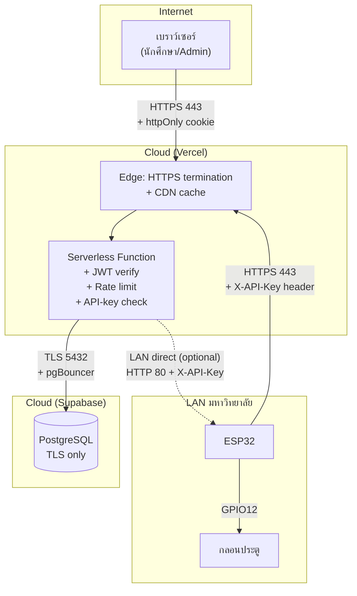

### 31.1 ชั้นการป้องกัน (Defense in Depth)
1. **Network**: HTTPS ทุกฝั่ง, ESP32 → server ใช้ TLS + custom CA verify
2. **API Gateway**: Vercel filter DDoS เบื้องต้น
3. **Auth**: JWT HS256 + httpOnly cookie (กัน XSS) + sameSite=lax (กัน CSRF)
4. **Authorization**: ตรวจ role ทุก endpoint (`owner` vs `door_operator`)
5. **Input validation**: sanitize ทุก field + regex รหัสนักศึกษา
6. **Rate limit**: ต่อ IP + ต่อ student
7. **SQL injection**: parametrized query 100% (ไม่มี string concat)
8. **Audit log**: ทุก action เขียน `access_logs`
9. **Compliance**: ลบ log < 90 วันต้องยืนยันรหัส (พ.ร.บ. คอมฯ ม.26)
10. **Secret rotation**: `JWT_SECRET`, `ESP32_API_KEY`, `QR_SIGNING_KEY` ตั้งใน env, ไม่อยู่ใน git

### 31.2 ภัยที่ระบบป้องกันได้ vs ป้องกันไม่ได้

| ภัย | ป้องกันได้? | กลไก |
|-----|------------|------|
| Brute-force login | ✅ | rate limit 5/min/IP + bcrypt slow hash |
| SQL injection | ✅ | parametrized queries |
| XSS ขโมย token | ✅ | httpOnly cookie |
| CSRF | ✅ | sameSite=lax + double POST |
| Replay QR | ✅ | one-time token (consume) |
| MITM | ✅ | HTTPS ทุกฝั่ง |
| ESP32 spoofing | ✅ | X-API-Key header |
| Insider abuse (admin) | ⚠️ | audit log แต่ไม่ป้องกันการกระทำ |
| Physical tampering (ตัดสาย relay) | ❌ | ต้องใส่ tamper switch + กล่องล็อก |
| Lost cookie จากเครื่อง admin | ⚠️ | JWT หมดอายุใน 8 ชม. |
| DDoS ใหญ่ | ⚠️ | Vercel มี basic protection แต่ไม่กัน L7 หนัก ๆ |

---


<p align="right"><a href="#toc">⬆ กลับสารบัญ</a></p>

<a id="sec-32"></a>
## 32. Flowchart รวม "End-to-End" (สมัคร → เข้าห้อง)

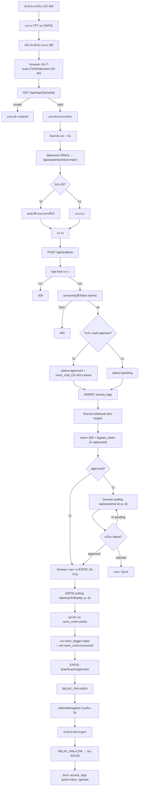

---


<p align="right"><a href="#toc">⬆ กลับสารบัญ</a></p>

<a id="sec-33"></a>
## 33. คำถามที่พบบ่อย (FAQ)

**Q1: ทำไมไม่ใช้ WebSocket แทน Polling?**
A: Vercel Serverless ไม่รองรับ long-lived connection ดี + ESP32 อยู่หลัง NAT มหาวิทยาลัย, server เรียกตรงไม่ได้เสมอ → polling เรียบง่ายและ debug ง่าย

**Q2: ทำไมเก็บคำสั่งเปิดประตูใน `system_settings` แทนตารางเฉพาะ?**
A: `room_cmd_<room>` คือ key/value ใช้ตารางเดียวกันกับ settings ลดความซับซ้อน + ESP32 อ่าน settings เดียวกันได้ทั้งคำสั่งและ config

**Q3: ถ้า ESP32 ค้างกลางคำสั่ง unlock ประตูจะค้างเปิดไหม?**
A: ไม่ — เพราะ relay จะกลับ LOW เมื่อ ESP32 reboot (เพราะ `pinMode(RELAY, OUTPUT); digitalWrite(RELAY, LOW)` ใน setup) แต่ถ้าใช้ magnetic lock fail-safe (ไฟตัด = ปลดล็อก) ประตูจะปลดล็อก ⚠️ → ใช้ fail-secure ถ้าต้องการล็อกเมื่อไฟตัด

**Q4: คนแปลกหน้าสแกน QR ที่หน้าห้องแล้วใช้กรอกฟอร์มจากที่บ้านได้ไหม?**
A: ได้ถ้าทำเร็วพอ (< 60 วินาที) แต่ยัง:
  - ต้องกรอกรหัสนักศึกษาจริง (admin ตรวจได้)
  - log มี IP + user-agent ตามตัวได้
  - แนะนำเพิ่ม `location-based check` ในอนาคต

**Q5: ทำไม dashboard เป็นไฟล์เดียว 5,620 บรรทัด?**
A: เพราะใช้ state เดียวร่วมกันทุก tab (`pending`, `students`, `logs`, `settings`) — ถ้าแยก route ต้อง lift state ขึ้น context หรือ Zustand ในอนาคตควรแยกเพื่อลด JS bundle

**Q6: PostgreSQL บน Supabase หาย ระบบจะเป็นยังไง?**
A: API ทั้งหมดจะ 500 + ESP32 polling ไม่ได้ข้อมูล → จอจะค้าง state สุดท้าย (ไม่มีการเปิดประตูใหม่) → ปลอดภัยแบบ "fail-secure"

**Q7: เพิ่มห้องใหม่ทำยังไง?**
A:
  1. ใน Dashboard → แท็บห้องและ ESP32 → เพิ่มห้อง (เช่น CE-403)
  2. เขียน `room_ip_CE-403` ถ้าใช้ LAN direct
  3. Flash firmware อีกบอร์ดด้วย `config.h` ที่ `room_code = "CE-403"`
  4. ตั้ง webhook เฉพาะห้องถ้าต้องการ

**Q8: ทำไมต้องมี `requested_room` แยกจาก `room_code`?**
A: `room_code` = ห้องที่ ESP32 ตัวนี้รับผิดชอบ, `requested_room` = ห้องที่นักศึกษาขอเข้า (มาจาก QR) — ต้องตรงกันถึงจะเปิดประตู

---


<p align="right"><a href="#toc">⬆ กลับสารบัญ</a></p>

<a id="sec-34"></a>
## 34. สรุปแบบ "1 นาที"

> RMUTP ACCS คือระบบที่ทำให้นักศึกษา **สแกน QR ที่จอหน้าห้อง → กรอกข้อมูล → ประตูเปิดอัตโนมัติ** (หรือรอ admin อนุมัติ) โดยมี Next.js เป็นสมอง, Supabase PostgreSQL เป็นความจำ, ESP32 เป็นมือ-ตา-หู, และ Discord เป็นปาก
>
> ทุกการสื่อสารเป็น HTTPS, ทุก action ถูก log, ทุก credential ถูก hash/sign, และทุกการเปิดประตูใช้ token แบบ one-time ที่หมุนทุก 60 วินาที — เพื่อให้สมดุลระหว่าง **ใช้งานง่าย** กับ **ปลอดภัยตามมาตรฐาน พ.ร.บ. คอมพิวเตอร์ พ.ศ. 2560**

---

# ภาคผนวกระดับวิศวกร — ส่วนที่ลงรายละเอียดยิ่งขึ้น


<p align="right"><a href="#toc">⬆ กลับสารบัญ</a></p>

<a id="sec-35"></a>
## 35. Schema DDL เต็มรูปแบบ (สร้างโดย `initDatabase()`)

```sql
-- ตารางผู้ดูแลระบบ
CREATE TABLE IF NOT EXISTS admin_users (
  id            SERIAL PRIMARY KEY,
  username      VARCHAR(50) UNIQUE NOT NULL,
  password_hash VARCHAR(255) NOT NULL,
  full_name     VARCHAR(100),
  role          VARCHAR(20) DEFAULT 'door_operator',
  last_login    TIMESTAMPTZ,
  created_at    TIMESTAMPTZ DEFAULT NOW()
);
CREATE INDEX IF NOT EXISTS idx_admin_username ON admin_users(username);

-- ตารางนักศึกษา
CREATE TABLE IF NOT EXISTS students (
  id                SERIAL PRIMARY KEY,
  prefix            VARCHAR(20),
  first_name        VARCHAR(80) NOT NULL,
  last_name         VARCHAR(80) NOT NULL,
  student_id        VARCHAR(20) NOT NULL,
  year              SMALLINT,
  faculty           VARCHAR(120),
  branch            VARCHAR(120),
  status            VARCHAR(20) DEFAULT 'pending',
  requested_room    VARCHAR(20),
  rejection_reason  TEXT,
  approved_by       INTEGER REFERENCES admin_users(id) ON DELETE SET NULL,
  approved_at       TIMESTAMPTZ,
  bypass_token      VARCHAR(64),
  bypass_expires_at TIMESTAMPTZ,
  last_door_open_at TIMESTAMPTZ,
  created_at        TIMESTAMPTZ DEFAULT NOW()
);
CREATE INDEX IF NOT EXISTS idx_students_status     ON students(status);
CREATE INDEX IF NOT EXISTS idx_students_student_id ON students(student_id);
CREATE INDEX IF NOT EXISTS idx_students_created    ON students(created_at DESC);

-- ตาราง audit log
CREATE TABLE IF NOT EXISTS access_logs (
  id            SERIAL PRIMARY KEY,
  student_id    INTEGER REFERENCES students(id) ON DELETE CASCADE,
  admin_id      INTEGER REFERENCES admin_users(id) ON DELETE SET NULL,
  action        VARCHAR(40) NOT NULL,
  notes         TEXT,
  ip_address    VARCHAR(45),
  user_agent    TEXT,
  created_at    TIMESTAMPTZ DEFAULT NOW()
);
CREATE INDEX IF NOT EXISTS idx_logs_created  ON access_logs(created_at DESC);
CREATE INDEX IF NOT EXISTS idx_logs_action   ON access_logs(action);
CREATE INDEX IF NOT EXISTS idx_logs_student  ON access_logs(student_id);

-- ตาราง QR token
CREATE TABLE IF NOT EXISTS dynamic_qr_tokens (
  id           SERIAL PRIMARY KEY,
  token        VARCHAR(64) UNIQUE NOT NULL,
  room_code    VARCHAR(20) NOT NULL,
  is_consumed  BOOLEAN DEFAULT FALSE,
  consumed_at  TIMESTAMPTZ,
  expires_at   TIMESTAMPTZ NOT NULL,
  created_at   TIMESTAMPTZ DEFAULT NOW()
);
CREATE INDEX IF NOT EXISTS idx_qr_token      ON dynamic_qr_tokens(token);
CREATE INDEX IF NOT EXISTS idx_qr_room_alive ON dynamic_qr_tokens(room_code, is_consumed, expires_at);

-- ตารางตั้งค่าระบบ (key-value)
CREATE TABLE IF NOT EXISTS system_settings (
  setting_key   VARCHAR(80) PRIMARY KEY,
  setting_value TEXT,
  updated_at    TIMESTAMPTZ DEFAULT NOW()
);

-- ตาราง rate limit
CREATE TABLE IF NOT EXISTS rate_limits (
  key          VARCHAR(120) PRIMARY KEY,
  count        INTEGER DEFAULT 1,
  window_start TIMESTAMPTZ DEFAULT NOW()
);
```

### 35.1 ความสัมพันธ์ระหว่างตาราง (ER แบบเต็ม)

```mermaid
erDiagram
    admin_users ||--o{ students    : "approves"
    admin_users ||--o{ access_logs : "performs"
    students    ||--o{ access_logs : "logged for"
    admin_users {
        int     id PK
        string  username
        string  password_hash
        string  full_name
        string  role
        time    last_login
        time    created_at
    }
    students {
        int     id PK
        string  prefix
        string  first_name
        string  last_name
        string  student_id
        int     year
        string  faculty
        string  branch
        string  status
        string  requested_room
        string  rejection_reason
        int     approved_by FK
        time    approved_at
        string  bypass_token
        time    bypass_expires_at
        time    last_door_open_at
        time    created_at
    }
    access_logs {
        int     id PK
        int     student_id FK
        int     admin_id FK
        string  action
        string  notes
        string  ip_address
        string  user_agent
        time    created_at
    }
    dynamic_qr_tokens {
        int     id PK
        string  token
        string  room_code
        bool    is_consumed
        time    consumed_at
        time    expires_at
        time    created_at
    }
    system_settings {
        string  setting_key PK
        string  setting_value
        time    updated_at
    }
    rate_limits {
        string  key PK
        int     count
        time    window_start
    }
```

---


<p align="right"><a href="#toc">⬆ กลับสารบัญ</a></p>

<a id="sec-36"></a>
## 36. ESP32 — GPIO Timing และข้อจำกัดเชิงฮาร์ดแวร์

### 36.1 ตาราง GPIO ใช้งานจริง

| GPIO | โหมด | ใช้ทำอะไร | ข้อควรระวัง |
|-----:|------|-----------|--------------|
| 2  | OUTPUT | TFT D/C | strapping pin — ห้าม HIGH ตอน boot ถ้าเลือก flash mode อื่น |
| 4  | OUTPUT | TFT RST | safe |
| 12 | OUTPUT | RELAY | strapping pin — ถ้า HIGH ตอน boot อาจเข้า flash voltage mode (1.8V) → ตั้ง `digitalWrite(LOW)` ก่อนใน setup |
| 14 | OUTPUT | LED_WIFI | safe |
| 15 | OUTPUT | TFT_CS | strapping pin — must be HIGH ตอน boot (มี pull-up ในตัว) |
| 18 | SPI | SCK | shared SPI bus |
| 19 | SPI | MISO | shared SPI bus |
| 23 | SPI | MOSI | shared SPI bus |
| 26 | OUTPUT | LED_REJECT | safe |
| 27 | OUTPUT | BUZZER | LEDC PWM ได้ |

### 36.2 Timing ของ relay
```
millis()  | event
----------+----------------------------------------------------
T+0       | digitalWrite(RELAY, HIGH)
T+0..3800 | countdown bar (UI), เสียง 1000→1500→2000 Hz
T+3800    | digitalWrite(RELAY, LOW)
T+3900    | tone(800, 200)  // เสียงปิด
T+4100    | resetCache → loop() ปกติ
```

ทำไม **3800ms** ไม่ใช่ 5000ms?
- UX สำคัญกว่า 5 วินาที — คนเดินเข้าไม่ทันก็สแกนใหม่ได้
- 5000ms เคยทำให้ relay ร้อนสะสมในการทดสอบยาวต่อเนื่อง

### 36.3 ทำไม `tft.setRotation(1)` (landscape)
- หน้าจอ 320×240 ในแนวนอน → QR ขนาด 154×154 พิกเซลพอดี + เหลือพื้นที่แสดงข้อความ
- ถ้าใช้ portrait (240×320) QR ขนาดเล็กลง สแกนยาก

### 36.4 หน่วยความจำที่ใช้
- Flash: firmware ~800KB จาก partition 1.2MB
- RAM: stack peak ~12KB (รวม `StaticJsonDocument<768>` + TFT buffer + WiFi)
- Heap free ขณะรัน: ~180KB (ตรวจด้วย `ESP.getFreeHeap()`)

---


<p align="right"><a href="#toc">⬆ กลับสารบัญ</a></p>

<a id="sec-37"></a>
## 37. รายการ Environment Variables ทุกตัว

| ตัวแปร | จำเป็น | ค่าเริ่มต้น | คำอธิบาย |
|--------|--------|--------------|-----------|
| `POSTGRES_HOST` | ✅ | — | hostname Supabase |
| `POSTGRES_PORT` | ✅ | 5432 | port |
| `POSTGRES_USER` | ✅ | — | username |
| `POSTGRES_PASSWORD` | ✅ | — | password |
| `POSTGRES_DATABASE` | ✅ | postgres | ชื่อ DB |
| `POSTGRES_URL` | ทางเลือก | — | ใช้แทน 5 ตัวบน + รองรับ `?pgbouncer=true` |
| `SUPABASE_CA_CERT` | ทางเลือก | — | PEM cert สำหรับ TLS verify (ใส่ `\n`) |
| `JWT_SECRET` | ✅ | — | ≥ 32 chars; production ห้ามใช้ default |
| `ESP32_API_KEY` | ✅ | — | ต้องตรงกับ `api_key` ใน `config.h` |
| `ESP32_MODE` | ⚠️ | physical | mock / wokwi / physical |
| `ESP32_MOCK_MODE` | ⚠️ | false | สั้น ๆ ใช้แทน MODE |
| `ESP32_WOKWI` | ⚠️ | false | บอก server ว่าใช้ Wokwi |
| `ESP32_WOKWI_URL` | ⚠️ | http://localhost:8180 | URL forward Wokwi |
| `ESP32_IP` | ⚠️ | — | IP บอร์ดในวง LAN |
| `ESP32_PORT` | ⚠️ | 80 | port บอร์ด |
| `DISCORD_WEBHOOK_URL` | ทางเลือก | — | webhook global |
| `DISCORD_WEBHOOK_LOG_URL` | ทางเลือก | — | webhook สำหรับ log แยก |
| `QR_SIGNING_KEY` | ทางเลือก | — | ถ้าต้องการ sign QR เพิ่ม |
| `NEXT_PUBLIC_APP_URL` | ✅ | http://localhost:3000 | ใช้สร้าง register URL ใน QR |
| `ALLOW_DEV_SEED` | dev | false | true = สร้าง admin จาก env ครั้งแรก |
| `INITIAL_ADMIN_USERNAME` | dev | admin | ใช้ตอน seed |
| `INITIAL_ADMIN_PASSWORD` | dev | — | ใช้ตอน seed |
| `INITIAL_ADMIN_FULL_NAME` | dev | — | ใช้ตอน seed |

> **กฎเหล็ก**: ใน production ต้องตั้ง `ALLOW_DEV_SEED=false` และ `JWT_SECRET`/`ESP32_API_KEY` ต้องเป็นค่าสุ่ม ≥ 32 ตัวอักษร

---


<p align="right"><a href="#toc">⬆ กลับสารบัญ</a></p>

<a id="sec-38"></a>
## 38. Deployment Runbook (ไป Production)

### 38.1 ขั้นตอนแรกเริ่ม
```mermaid
flowchart TD
    A["1. สร้าง Supabase project"] --> B["2. คัดลอก POSTGRES_URL"]
    B --> C["3. สร้าง Vercel project<br/>เชื่อม GitHub repo"]
    C --> D["4. ตั้ง Env Vars บน Vercel<br/>(ตามตาราง §37)"]
    D --> E["5. กด Deploy"]
    E --> F["6. รอ build เสร็จ → ได้ URL https://xxx.vercel.app"]
    F --> G["7. Login admin ครั้งแรก<br/>(ใช้ INITIAL_ADMIN_*)"]
    G --> H["8. ตั้ง ALLOW_DEV_SEED=false → Redeploy"]
    H --> I["9. Flash ESP32 ด้วย<br/>server_url = https://xxx.vercel.app/api/esp32/display?room=CE-401"]
    I --> J["10. เช็ค heartbeat ใน Dashboard"]
    J --> K["11. ทดสอบเปิดประตู"]
```

### 38.2 Checklist ก่อนเปิดใช้จริง
- [ ] `JWT_SECRET` สุ่มใหม่ (ใช้ `openssl rand -hex 32`)
- [ ] `ESP32_API_KEY` สุ่มใหม่ + อัปเดต `config.h`
- [ ] `ALLOW_DEV_SEED=false`
- [ ] เปลี่ยน password admin เริ่มต้น
- [ ] ตั้ง custom domain + HTTPS
- [ ] ทดสอบ Discord webhook
- [ ] ทดสอบ export PDF ทั้ง 2 แบบ
- [ ] ทดสอบ rate limit (login ผิด 6 ครั้ง → ต้องโดน 429)
- [ ] backup Supabase enable
- [ ] log retention policy (90 วันขึ้นไป ตาม พ.ร.บ.)

### 38.3 Rollback ฉุกเฉิน
1. Vercel Dashboard → Deployments → กด "Promote to Production" บน build เก่าที่ทำงานได้
2. ถ้า schema เพี้ยน: restore Supabase backup (ใน dashboard มี point-in-time)
3. ถ้า ESP32 รับคำสั่งเปิดประตูค้าง: เข้า Dashboard → ตั้ง `room_cmd_<room>` = `idle` ผ่าน Settings

---


<p align="right"><a href="#toc">⬆ กลับสารบัญ</a></p>

<a id="sec-39"></a>
## 39. Monitoring & Observability

### 39.1 จุดที่ต้องเฝ้าดู
```mermaid
flowchart LR
    M1["Vercel Logs<br/>ดู API errors"] --> ALERT["Alert"]
    M2["Supabase Dashboard<br/>ดู query slow, connection"] --> ALERT
    M3["Discord channel<br/>รับ event realtime"] --> ALERT
    M4["heartbeat<br/>room_last_seen"] --> ALERT
    M5["Dashboard /api/system/status"] --> ALERT
```

### 39.2 ตัวชี้วัด (KPI)
| ตัวชี้วัด | เป้าหมาย | วิธีวัด |
|----------|----------|---------|
| API p95 latency | < 500ms | Vercel Analytics |
| DB query p95 | < 100ms | Supabase Reports |
| ESP32 uptime | ≥ 99% | heartbeat / รวม 24 ชม. |
| ประตูเปิดสำเร็จ | ≥ 99.5% | นับจาก `action=door_opened` vs `door_failed` |
| Login fail rate | < 2% | rate-limit log |

---


<p align="right"><a href="#toc">⬆ กลับสารบัญ</a></p>

<a id="sec-40"></a>
## 40. การ Migrate / เพิ่มฟีเจอร์ใหม่ (Future-proofing)

### 40.1 ถ้าต้องการเปลี่ยนจาก polling เป็น push (WebSocket / SSE)
- ทางเลือก A: ใช้ **Supabase Realtime** (subscribe ตาราง `system_settings`) → ESP32 เปลี่ยนเป็น MQTT bridge
- ทางเลือก B: ใช้ **Pusher / Ably** — เพิ่ม cost รายเดือน
- ทางเลือก C: ติด **MQTT broker** ใน LAN เอง → ESP32 subscribe → server publish

### 40.2 ถ้าต้องการรองรับห้องเกิน 50 ห้อง
- เพิ่มตาราง `rooms` แยกออกจาก `system_settings` (ตอนนี้ใช้ key-value flat)
- เพิ่ม index `(room_code, created_at)` ใน `dynamic_qr_tokens`
- ปรับ heartbeat ให้เก็บใน column แยก ไม่ใช่ key

### 40.3 ถ้าต้องการ Face Recognition / RFID
- เพิ่มตาราง `student_credentials` (type=rfid/face_embedding/qr)
- ESP32 ต่อ MFRC522 reader → POST `/api/esp32/credential/verify`
- เพิ่ม model ML ฝั่ง server (เรียก HuggingFace / Replicate)

### 40.4 ถ้าต้องการ Mobile App
- เปิด API endpoint `/api/mobile/*` ที่ใช้ JWT แทน cookie
- ใช้ React Native + expo-camera สแกน QR

---


<p align="right"><a href="#toc">⬆ กลับสารบัญ</a></p>

<a id="sec-41"></a>
## 41. Performance Profiling แบบลงรายละเอียด

### 41.1 ที่มาของเวลา 800ms ใน "cold start"
```
Total: ~800ms
├─ DNS resolution            ~20ms
├─ TLS handshake             ~80ms
├─ Vercel routing            ~30ms
├─ Lambda init               ~250ms  ← ใหญ่สุด
│  ├─ Node runtime boot      ~120ms
│  └─ require('pg') + lib    ~130ms
├─ pgBouncer auth + TLS      ~150ms
├─ Query                     ~15ms
├─ JSON serialize            ~5ms
└─ Response back             ~250ms (network)
```

วิธีลด:
- ใช้ **Edge runtime** กับ route ที่ไม่ต้อง `pg` (เช่น `/api/auth/me`) → ลด init เหลือ ~50ms
- เปิด **Vercel KV** cache layer ระดับ Edge สำหรับ settings
- ใช้ **fluid compute** (Vercel feature ใหม่) → instance warm นานขึ้น

### 41.2 ที่มาของเวลา 70ms ใน bcrypt
- bcrypt cost factor 10 = 2^10 = 1024 รอบของ Blowfish
- 70ms บน CPU มาตรฐาน Vercel
- ถ้าลด cost = 8 → 17ms แต่ปลอดภัยน้อยลง 4 เท่า → **ไม่แนะนำ**

### 41.3 ESP32 polling traffic
- 1 บอร์ด × 1 request ทุก 2 วินาที = 30 req/นาที = 43,200 req/วัน
- Response ~400 byte = 17 MB/วัน/บอร์ด
- 10 บอร์ด ≈ 170 MB/วัน → Vercel free tier (100GB/เดือน) เพียงพอ ~17 วัน
- **ถ้าต้องสเกล 100 ห้อง** → ต้องอัปเป็น Pro plan หรือเปลี่ยนเป็น push

---


<p align="right"><a href="#toc">⬆ กลับสารบัญ</a></p>

<a id="sec-42"></a>
## 42. Code Smells ที่ควร refactor (Tech Debt)

| ที่ | ปัญหา | วิธีแก้ |
|-----|--------|----------|
| `app/admin/dashboard/page.tsx` | 5,620 บรรทัดไฟล์เดียว | แยกเป็น sub-route `/admin/dashboard/{pending,users,logs,...}` + dynamic import |
| `lib/db.ts` `initDatabase()` | auto-migrate ใน production มีความเสี่ยง | แยกเป็น script `npm run migrate` |
| in-memory rate-limit cache | ไม่ทำงานข้าม Vercel function instance | ย้ายไป Redis (Upstash) |
| settings cache 30s | invalidate ไม่ทันเมื่อหลาย instance update พร้อมกัน | ใช้ pub/sub (Supabase realtime) |
| ใช้ JWT 8 ชม. | ถ้า cookie หลุดมี window ใหญ่ | ใช้ refresh token + sliding session |

---


<p align="right"><a href="#toc">⬆ กลับสารบัญ</a></p>

<a id="sec-43"></a>
## 43. Glossary (ภาคผนวกศัพท์เทคนิคเพิ่มเติม)

| คำ | คำอธิบาย |
|----|----------|
| **HMAC-SHA256** | hash ที่ต้องมีกุญแจลับ ใช้ใน HS256 JWT |
| **Atomic operation** | คำสั่ง DB ที่ทำเป็นชุดเดียว ไม่มีใครแทรกได้ |
| **Race condition** | บั๊กที่เกิดเมื่อ 2 processes ทำงานพร้อมกันแล้วได้ผลไม่คาดคิด |
| **Strapping pin** | GPIO ของ ESP32 ที่ค่าตอน boot กำหนด boot mode (GPIO 0, 2, 5, 12, 15) |
| **pgBouncer** | connection pooler ของ PostgreSQL ลด TLS overhead |
| **ISR** | Incremental Static Regeneration — Next.js สร้างหน้า static แล้ว revalidate เป็นช่วง |
| **Edge runtime** | runtime ของ Vercel ที่เบา (V8 isolate) ไม่ใช่ Node เต็ม |
| **CSRF** | Cross-Site Request Forgery — เว็บอื่นยิง request จาก browser ผู้ใช้ |
| **Optocoupler** | ตัวแยกไฟ AC/DC ระหว่างสัญญาณ logic กับ relay |
| **Fail-safe vs Fail-secure** | กลอนปลดล็อกเมื่อไฟตัด vs ล็อกเมื่อไฟตัด |

---

> **หมายเหตุการอัปเดต**: ส่วน §35–43 เพิ่มเมื่อ 2026-05-27 18:08:57 +07:00 — รวมเอกสารตอนนี้ครอบคลุม Architecture, UX, Firmware, Database DDL, GPIO, Deployment, Monitoring, Future-roadmap, Profiling และ Glossary ครบทุกระดับชั้น

---


<p align="right"><a href="#toc">⬆ กลับสารบัญ</a></p>

<a id="sec-44"></a>
## 44. ทำไมหน้าจอ TFT บน ESP32 จึงเปลี่ยนสถานะ "ช้า" ไม่เรียลไทม์

นี่เป็นคำถามที่สำคัญมาก และคำตอบมีหลายชั้นซ้อนกัน — ความ "ช้า" ที่เห็นเกิดจาก **ผลรวมของ 8 ปัจจัยทางวิศวกรรม** ที่ตั้งใจออกแบบไว้แบบนี้ ไม่ใช่ความผิดพลาด

### 44.1 ภาพรวม Pipeline ความหน่วงทั้งหมด

```mermaid
flowchart LR
    A["เหตุการณ์เกิด<br/>(แอดมินกด approve)"] --> B["เขียน DB<br/>~20ms"]
    B --> C["รอ ESP32 poll ครั้งถัดไป<br/>0–2000ms"]
    C --> D["TLS handshake<br/>+ HTTP request<br/>~200–400ms"]
    D --> E["Server query DB<br/>~30ms"]
    E --> F["Response กลับ ESP32<br/>~150–300ms"]
    F --> G["JSON parse + diff<br/>~20ms"]
    G --> H["Redraw TFT<br/>~80–400ms"]
    H --> I["ผู้ใช้เห็นการเปลี่ยน"]

    style C fill:#c0392b,stroke:#7b241c,color:#ffffff
    style D fill:#d35400,stroke:#873600,color:#ffffff
    style F fill:#d35400,stroke:#873600,color:#ffffff
    style H fill:#d35400,stroke:#873600,color:#ffffff
```

**รวมแล้ว worst case ~3.1 วินาที, best case ~500ms** — เปรียบเทียบกับเว็บเรียลไทม์ที่ ~50ms

### 44.2 เหตุผลที่ 1 — Polling Interval 2000ms (ใหญ่สุด)

ESP32 **ไม่ได้** รับการแจ้งเตือนแบบ push เมื่อมีข้อมูลใหม่ — มันต้อง "ถาม" server เป็นรอบ ๆ ทุก 2 วินาที

```mermaid
sequenceDiagram
    participant Admin
    participant Server
    participant ESP32
    Admin->>Server: approve student (T=0ms)
    Note over Server: room_cmd_CE-401 = unlock
    Note over ESP32: รอบ poll ล่าสุดเพิ่งผ่านที่ T=-100ms
    Note over ESP32: ⏳ รอรอบถัดไป...
    ESP32->>Server: GET /api/esp32/display (T=1900ms)
    Server-->>ESP32: door_trigger=open
    Note over ESP32: เริ่มเปิดประตู
```

**ทำไมไม่ใช่ 500ms?**
- 1 บอร์ด poll ทุก 2 วินาที = 43,200 req/วัน
- ถ้าเปลี่ยนเป็น 500ms = 172,800 req/วัน (4 เท่า!)
- 10 บอร์ดจะกินโควต้า Vercel free tier (100GB) ในไม่กี่วัน
- ทำให้ ESP32 ร้อนขึ้น + กิน battery (ถ้าใช้ portable)

**ทำไมไม่ใช่ 5000ms?**
- ผู้ใช้สูงสุดจะรอ 5 วินาที = นานเกินจะรู้สึกว่าระบบ "พัง"
- งานวิจัย UX (Jakob Nielsen): >1 วินาทีเริ่มรู้สึก, >10 วินาทีเสียสมาธิ

**2 วินาที = sweet spot** ระหว่าง responsiveness กับ resource

### 44.3 เหตุผลที่ 2 — ไม่มี Push Notification (WebSocket/MQTT/SSE)

ทำไมไม่ใช้ push เลยล่ะ? เพราะ:

| ทางเลือก | ปัญหาในระบบนี้ |
|----------|----------------|
| **WebSocket** | Vercel Serverless function ทำงานสูงสุด 10 วินาที — เปิด connection ค้างไม่ได้ |
| **Server-Sent Events (SSE)** | เหมือนกัน — Serverless ไม่เหมาะ long-lived |
| **MQTT** | ต้องเปิด broker (เช่น HiveMQ) เสียค่าใช้จ่ายเพิ่ม + ESP32 ต้องต่อ 2 protocol |
| **Firebase Cloud Messaging** | ESP32 library FCM ใช้ยาก, มีข้อจำกัด credential |
| **Webhook ตรงไป ESP32** | ESP32 อยู่หลัง NAT มหาวิทยาลัย — server เรียกตรงไม่ได้ |

> สรุป: **architecture บังคับ** ให้เลือก polling เพราะระบบ deploy บน Vercel + ESP32 อยู่หลัง firewall

### 44.4 เหตุผลที่ 3 — TLS Handshake แพง

ทุกครั้งที่ ESP32 เปิด HTTPS ใหม่ ต้องผ่าน:

```mermaid
sequenceDiagram
    participant E as ESP32
    participant S as Server
    E->>S: TCP SYN (~50ms)
    S-->>E: SYN-ACK
    E->>S: ACK (TCP handshake ~150ms รวม)
    E->>S: TLS ClientHello
    S-->>E: ServerHello + Certificate (~1.5KB)
    E->>E: Verify CA cert (RSA-2048 ~100ms บน ESP32!)
    E->>S: ClientKeyExchange + Finished
    S-->>E: ServerFinished
    Note over E,S: รวม TLS ~250–400ms
    E->>S: HTTP GET (ในที่สุด)
    S-->>E: HTTP Response
```

- **CPU ESP32 มี 240MHz เท่านั้น** — RSA verify ใช้เวลานานเทียบกับ server CPU
- ไม่มี hardware crypto accelerator แบบครบเครื่อง (มีบางส่วน)
- ทำไมไม่ใช้ HTTP? — ป้องกัน MITM ขโมย `X-API-Key`

**Optimization ที่ทำในโค้ด**: ใช้ `WiFiClientSecure` แล้ว reuse connection (HTTP keep-alive) เมื่อทำได้ — แต่ Vercel function บาง instance ปิด connection หลังตอบ ทำให้ต้อง handshake ใหม่บ่อย

### 44.5 เหตุผลที่ 4 — TFT SPI Bus จำกัดที่ ~40MHz

จอ ILI9341 ต่อผ่าน SPI:
- ทฤษฎี: 40MHz × 16-bit/pixel = ~80MB/s
- จริง: ~30–50 fps สำหรับ 320×240 full screen
- **เขียนเต็มจอ 1 ครั้ง ≈ 60–80ms**

```
หน่วยเวลาการ redraw:
├─ fillScreen()        ~70ms (เคลียร์)
├─ drawQRCode (154x154)~120ms (จุดเล็ก ๆ จำนวนมาก!)
├─ ข้อความ header     ~15ms
├─ ข้อความ status     ~25ms
├─ countdown bar      ~5ms ต่อ tick
└─ รวมเต็มจอ          ~250–400ms
```

**ทำไมต้องวาด QR ด้วย `fillRect` ทีละจุด?**
- Library `ricmoo_qrcode` คืน matrix bit-by-bit
- ไม่มี hardware acceleration สำหรับ pattern แบบนี้
- การ batch หลายจุดเป็นแถวเดียวก็ทำได้ แต่ซับซ้อนกว่าและช่วยแค่ ~20%

### 44.6 เหตุผลที่ 5 — Partial Redraw Strategy (ตั้งใจให้ "ช้าเพื่อไม่กระพริบ")

โค้ดในระบบจงใจไม่ redraw ทั้งจอทุกรอบ poll เพราะ:

```cpp
// ถ้าข้อมูลไม่เปลี่ยน → update เฉพาะนาฬิกา
if (queueCount == last_queue_count
    && approvedName == last_approved_name
    && token == last_active_token) {
  drawClockOnly(timeStr);   // ~5ms เท่านั้น
  return;
}
// ถ้าข้อมูลเปลี่ยน → redraw เต็ม
drawMainScreen(...);  // ~250-400ms
```

**ผลลัพธ์**:
- 95% ของ polling cycles แค่อัปเดตเวลา → จอนิ่ง ไม่กระพริบ
- 5% ที่ข้อมูลเปลี่ยนจริง → ผู้ใช้เห็นการเปลี่ยน "เด้ง" ครั้งเดียว
- **trade-off**: เปลี่ยนสถานะช้าลง ~300ms เพื่อแลก visual stability

ถ้าทำ "เร็วเรียลไทม์" จะต้อง:
- Double buffering (TFT ไม่มีในตัว)
- Dirty rectangle tracking (ต้องเขียน framework เอง)
- = เพิ่ม code complexity 3 เท่า เพื่อลด latency ~200ms

### 44.7 เหตุผลที่ 6 — JSON Parsing บน ESP32

```cpp
StaticJsonDocument<768> doc;
DeserializationError err = deserializeJson(doc, http.getStream());
```

- ArduinoJson parse JSON 400 byte ใช้ ~10-25ms
- ทำไมไม่ใช้ MsgPack/Protobuf? — debug ยาก, library ใหญ่ขึ้น ~80KB
- JSON อ่านง่าย ผู้ดูแลคนต่อมาแก้ได้

### 44.8 เหตุผลที่ 7 — Network Variance (ที่ควบคุมไม่ได้)

```mermaid
flowchart LR
    A["ESP32"] -->|"Wi-Fi"| B["AP มหาวิทยาลัย"]
    B -->|"backbone"| C["ISP"]
    C -->|"BGP"| D["Vercel Edge<br/>(Singapore)"]
    D --> E["Lambda"]
    E -->|"private network"| F["Supabase<br/>(Tokyo)"]
```

ความหน่วงสะสม:
- Wi-Fi → AP: 5–30ms (ขึ้นกับสัญญาณ)
- AP → ISP: 5–20ms
- ISP → Vercel SG: **40–80ms** (RTT)
- Vercel SG → Supabase JP: 40–60ms
- รวมทาง: **150–300ms ขั้นต่ำ**

ถ้า Wi-Fi อ่อน packet loss → retransmit → +200ms ต่อแพ็กเก็ตที่หาย

### 44.9 เหตุผลที่ 8 — Cold Start ของ Serverless Function

```
Function ที่ไม่ถูกเรียกนาน 5 นาที → Vercel ปลด container ทิ้ง
ครั้งหน้าที่ ESP32 poll → ต้อง:
├─ ปลุก container         ~120ms
├─ Node.js boot           ~100ms
├─ require('pg')          ~150ms
├─ Create DB connection   ~150ms
└─ ทำงานจริง              ~30ms
                          ────────
รวม cold start            ~550ms
```

แต่ในระบบนี้ **ESP32 poll ทุก 2 วิ → function อบอุ่นตลอด** → cold start เกิดน้อย (เฉพาะหลัง deploy หรือ instance scale-down)

### 44.10 สรุป Latency Budget แบบรวม

```mermaid
flowchart TD
    subgraph Total["รวม Worst Case ~3100ms"]
        A["1. Polling wait: 0–2000ms (avg 1000)"]
        B["2. TLS handshake: 250–400ms"]
        C["3. HTTP request transit: 100–200ms"]
        D["4. Server processing: 30–80ms"]
        E["5. HTTP response transit: 100–200ms"]
        F["6. JSON parse: 10–25ms"]
        G["7. TFT redraw: 80–400ms"]
        H["8. Relay actuation: 50ms"]
    end
```

| ปัจจัย | เวลาเฉลี่ย | คุมได้ไหม? | วิธีลด |
|--------|------------|-------------|--------|
| Polling wait | 1000ms | ✅ | ลด interval (แลก traffic) |
| TLS handshake | 300ms | ⚠️ | keep-alive, TLS 1.3 |
| Network RTT | 200ms | ❌ | ใช้ Vercel region ใกล้กว่า |
| Server processing | 50ms | ✅ | cache, index |
| JSON parse | 15ms | ⚠️ | เปลี่ยนเป็น binary format |
| TFT redraw | 250ms | ⚠️ | partial redraw (ทำแล้ว) |
| Relay | 50ms | ❌ | hardware-limited |

### 44.11 ถ้าอยาก "เรียลไทม์" จริง ๆ ต้องทำอย่างไร

**แผน A: ลด polling เหลือ 500ms**
- ✅ ง่ายมาก (แก้ค่าใน `.ino` 1 บรรทัด)
- ❌ traffic เพิ่ม 4 เท่า + ESP32 ร้อนขึ้น
- ผลที่ได้: latency เฉลี่ยลดเหลือ ~700ms

**แผน B: เพิ่ม LAN direct push**
- ESP32 เปิด endpoint `/door/open` ใน LAN
- Server เรียกตรงเมื่อมีคำสั่ง
- ✅ latency ลดเหลือ ~150ms
- ❌ ต้อง LAN เดียวกัน + ต้องจัดการ NAT + firewall
- **โค้ดมีโครงสร้างพร้อมแล้ว** (`tryLanDirectBackground` ใน `lib/esp32.ts`)

**แผน C: MQTT broker ใน LAN**
- ESP32 subscribe topic `door/CE-401`
- Server publish เมื่อมีคำสั่ง
- ✅ latency ~50ms (ใกล้ realtime จริง)
- ❌ ต้อง deploy broker (Mosquitto ฟรี + Raspberry Pi)
- ❌ ESP32 code ซับซ้อนขึ้น ~30%

**แผน D: Supabase Realtime**
- ใช้ Postgres LISTEN/NOTIFY ผ่าน Supabase WebSocket
- ESP32 ต่อ WebSocket ตรง
- ✅ latency ~100ms
- ❌ ESP32 WebSocket library ยังไม่นิ่ง

### 44.12 ทำไม "ช้า 2-3 วินาที" จึงยอมรับได้สำหรับงานนี้

| มุมมอง | เหตุผล |
|--------|--------|
| **UX** | ผู้ใช้สแกน QR + กรอกฟอร์มเอง — ใช้เวลา 20-40 วินาทีอยู่แล้ว, +3 วินาทีไม่รู้สึก |
| **ความปลอดภัย** | เปิดเร็วเกินอาจทำให้คนตามหลังเข้าตามได้ (tailgating) |
| **ความน่าเชื่อถือ** | polling = stateless, ฟื้นจาก network drop ง่ายกว่า WebSocket |
| **ต้นทุน** | ไม่ต้องเช่า MQTT broker / Realtime service |
| **Maintenance** | ผู้สืบทอดโค้ดเข้าใจง่าย — HTTP + JSON เป็นมาตรฐาน |
| **Compliance** | ทุก action ผ่าน HTTP request → log ง่ายตาม พ.ร.บ. คอมฯ |

> **คำตอบสั้น**: TFT ช้าเพราะระบบเลือก architecture แบบ **"pull ทุก 2 วินาที"** เพื่อความเรียบง่าย ความน่าเชื่อถือ และต้นทุนต่ำ — โดยแลกกับ latency เฉลี่ย ~1.5 วินาที ซึ่งยอมรับได้สำหรับ use case "เปิดประตูตามอนุมัติ" ที่ไม่ต้องการ sub-second response

---

> **อัปเดตล่าสุด**: 2026-05-27 18:15:00 +07:00 — เพิ่มสารบัญแบบกดได้, ปุ่มกลับสารบัญทุก section, และ §44 อธิบายความช้าของ TFT แบบละเอียด

<p align="right"><a href="#toc">⬆ กลับสารบัญ</a></p>
