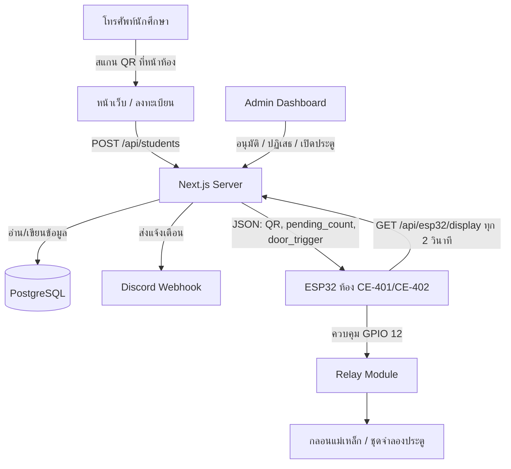
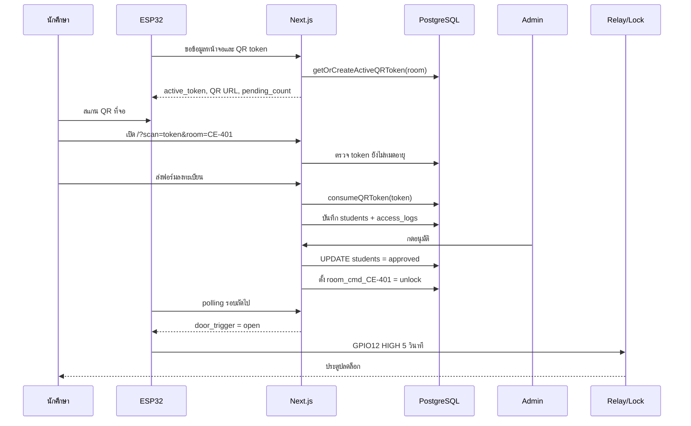
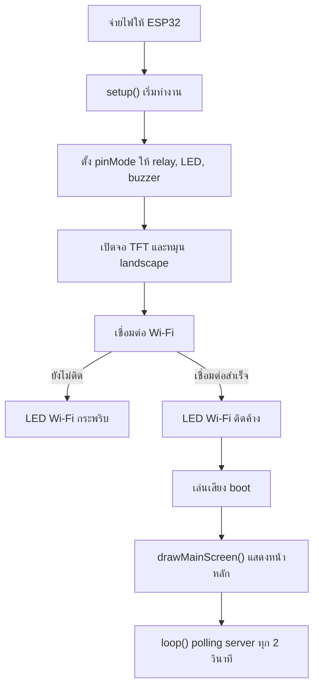
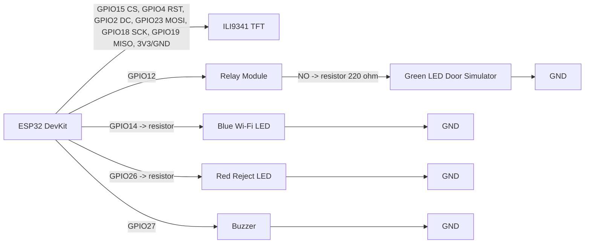
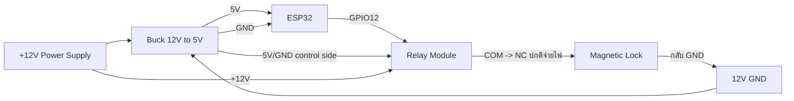
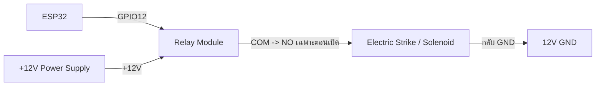
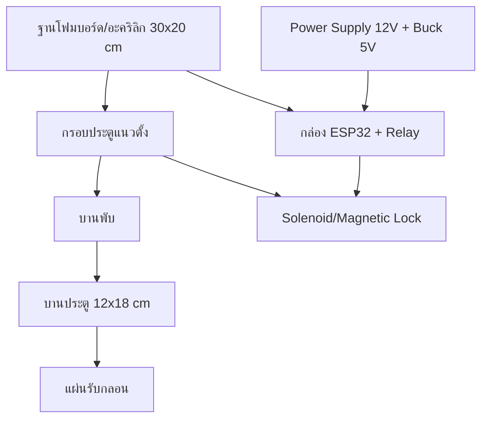
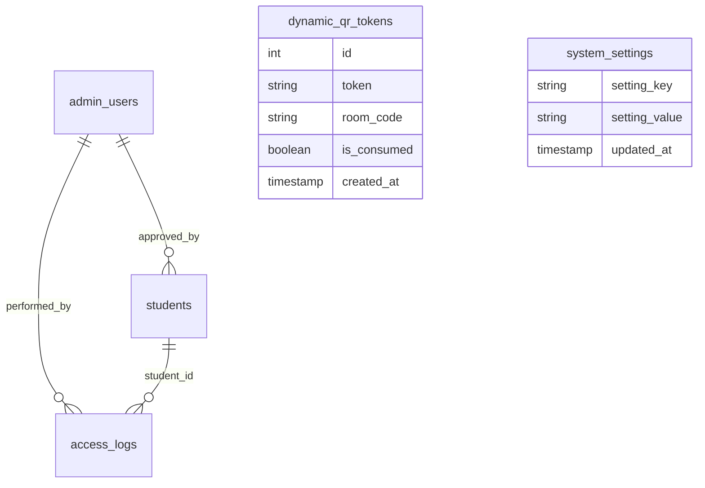
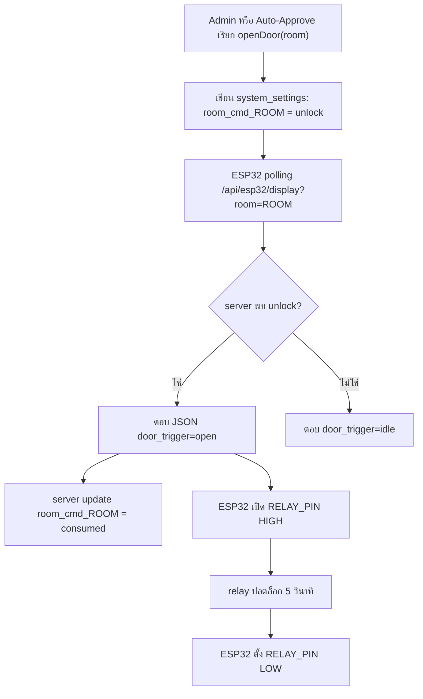

# คู่มือระบบควบคุมประตู RMUTP Door Access ฉบับละเอียด

วันที่จัดทำ: 26 พฤษภาคม 2026  
โปรเจกต์อ้างอิง: RMUTP Door Access System  
ขอบเขตคู่มือ: วิธีใช้งานเว็บ, วิธีใช้งานบอร์ด ESP32, วิธีต่อวงจร, วิธีทำชุดจำลองประตู, และคำอธิบายโค้ดรายฟังก์ชัน

> คู่มือนี้อธิบายจากโค้ดจริงในโปรเจกต์ปัจจุบัน โดยระบบเว็บอยู่ใน `my-app/` และเฟิร์มแวร์บอร์ดอยู่ใน `esp32/` กับ `esp32C1/`

---

## 1. ภาพรวมระบบ

ระบบนี้เป็นระบบควบคุมการเข้าใช้งานห้องผ่านเว็บและบอร์ด ESP32 โดยมีองค์ประกอบหลัก 4 ส่วน

1. เว็บ Next.js สำหรับนักศึกษาและผู้ดูแลระบบ
2. ฐานข้อมูล PostgreSQL สำหรับเก็บผู้ใช้, คำขอเข้าใช้งาน, log, token QR และค่าตั้งค่าระบบ
3. ESP32 พร้อมจอ ILI9341, relay, LED และ buzzer สำหรับแสดง QR และสั่งปลดล็อกประตู
4. Discord Webhook สำหรับแจ้งเตือนการลงทะเบียน, การอนุมัติ, การเปิดประตู และเหตุการณ์ระบบ

แนวคิดสำคัญของระบบปัจจุบันคือ ESP32 ไม่ได้รอรับคำสั่งแบบ local server เป็นหลัก แต่ใช้การ polling ขึ้นไปถามเว็บทุก 2 วินาทีที่ `/api/esp32/display?room=...` ถ้า server มีคำสั่ง `door_trigger: "open"` บอร์ดจะเปิด relay เพื่อปลดล็อกประตู แล้ว server จะเปลี่ยนคำสั่งในฐานข้อมูลเป็น consumed เพื่อไม่ให้เปิดซ้ำ

### ภาพที่ 1: สถาปัตยกรรมรวม



### ภาพที่ 2: ลำดับการใช้งานจริง



---

## 2. โครงสร้างไฟล์สำคัญ

```text
Project/
  my-app/
    app/
      page.tsx                         หน้าเว็บลงทะเบียนของนักศึกษา
      admin/login/page.tsx             หน้าเข้าสู่ระบบ Admin
      admin/dashboard/page.tsx         แดชบอร์ดผู้ดูแลระบบ
      esp32-preview/page.tsx           หน้าจำลองจอ ESP32
      api/                             API ทั้งหมดของระบบ
    lib/
      db.ts                            เชื่อม PostgreSQL และสร้างตาราง
      auth.ts                          JWT และ cookie session ของ Admin
      qr.ts                            สร้างและตรวจ token QR
      esp32.ts                         คิวคำสั่งเปิดประตูและสถานะ ESP32
      discord.ts                       ส่ง Discord webhook
      pdf.ts                           สร้าง PDF รายงาน
      rate-limit.ts                    จำกัดจำนวน request ด้วย PostgreSQL
      faculties.ts                     รายชื่อคณะและสาขา
    proxy.ts                           ป้องกันเส้นทาง /admin/dashboard
    next.config.ts                     security headers และ Next config
  esp32/
    esp32.ino                          เฟิร์มแวร์บอร์ดห้อง CE-402
    config.h.template                  template ตั้งค่า Wi-Fi/server/API key
    diagram.json                       วงจร Wokwi
    wokwi.toml                         ตั้งค่า Wokwi simulator
  esp32C1/
    esp32C1.ino                        เฟิร์มแวร์บอร์ดห้อง CE-401
    config.h.template                  template ตั้งค่าห้อง CE-401
```

---

## 3. การติดตั้งและรันเว็บ

### 3.1 เตรียม Node.js และ package

เข้าไปที่โฟลเดอร์เว็บ

```bash
cd my-app
npm install
```

รัน dev server

```bash
npm run dev
```

เปิดเว็บ

```text
http://localhost:3000
```

หน้า Admin

```text
http://localhost:3000/admin/login
```

หน้าจำลอง ESP32

```text
http://localhost:3000/esp32-preview
```

### 3.2 ตัวแปรสภาพแวดล้อมที่ควรตั้งค่า

สร้างไฟล์ `my-app/.env.local`

```env
POSTGRES_HOST=your-db-host
POSTGRES_PORT=5432
POSTGRES_USER=your-db-user
POSTGRES_PASSWORD=your-db-password
POSTGRES_DATABASE=postgres

JWT_SECRET=change-this-to-a-long-random-secret

NEXT_PUBLIC_APP_URL=http://localhost:3000

ESP32_API_KEY=change-this-to-the-same-key-in-config-h
ESP32_MOCK_MODE=false
ESP32_WOKWI=false
ESP32_IP=192.168.1.100
ESP32_PORT=80

DISCORD_WEBHOOK_URL=

ALLOW_DEV_SEED=true
INITIAL_ADMIN_USERNAME=admin
INITIAL_ADMIN_PASSWORD=admin123456
INITIAL_ADMIN_FULL_NAME=System Administrator
```

หมายเหตุสำคัญ:

- โค้ดปัจจุบันใช้ PostgreSQL ผ่านแพ็กเกจ `pg`
- ใน production ห้ามใช้ `JWT_SECRET` ค่า default
- ใน production ห้ามใช้ `ESP32_API_KEY` ค่า placeholder
- ถ้าใช้ Vercel/Supabase ให้ตั้งตัวแปรทั้งหมดใน Project Settings ของ Vercel
- `ALLOW_DEV_SEED=true` ใช้เฉพาะ development เพื่อสร้าง admin เริ่มต้น

---

## 4. วิธีใช้งานเว็บสำหรับนักศึกษา

### 4.1 เข้าใช้งานผ่าน QR เท่านั้น

หน้า `/` ถูกออกแบบให้เข้าใช้งานผ่านลิงก์ที่มี token เช่น

```text
/?scan=<token>&room=CE-401
```

ถ้าเปิด `/` ตรง ๆ โดยไม่มี `scan` ระบบจะแสดงหน้าว่าถูกจำกัดการเข้าถึง เพราะต้องสแกน QR ที่จอหน้าห้องก่อน

### 4.2 ขั้นตอนใช้งาน

1. ไปที่หน้าห้องที่มีบอร์ด ESP32
2. เปิดกล้องโทรศัพท์แล้วสแกน QR บนจอ
3. เว็บจะเปิดหน้าลงทะเบียนพร้อม room เช่น `CE-401`
4. กรอกคำนำหน้า, ชื่อ, นามสกุล, รหัสนักศึกษา, ชั้นปี, คณะ, สาขา
5. กดส่งข้อมูลขอเปิดประตู
6. ถ้าอยู่ในช่วง auto-approve ระบบจะอนุมัติและสั่งเปิดประตูทันที
7. ถ้าอยู่นอกช่วง auto-approve คำขอจะเข้า queue ให้ Admin ตรวจสอบ
8. หลังส่งสำเร็จ หน้าเว็บจะ polling สถานะทุก 3 วินาทีเพื่อตรวจว่า approved หรือ rejected แล้วหรือยัง

### 4.3 เงื่อนไข QR token

ระบบมี token 2 ชั้น

1. ตอนเปิดหน้าเว็บ: `/api/esp32/qr/verify` ตรวจว่า token ยัง valid แต่ยังไม่ consume
2. ตอนส่งฟอร์ม: `/api/students` เรียก `consumeQRToken()` เพื่อใช้ token จริงและกันการส่งซ้ำ

ค่าที่ใช้ในโค้ด:

- QR token rotation: 60 วินาที
- QR token expiry: 300 วินาที
- หน้าเว็บมีตัวจับเวลาฝั่ง client 120 วินาทีหลังผ่านการตรวจ token

### 4.4 ระบบ Auto-fill

ถ้านักศึกษาเคยลงทะเบียนมาก่อนและกรอกชื่อ, นามสกุล, รหัสนักศึกษาตรงกับประวัติ ระบบจะเรียก `/api/students/check-match` เพื่อดึงชั้นปี, คณะ, สาขาเดิมมาเติมให้

โหมด Auto-fill มี 2 แบบ:

- `auto`: เติมให้อัตโนมัติ
- `manual`: แสดงปุ่มให้ผู้ใช้กดยืนยันก่อนเติม

### 4.5 ระบบ Offline Queue

ถ้าอินเทอร์เน็ตหลุดระหว่างใช้งาน หน้าเว็บจะเก็บข้อมูลลง `localStorage` key `rmutp_offline_queue` แล้วพยายามส่งใหม่เมื่อ browser กลับมา online

ข้อควรระวัง: เพราะระบบใช้ QR token แบบใช้ครั้งเดียว ถ้า offline นานจน token หมดอายุ การส่งย้อนหลังอาจถูกปฏิเสธ ต้องสแกน QR ใหม่

### 4.6 ระบบ Bypass ภายใน 5 นาที

เมื่อผู้ใช้ได้รับอนุมัติแล้ว หน้าเว็บจะเก็บ session ใน `localStorage` key `rmutp_user_session` พร้อม `bypass_token`

ถ้ากลับมาสแกนซ้ำภายใน 5 นาที ระบบจะเรียก `/api/students/bypass` เพื่อเปิดประตูโดยไม่ต้องกรอกฟอร์มซ้ำ

---

## 5. วิธีใช้งานเว็บสำหรับ Admin

### 5.1 เข้าสู่ระบบ

เปิด

```text
http://localhost:3000/admin/login
```

กรอก username/password ที่มีในตาราง `admin_users`

เมื่อ login สำเร็จ ระบบจะสร้าง JWT และเก็บใน cookie ชื่อ `rmutp_admin_token`

### 5.2 บทบาทผู้ใช้

| Role | สิทธิ์หลัก |
|---|---|
| `owner` | เห็นข้อมูลทั้งหมด, อนุมัติ, ปฏิเสธ, เปิดประตู, ลบข้อมูล, export PDF, จัดการ admin, ตั้งค่าระบบ |
| `door_operator` | เข้า dashboard และใช้งานส่วนปฏิบัติการบางส่วน เช่นดู pending และสั่งเปิดประตูตามที่ UI เปิดให้ |

### 5.3 แท็บสำคัญใน Dashboard

| แท็บ | ใช้ทำอะไร |
|---|---|
| คิวรอตรวจสอบ | ดูคำขอใหม่, กดอนุมัติหรือปฏิเสธ |
| ทำเนียบและประวัติ | ค้นหานักศึกษา, เปิดประตูรายบุคคล, export PDF, ดู access logs |
| ผู้ดูแลระบบ | เพิ่มหรือลบ admin |
| ห้องเรียนและ ESP32 | เพิ่มห้อง, ตั้ง IP, ทดสอบบอร์ด, ปลดล็อกด่วน |
| ตั้งค่าระบบ | ตั้ง auto-approve, auto-fill, Discord webhook, การแสดงรหัสนักศึกษา |
| คู่มือ | คู่มือย่อใน dashboard |

### 5.4 อนุมัติคำขอ

เมื่อกดอนุมัติ ระบบจะทำงานดังนี้

1. เรียก `POST /api/students/{id}/approve`
2. ตรวจ cookie ว่าเป็น admin และต้องเป็น `owner`
3. อัปเดต `students.status = 'approved'`
4. เรียก `openDoor(student_id, requested_room)`
5. `openDoor()` เขียน `room_cmd_<room> = unlock` ลง `system_settings`
6. บอร์ด ESP32 polling มาเจอคำสั่งและเปิด relay
7. บันทึก `access_logs`
8. ส่ง Discord notification

### 5.5 ปฏิเสธคำขอ

เมื่อกดปฏิเสธ ระบบจะทำงานดังนี้

1. เรียก `POST /api/students/{id}/reject`
2. ตรวจสิทธิ์ `owner`
3. อัปเดตสถานะเป็น `rejected`
4. เก็บ `rejection_reason`
5. บันทึก log และแจ้ง Discord

### 5.6 ปลดล็อกด่วนทั้งห้อง

ในแท็บห้องเรียนและ ESP32 กดปุ่มปลดล็อกห้อง เช่น CE-401

ระบบจะเรียก

```text
POST /api/system/unlock-room
```

body

```json
{ "room": "CE-401" }
```

จากนั้น server จะเขียน `room_cmd_CE-401 = unlock` ลงฐานข้อมูล และบอร์ดห้องนั้นจะเปิด relay เมื่อ polling รอบถัดไป

### 5.7 Export PDF

Owner สามารถ export ได้ 2 แบบ

1. รายงานรวมตามช่วงวันที่และสถานะ
2. รายงานรายบุคคล

API ที่ใช้คือ

```text
GET /api/export/pdf
GET /api/export/pdf?id=<student_id>
```

---

## 6. วิธีใช้งานบอร์ด ESP32

### 6.1 อุปกรณ์ที่ใช้กับบอร์ด

| อุปกรณ์ | หน้าที่ |
|---|---|
| ESP32 DevKit V1 | ตัวควบคุมหลัก |
| ILI9341 TFT 320x240 | แสดง QR, สถานะห้อง, คิว, ผู้อนุมัติล่าสุด |
| Relay Module 5V | สวิตช์ไฟให้กลอนหรือชุดจำลองประตู |
| Buzzer | ส่งเสียงตอน boot, กำลังตรวจ, อนุมัติ |
| LED Wi-Fi | แสดงสถานะเชื่อมต่อ Wi-Fi |
| LED Reject | เตรียมไว้สำหรับสถานะ reject |
| LED Door หรือ solenoid/maglock | แสดงหรือทำหน้าที่เป็นประตู |

### 6.2 สร้างไฟล์ config.h

คัดลอก template

```bash
copy esp32\config.h.template esp32\config.h
```

แก้ค่าหลัก

```cpp
const char *ssid = "ชื่อ Wi-Fi";
const char *password = "รหัสผ่าน Wi-Fi";
const char *server_url = "https://your-domain.vercel.app/api/esp32/display?room=CE-402";
const char *room_code = "CE-402";
const char *api_key = "ค่าเดียวกับ ESP32_API_KEY บน server";
```

ถ้าใช้ `esp32C1/` ให้ตั้ง room เป็น `CE-401`

### 6.3 ติดตั้ง library ใน Arduino IDE

ต้องมี library ต่อไปนี้

- Adafruit GFX Library
- Adafruit ILI9341
- ArduinoJson เวอร์ชัน 6.x
- WiFi และ HTTPClient มากับ ESP32 Arduino Core
- `ricmoo_qrcode.c/.h` อยู่ในโปรเจกต์แล้ว

### 6.4 Upload firmware

1. เปิด Arduino IDE
2. เลือก board เป็น ESP32 Dev Module หรือ ESP32 DevKit
3. เปิด `esp32/esp32.ino`
4. ตรวจว่า `config.h` อยู่ในโฟลเดอร์เดียวกับ `.ino`
5. กด Verify
6. กด Upload
7. เปิด Serial Monitor ที่ 115200 baud

### 6.5 การทำงานตอนเปิดบอร์ด



### 6.6 การทำงานใน loop()

ทุก 2 วินาทีบอร์ดจะทำงานนี้

1. ตรวจว่า Wi-Fi ยังเชื่อมอยู่หรือไม่
2. สร้างเวลาปัจจุบันจาก `millis()` หรือใช้ `server_time_text` จาก server
3. เปิด HTTP/HTTPS ไปที่ `server_url`
4. ส่ง header `x-api-key`
5. อ่าน JSON จาก `/api/esp32/display`
6. ดึงค่า `pending_count`, `last_approved`, `active_token`, `register_url`, `door_trigger`
7. สร้าง URL สำหรับ QR เป็น `/?scan=<active_token>&room=<requested_room>`
8. ถ้า `door_trigger == "open"` ให้เปิด relay 5 วินาที
9. ถ้าข้อมูลเปลี่ยน ให้ redraw ทั้งหน้าจอ
10. ถ้าไม่มีข้อมูลเปลี่ยน ให้ redraw เฉพาะนาฬิกาเพื่อลดจอกะพริบ

---

## 7. วิธีเปิด Wokwi Simulator

ไฟล์ที่เกี่ยวข้อง:

- `esp32/diagram.json`
- `esp32/wokwi.toml`
- `esp32/build_wokwi.bat`

ขั้นตอน

1. ติดตั้ง VS Code
2. ติดตั้ง extension Wokwi Simulator
3. ติดตั้ง Arduino CLI
4. เปิดโฟลเดอร์โปรเจกต์ใน VS Code
5. เปิดไฟล์ `esp32/diagram.json`
6. รัน `esp32/build_wokwi.bat` เพื่อ compile firmware
7. กด `F1`
8. เลือก `Wokwi: Start Simulator`

ถ้าต้องการให้ Next.js เชื่อมกับ Wokwi ให้ตั้งใน `.env.local`

```env
ESP32_WOKWI=true
ESP32_WOKWI_URL=http://localhost:8180
```

หมายเหตุ: `wokwi.toml` มี port forwarding จาก `localhost:8180` ไปที่ simulated ESP32 port 80 แต่ firmware ปัจจุบันใช้ cloud polling เป็นหลัก ไม่ได้เปิด endpoint `/door/open` บน ESP32 ดังนั้นสถานะและคำสั่งเปิดประตูหลักจะยังอ้างอิงฐานข้อมูลผ่าน `/api/esp32/display`

---

## 8. การต่อวงจรตาม Wokwi

### 8.1 ตารางต่อจอ ILI9341

| ILI9341 | ESP32 | สีสายตาม diagram | หน้าที่ |
|---|---|---|---|
| VCC | 3V3 | แดง | ไฟเลี้ยงจอ |
| GND | GND | ดำ | กราวด์ |
| CS | D15 / GPIO15 | ส้ม | เลือกอุปกรณ์ SPI |
| RST | D4 / GPIO4 | เทา | reset จอ |
| D/C | D2 / GPIO2 | เขียว | data/command |
| MOSI | D23 / GPIO23 | น้ำเงิน | ส่งข้อมูลจาก ESP32 ไปจอ |
| SCK | D18 / GPIO18 | เหลือง | clock SPI |
| MISO | D19 / GPIO19 | ม่วง | อ่านข้อมูลกลับ |
| LED | 3V3 | แดง | backlight |

### 8.2 ตารางต่อ relay

| Relay Module | ESP32 | หน้าที่ |
|---|---|---|
| VCC | VIN | ไฟเลี้ยง relay module 5V |
| GND | GND | กราวด์ร่วม |
| IN | D12 / GPIO12 | สัญญาณควบคุมจากโค้ด `RELAY_PIN` |
| COM | VIN ใน Wokwi | จุด common ของสวิตช์ relay |
| NO | LED door ผ่าน resistor | ปลายสวิตช์ที่ต่อเมื่อตัว relay ทำงาน |

### 8.3 ตารางต่อ LED และ buzzer

| อุปกรณ์ | ขาแรก | ขาที่สอง | หน้าที่ |
|---|---|---|---|
| LED Door สีเขียว | relay NO -> resistor 220 ohm -> anode | cathode -> GND | จำลองกลอน/ประตู |
| LED Wi-Fi สีน้ำเงิน | GPIO14 -> resistor 220 ohm -> anode | cathode -> GND | แสดง Wi-Fi |
| LED Reject สีแดง | GPIO26 -> resistor 220 ohm -> anode | cathode -> GND | แสดง reject |
| Buzzer | GPIO27 | GND | เสียงแจ้งเตือน |

### ภาพที่ 3: วงจรจำลองใน Wokwi



---

## 9. การต่อวงจรประตูจริง

คำเตือนสำคัญ:

- ห้ามต่อ 12V เข้าขา GPIO ของ ESP32 เด็ดขาด
- ห้ามใช้ ESP32 จ่ายไฟให้กลอนแม่เหล็กโดยตรง
- กลอนแม่เหล็กหรือ solenoid ต้องใช้แหล่งจ่ายไฟแยกตามสเปก เช่น 12V 2A หรือ 12V 5A
- ถ้าใช้ solenoid หรือ magnetic lock ที่เป็นขดลวด ควรใส่ diode กันไฟย้อน เช่น 1N4007 ถ้า module/lock ไม่มีวงจรป้องกันในตัว
- ก่อนต่อ ESP32 ให้ปรับ buck converter ให้ได้ 5V ด้วย multimeter ก่อน

### 9.1 อุปกรณ์สำหรับประตูจริง 1 ชุด

| อุปกรณ์ | จำนวน | หมายเหตุ |
|---|---:|---|
| ESP32 DevKit | 1 | ตัวควบคุม |
| Relay Module 5V | 1 | ควรใช้แบบ optocoupler ถ้ามี |
| Power supply 12V | 1 | เลือกกระแสตาม lock เช่น 2A ถึง 5A |
| Buck converter 12V to 5V | 1 | ลดไฟให้ ESP32/relay |
| Magnetic lock หรือ electric strike/solenoid | 1 | เลือกชนิดตามงาน |
| Diode 1N4007 | 1 | คร่อม coil ถ้าจำเป็น |
| สายไฟและ terminal block | ตามจริง | แยกสายสัญญาณกับสายไฟกำลัง |

### 9.2 แบบ A: Magnetic lock แบบ fail-safe

Magnetic lock ทั่วไปจะล็อกเมื่อมีไฟ 12V และปลดล็อกเมื่อไฟถูกตัด ดังนั้นต้องใช้ขา NC ของ relay



สถานะ:

- ปกติ relay ไม่ทำงาน: COM ต่อกับ NC, magnetic lock ได้ไฟ, ประตูล็อก
- ตอนเปิดประตู `RELAY_PIN = HIGH`: relay สลับจาก NC ไป NO, ไฟ lock ถูกตัด, ประตูปลดล็อก 5 วินาที
- หลัง 5 วินาที `RELAY_PIN = LOW`: lock ได้ไฟกลับมาและล็อกอีกครั้ง

### 9.3 แบบ B: Electric strike หรือ solenoid ที่จ่ายไฟเพื่อปลดล็อก

ถ้าอุปกรณ์ปลดล็อกเมื่อได้รับไฟ 12V ให้ใช้ขา NO



สถานะ:

- ปกติ relay ไม่ทำงาน: NO เปิดวงจร, strike ไม่ได้ไฟ
- ตอนเปิดประตู: relay ทำงาน, NO ปิดวงจร, strike ได้ไฟและปลดล็อก
- หลัง 5 วินาที: relay ปิด, strike ไม่ได้ไฟ

### 9.4 การต่อกราวด์

ฝั่งควบคุม relay ต้องมีกราวด์ร่วมกับ ESP32

```text
ESP32 GND ------------- Relay GND
Buck 5V GND ----------- ESP32 GND
```

ฝั่งโหลด 12V ของ lock สามารถแยกตามรูปแบบ module แต่ในงานทั่วไปมักมีกราวด์ร่วมผ่าน power supply และ buck converter

---

## 10. วิธีทำอุปกรณ์จำลองประตูติดกับบอร์ด

มี 2 แบบที่แนะนำ

### 10.1 แบบง่าย: ใช้ LED จำลองประตู

เหมาะสำหรับนำเสนอในห้องเรียนหรือทดสอบ logic โดยไม่ใช้ไฟ 12V

อุปกรณ์:

- LED สีเขียว 1 ดวง
- Resistor 220 ohm 1 ตัว
- Relay module 1 ตัว
- Breadboard และสาย jumper

วิธีทำ:

1. ต่อ ESP32 GPIO12 ไปที่ relay IN
2. ต่อ relay VCC ไปที่ VIN ของ ESP32 หรือ 5V จาก buck
3. ต่อ relay GND ไปที่ ESP32 GND
4. ต่อ relay COM ไปที่ 5V
5. ต่อ relay NO ไปที่ resistor 220 ohm
6. ต่อ resistor ไปที่ anode ของ LED
7. ต่อ cathode ของ LED ไป GND
8. เมื่อระบบเปิดประตู LED จะติด 5 วินาที แปลว่าประตูถูกปลดล็อก

### 10.2 แบบสมจริง: ทำประตูจำลองขนาดเล็ก

อุปกรณ์:

| อุปกรณ์ | แนะนำ |
|---|---|
| แผ่นโฟมบอร์ดหรืออะคริลิก | ฐาน 30 x 20 cm |
| แผ่นทำบานประตู | 12 x 18 cm |
| บานพับเล็ก | 1 ถึง 2 ตัว |
| กลอน solenoid 12V หรือ mini magnetic lock | 1 ตัว |
| เหล็กรับกลอนหรือแผ่น strike plate | 1 ชิ้น |
| Relay module | 1 ตัว |
| Power supply 12V | 1 ตัว |
| Buck converter | 1 ตัว |
| กล่องพลาสติกใส่ ESP32/relay | 1 กล่อง |
| สกรู, กาวร้อน, cable tie | ตามจำเป็น |

ขั้นตอนทำโครง:

1. ตัดแผ่นฐานประมาณ 30 x 20 cm
2. ตัดแผ่นแนวตั้งเป็นกรอบประตูสูงประมาณ 20 cm
3. ติดกรอบประตูลงบนฐานด้วยกาวร้อนหรือสกรู
4. ตัดบานประตูขนาดประมาณ 12 x 18 cm
5. ติดบานพับด้านซ้ายของบานประตูเข้ากับกรอบ
6. ทดลองเปิดปิดให้ไม่ฝืดและไม่ติดพื้น
7. ติด solenoid หรือ magnetic lock ที่กรอบด้านขวา
8. ติดแผ่นรับกลอนที่บานประตูให้ตรงตำแหน่ง lock
9. ติดกล่อง ESP32 และ relay ไว้ด้านหลังฐานหรือด้านข้าง
10. เจาะรูเล็กสำหรับเดินสายให้เรียบร้อย
11. ติดป้ายชื่อสาย เช่น 12V, GND, GPIO12, LOCK

ขั้นตอนต่อไฟ:

1. ต่อ power supply 12V เข้า terminal block
2. ต่อ 12V เข้า buck converter
3. ปรับ buck output ให้ได้ 5.0V ก่อนเสียบ ESP32
4. ต่อ 5V จาก buck เข้า VIN ของ ESP32
5. ต่อ GND จาก buck เข้า GND ของ ESP32
6. ต่อ GPIO12 เข้า relay IN
7. ต่อ relay VCC/GND เข้าฝั่ง 5V/GND
8. เลือกต่อ lock ผ่าน NC หรือ NO ตามชนิด lock ตามหัวข้อ 9.2 หรือ 9.3
9. ใส่ diode คร่อมขดลวด solenoid ถ้า lock ไม่มีวงจรป้องกัน
10. เปิดไฟและทดสอบด้วยการกดปลดล็อกใน dashboard

### ภาพที่ 4: โครงประตูจำลอง



---

## 11. ฐานข้อมูลและตารางสำคัญ

ระบบสร้างตารางใน `initDatabase()` ของ `my-app/lib/db.ts`

| ตาราง | หน้าที่ |
|---|---|
| `admin_users` | เก็บบัญชี admin, password hash, role, last_login |
| `students` | เก็บผู้ลงทะเบียน, สถานะ, ห้อง, token bypass, เวลาการเปิดประตู |
| `access_logs` | เก็บ audit log ทุกเหตุการณ์ |
| `dynamic_qr_tokens` | เก็บ QR token แยกตามห้องและสถานะ consumed |
| `system_settings` | เก็บ config เช่น auto approve, room IP, webhook, command queue |
| `rate_limits` | เก็บตัวนับ rate limit แบบ serverless-safe |

### ภาพที่ 5: ความสัมพันธ์ข้อมูลหลัก



---

## 12. อธิบายโค้ดฝั่ง ESP32 รายฟังก์ชัน

ไฟล์หลัก:

- `esp32/esp32.ino`: ใช้กับห้อง CE-402 ตาม template
- `esp32C1/esp32C1.ino`: ใช้กับห้อง CE-401

โครงสร้างทั้งสองไฟล์เหมือนกัน ต่างที่ `config.h` และ room target

### 12.1 ตัวแปรและ pin

| ชื่อ | ค่า | หน้าที่ |
|---|---:|---|
| `TFT_CS` | 15 | ขา CS ของจอ ILI9341 |
| `TFT_RST` | 4 | reset จอ |
| `TFT_DC` | 2 | data/command |
| `RELAY_PIN` | 12 | สั่ง relay เปิดประตู |
| `LED_WIFI` | 14 | LED สถานะ Wi-Fi |
| `LED_REJECT` | 26 | LED สถานะปฏิเสธ |
| `BUZZER_PIN` | 27 | buzzer |
| `polling_delay` | 2000 ms | หน่วงเวลา polling server |
| `last_queue_count` | -1 | เก็บคิวล่าสุดเพื่อลด redraw |
| `last_approved_name` | empty | เก็บ student id ล่าสุด |
| `last_active_token` | empty | เก็บ token ล่าสุด |
| `ip_address_str` | `0.0.0.0` | แสดง IP ของบอร์ด |

### 12.2 `drawQRCode(String qrText, int startX, int startY, int boxSize)`

หน้าที่: สร้าง QR code จากข้อความ URL แล้ววาดลงจอ TFT

การทำงานละเอียด:

1. สร้าง object `QRCode qrcode`
2. เลือก QR version 7 ถ้าข้อความไม่ยาวเกิน 154 ตัวอักษร
3. ถ้ายาวเกิน 154 ตัวอักษรใช้ version 9
4. จอง buffer ด้วย `qrcode_getBufferSize(qrVersion)`
5. เรียก `qrcode_initText()` เพื่อแปลงข้อความเป็น matrix QR
6. กำหนด `scale = 2` เพื่อขยายจุด QR ให้มือถือสแกนง่าย
7. คำนวณ `paddingX` และ `paddingY` เพื่อจัด QR ให้อยู่กลางกรอบ
8. วาดพื้นหลังสีขาวด้วย `tft.fillRect()`
9. วน loop ทุกตำแหน่งของ QR matrix
10. ถ้า module เป็นสีดำ ให้ใช้ `tft.fillRect()` วาดจุดสีดำ

### 12.3 `drawMainScreen(int queueCount, String lastApprovedName, String timeStr, String qrText)`

หน้าที่: วาดหน้าจอปกติของบอร์ด

สิ่งที่วาด:

- แถบหัวจอ RMUTP DOOR ACCESS และสถานะ ACTIVE
- เวลา
- กรอบ QR ทางซ้าย
- ข้อความ SCAN FOR ACCESS
- ห้องจากตัวแปร `room_code`
- จำนวนคิวรออนุมัติ
- student id ล่าสุดที่อนุมัติ
- IP ของบอร์ดด้านล่าง

เงื่อนไขสำคัญ:

- ถ้า `qrText.length() > 0` จะเรียก `drawQRCode()`
- ถ้าไม่มี QR จะวาดกล่องขาวและข้อความ Loading QR
- ถ้ามี `lastApprovedName` จะวาดกล่อง LATEST APPROVED
- ถ้าไม่มี จะวาดข้อความ NO RECENT ACCESS

### 12.4 `drawScanningScreen()`

หน้าที่: แสดงหน้าจอกำลังตรวจสอบ

ใช้ตอนบอร์ดได้รับคำสั่งเปิดประตูแล้วแต่ก่อนแสดง approved เพื่อให้ผู้ใช้เห็นว่าระบบกำลังประมวลผล

องค์ประกอบ:

- พื้นหลังสีน้ำเงินเข้ม
- วงกลมจำลองการ scan
- ข้อความ PROCESSING
- ข้อความ VERIFYING REQUEST WITH SERVER

### 12.5 `drawUnlockedScreen(String approvedName, String studentId)`

หน้าที่: แสดงหน้าจออนุมัติและปลดล็อกสำเร็จ

การทำงาน:

1. ล้างจอด้วยพื้นหลังสีเขียวเข้ม
2. วาดวงกลมสีเขียวตรงกลาง
3. แสดงเครื่องหมายถูกด้วยตัวอักษร `v`
4. แสดง ACCESS GRANTED
5. แสดง DOOR UNLOCKED
6. แสดงข้อความ VERIFIED MEMBER
7. แสดง `studentId`

หมายเหตุ: ฟังก์ชันรับ `approvedName` แต่โค้ดเลือกแสดง status ภาษาอังกฤษเพื่อลดปัญหาฟอนต์ไทยบนจอ

### 12.6 `drawRejectedScreen()`

หน้าที่: วาดหน้าจอปฏิเสธการเข้าใช้งาน

โค้ดปัจจุบันมีฟังก์ชันนี้ไว้แสดงกรณี denied แต่ flow หลักใน `loop()` ยังไม่ได้เรียกจาก JSON โดยตรง เพราะ server ส่ง `door_trigger` เป็น open หรือ idle เป็นหลัก

### 12.7 `setup()`

หน้าที่: เตรียมบอร์ดทั้งหมดตอนเปิดเครื่อง

ลำดับละเอียด:

1. เปิด Serial ที่ 115200
2. ตั้ง `RELAY_PIN`, `LED_WIFI`, `LED_REJECT`, `BUZZER_PIN` เป็น output
3. ตั้ง relay เป็น LOW เพื่อให้ประตูอยู่สถานะล็อกตอนเริ่มต้น
4. ปิด LED Wi-Fi และ LED Reject
5. เริ่มจอ TFT ด้วย `tft.begin()`
6. หมุนจอเป็นแนวนอนด้วย `tft.setRotation(1)`
7. วาดหน้าจอ CONNECTING WIFI
8. เรียก `WiFi.begin(ssid, password)`
9. ระหว่างรอ Wi-Fi ให้ LED Wi-Fi กระพริบทุก 400 ms
10. เมื่อเชื่อมต่อสำเร็จให้ LED Wi-Fi ติดค้าง
11. เก็บ IP ลง `ip_address_str`
12. เล่นเสียง boot melody ด้วย `tone()`
13. วาดหน้าจอหลักด้วย `drawMainScreen(0, "", "12:00:00", "")`

### 12.8 `loop()`

หน้าที่: เป็นวงจรหลักของบอร์ด

ลำดับละเอียด:

1. ตรวจ `WiFi.status()`
2. ถ้า Wi-Fi ต่ออยู่ ให้ LED Wi-Fi ติดค้าง
3. คำนวณเวลาแบบง่ายจาก `millis()`
4. สร้าง `HTTPClient`
5. ถ้า `server_url` เป็น HTTPS ให้ใช้ `WiFiClientSecure`
6. ตั้ง CA certificate ด้วย `client->setCACert(root_ca_cert)`
7. เรียก `http.begin()`
8. ตั้ง timeout 1200 ms
9. เพิ่ม header `Content-Type: application/json`
10. เพิ่ม header `x-api-key: api_key`
11. ยิง `GET`
12. ถ้า HTTP 200 ให้อ่าน JSON
13. parse ด้วย `StaticJsonDocument<768>`
14. อ่าน `door_trigger`, `pending_count`, `server_time_text`, `last_approved`, `active_token`, `register_url`, `requested_room`
15. สร้าง `qrText` เป็นลิงก์ `/?scan=<token>&room=<room>`
16. ถ้า `door_trigger == "open"` ให้เข้าลำดับปลดล็อก
17. ถ้าข้อมูลเปลี่ยน ให้วาดหน้าจอหลักใหม่
18. ถ้าข้อมูลไม่เปลี่ยน ให้อัปเดตเฉพาะเวลา
19. ถ้า Wi-Fi หลุด ให้กระพริบ LED Wi-Fi
20. หน่วงเวลา `polling_delay`

ลำดับปลดล็อกใน `loop()`:

1. เรียก `drawScanningScreen()`
2. ส่งเสียง 1500 Hz 100 ms
3. หน่วง 1200 ms
4. เรียก `drawUnlockedScreen()`
5. ตั้ง `RELAY_PIN` เป็น HIGH
6. เล่นเสียง 1000, 1500, 2000 Hz
7. วาด countdown bar ประมาณ 3.8 วินาที
8. ตั้ง `RELAY_PIN` เป็น LOW
9. เล่นเสียงปิด 800 Hz
10. reset cache state เพื่อบังคับ redraw รอบถัดไป

---

## 13. อธิบายโค้ดฝั่งเว็บและ API รายฟังก์ชัน

### 13.1 `my-app/lib/db.ts`

| ฟังก์ชัน | หน้าที่ | รายละเอียด |
|---|---|---|
| `readEnv(name)` | อ่านค่า env | trim ค่า, ลบ quote รอบนอกถ้ามี, คืน `undefined` ถ้าว่าง |
| `readCaCert()` | อ่าน CA cert | อ่าน `SUPABASE_CA_CERT`, แปลง `\n`, กันค่า placeholder |
| `getPool()` | สร้าง PostgreSQL pool | ใช้ singleton บน `globalThis`, parse `POSTGRES_URL` หรือ env แยก, ตั้ง SSL, max pool, timeout และ keepAlive |
| `initDatabase()` | สร้าง schema และ seed | สร้างตาราง, index, default settings, seed admin ตาม env, ป้องกัน seed default ใน production |
| `clearSystemSettingsCache()` | ล้าง settings cache | ทำให้การอ่าน settings ครั้งถัดไปดึง DB ใหม่ |
| `getSystemSettings(options)` | อ่าน setting ทั้งหมด | cache 30 วินาทีเพื่อลด query จาก ESP32 polling |
| `updateSystemSetting(key, value)` | บันทึก setting เดี่ยว | upsert ลง `system_settings` และล้าง cache |
| `updateSystemSettings(settings)` | บันทึกหลาย setting | ใช้ `UNNEST` กับ `ON CONFLICT` เพื่อ update หลาย key ในครั้งเดียว |

Interface สำคัญ:

- `StudentRow`: shape ของข้อมูลนักศึกษา
- `AdminRow`: shape ของ admin
- `AccessLogRow`: shape ของ log

### 13.2 `my-app/lib/auth.ts`

| ฟังก์ชัน | หน้าที่ | รายละเอียด |
|---|---|---|
| `verifyJwtSecretSecurity()` | ตรวจความปลอดภัย JWT | ใน production ถ้าใช้ secret default จะ throw error |
| `signToken(payload)` | สร้าง JWT | ใช้ HS256 ผ่าน `jsonwebtoken`, หมดอายุใน 8 ชั่วโมง |
| `verifyToken(token)` | ตรวจ JWT | คืน payload ถ้าถูกต้อง, คืน null ถ้าหมดอายุหรือผิด |
| `getAdminFromCookie()` | อ่าน admin จาก cookie | อ่าน `rmutp_admin_token`, verify แล้วคืนข้อมูล admin |
| `setAuthCookie(token)` | สร้าง options cookie | ตั้ง `httpOnly`, `sameSite=lax`, `secure` เฉพาะ production, maxAge 8 ชั่วโมง |

### 13.3 `my-app/lib/qr.ts`

| ฟังก์ชัน | หน้าที่ | รายละเอียด |
|---|---|---|
| `generateQRCodeBuffer(text)` | สร้าง PNG buffer | ใช้กับ endpoint QR ให้ ESP32/preview โหลดเป็นภาพ |
| `generateQRCodeDataURL(text, size)` | สร้าง Data URL | ใช้กับเว็บที่ต้องแสดง QR แบบ base64 |
| `generateQRCodeSVG(text)` | สร้าง SVG string | ใช้ preview หรือ export ที่ต้องเป็น vector |
| `generateSecureToken()` | สร้าง token | ใช้ `crypto.randomBytes(16).toString("hex")`, ได้ 32 hex chars |
| `getOrCreateActiveQRToken(roomCode)` | คืน token ปัจจุบันหรือสร้างใหม่ | ลบ token หมดอายุทุก 5 นาทีต่อห้อง, ใช้ token ที่ยังไม่ consume และไม่เกิน 60 วินาที, ถ้าไม่มีให้ insert ใหม่ |
| `consumeQRToken(token)` | ใช้ token แบบ atomic | ตรวจ format 32 hex, update `is_consumed = TRUE` ด้วยเงื่อนไขยังไม่หมดอายุ, ป้องกันหลายคนใช้ token เดียวกัน |
| `validateQRToken(token)` | ตรวจ token โดยไม่ consume | ใช้ตอนเปิดหน้าหลัง scan เพื่อให้ token ยังถูก consume ตอน submit จริง |

### 13.4 `my-app/lib/esp32.ts`

| ฟังก์ชัน | หน้าที่ | รายละเอียด |
|---|---|---|
| `verifyApiKeySecurity()` | ตรวจ API key | production ห้ามใช้ placeholder |
| `getESP32Mode()` | บอกโหมดเชื่อมต่อ | คืน `mock`, `wokwi` หรือ `physical` |
| `getESP32BaseUrl()` | คืน base URL | ใช้ `WOKWI_URL` หรือ `http://ESP32_IP:ESP32_PORT` |
| `isPrivateLanUrl(url)` | ตรวจ LAN/private IP | ใช้แยก localhost, 192.168, 10, 172.16-31 |
| `isCloudEnvironment()` | ตรวจ cloud runtime | ตรวจ env ของ Vercel/AWS/GCP |
| `getESP32Url(roomCode)` | หา URL บอร์ดตามห้อง | อ่าน `room_ip_<room>` จาก settings, fallback ไป `BASE_URL` |
| `fetchWithTimeout(url, options, timeoutMs)` | fetch พร้อม timeout | ใช้ `AbortController` กัน request ค้าง |
| `tryLanDirectBackground(url, studentId, roomCode)` | ยิงตรงไป ESP32 แบบ background | ใช้เป็น fast path เฉพาะ LAN แต่ firmware ปัจจุบันยังใช้ polling เป็นหลัก |
| `openDoor(studentId, roomCode)` | สั่งเปิดประตู | เขียน `room_cmd_<room> = unlock` ลง DB, mock mode ตอบสำเร็จทันที, ถ้าไม่ใช่ cloud อาจยิงตรงใน background |
| `getESP32Status(roomCode)` | ตรวจสถานะบอร์ด | mock ตอบ online, physical/wokwi ลอง ping โดยตรงถ้าทำได้, ถ้าอยู่ cloud กับ LAN IP จะใช้ heartbeat `room_last_seen_<room>` |
| `updateESP32Display(payload, roomCode)` | ส่งข้อมูล display ไป ESP32 | เตรียมไว้สำหรับ endpoint `/display` บนบอร์ด แต่ firmware ปัจจุบันยังไม่ได้เปิด endpoint นี้ |

### 13.5 `my-app/lib/discord.ts`

| ฟังก์ชัน | หน้าที่ | รายละเอียด |
|---|---|---|
| `sendDiscordNotification(eventType, data)` | ส่ง Discord embed | เลือก webhook ตามห้องและ event, fallback ไป global env, สร้าง embed ตามประเภท event, ส่งไป target webhook และ log webhook |

Event ที่รองรับ:

- `student_registered`
- `student_approved`
- `student_rejected`
- `door_opened`
- `door_failed`
- `esp32_offline`

### 13.6 `my-app/lib/rate-limit.ts`

| ฟังก์ชัน | หน้าที่ | รายละเอียด |
|---|---|---|
| `rateLimit(options)` | จำกัดจำนวน request | ใช้ตาราง `rate_limits`, query เดียวแบบ `INSERT ... ON CONFLICT DO UPDATE`, race-condition safe สำหรับ serverless |

### 13.7 `my-app/lib/pdf.ts`

| ฟังก์ชัน | หน้าที่ | รายละเอียด |
|---|---|---|
| `setupFonts(doc)` | โหลดฟอนต์ไทย | ใช้ `public/fonts/tahoma.ttf` หรือ Windows Tahoma, fallback Helvetica |
| `safeText(value, fonts)` | แปลงข้อความให้ปลอดภัยต่อ PDF | ถ้าไม่มีฟอนต์ไทยจะแทน non-ASCII ด้วย `?` |
| `formatThaiDateTime(date)` | format วันเวลาไทย | แปลงเป็น พ.ศ. และรูปแบบ `dd/mm/yyyy hh:mm น.` |
| `formatThaiDate(dateStr)` | format วันที่ | ใช้กับช่วงวันที่ export |
| `roomLabel(room)` | แสดงชื่อห้อง | คืน room หรือ `default` |
| `studentName(student)` | รวมชื่อเต็ม | รวมคำนำหน้า ชื่อ นามสกุล |
| `truncate(text, length)` | ตัดข้อความยาว | ใช้ในตาราง PDF |
| `addFooter(doc, fonts, margin)` | ใส่ footer ทุกหน้า | แสดงชื่อระบบและเลขหน้า |
| `header(doc, fonts, title, subtitle, margin)` | วาดหัวรายงาน | แถบสีเข้ม ชื่อมหาวิทยาลัย และชื่อรายงาน |
| `infoBox(doc, fonts, x, y, w, label, value)` | วาดกล่องข้อมูล | ใช้แสดงผู้จัดทำ วันที่ ตัวกรอง ช่วงวันที่ |
| `generateStudentsPDF(students, exportedBy, filter, startDate, endDate)` | สร้าง PDF รายงานรวม | วาด summary, ตารางรายชื่อ, สถานะ, ห้อง, วันเวลา |
| `generateSingleStudentPDF(student, exportedBy)` | สร้าง PDF รายบุคคล | วาดบัตรข้อมูล, รายละเอียด, หมายเหตุ และช่องลายเซ็น |

### 13.8 `my-app/lib/faculties.ts`

| ชื่อ | หน้าที่ |
|---|---|
| `RMUTP_FACULTIES` | object รายชื่อคณะและสาขาที่ใช้ validate ฟอร์มนักศึกษา |
| `FACULTY_NAMES` | array ชื่อคณะ ใช้สร้าง dropdown |

### 13.9 `my-app/proxy.ts`

| ฟังก์ชัน | หน้าที่ | รายละเอียด |
|---|---|---|
| `proxy(request)` | ป้องกัน route admin | ถ้าเข้า `/admin/dashboard` โดยไม่มี JWT จะ redirect ไป login, ถ้า token invalid จะลบ cookie |
| `config.matcher` | ระบุ route ที่ proxy ทำงาน | ใช้กับ `/admin`, `/admin/`, `/admin/dashboard/:path*` |

---

## 14. อธิบายหน้าเว็บหลัก

### 14.1 `app/page.tsx`

หน้าที่: หน้าแรกสำหรับนักศึกษาลงทะเบียน

Component และฟังก์ชันหลัก:

| ชื่อ | หน้าที่ |
|---|---|
| `QRAccessBlockedScreen()` | แสดงหน้าปฏิเสธถ้าไม่เข้าจาก QR token |
| `RegistrationPageInner()` | component หลักของฟอร์มลงทะเบียน |
| `applyManualAutoFill()` | เติมข้อมูลประวัติเดิมเมื่อ user กดยืนยัน |
| `getOfflineQueue()` | อ่าน queue offline จาก localStorage |
| `saveOfflineQueue(q)` | บันทึก queue offline และจำนวนคิว |
| `flushOfflineQueue()` | ส่งข้อมูล offline ที่ค้างอยู่เมื่อ online |
| `triggerBypass(session)` | เรียก `/api/students/bypass` เพื่อเปิดประตูซ้ำใน 5 นาที |
| `handleFacultyChange(faculty)` | เปลี่ยนคณะและรีเซ็ตสาขา |
| `handleStudentIdInput(raw)` | กรอง input รหัสนักศึกษาให้มีเฉพาะตัวเลขและขีด |
| `handleSubmit(e)` | validate ฟอร์ม, ส่ง API, จัดการ offline, เก็บ bypass token |
| `UserRegistrationPage()` | wrapper ที่ใส่ `Suspense` สำหรับ `useSearchParams()` |

useEffect สำคัญ:

- ตรวจ QR token และ session bypass ตอนโหลดหน้า
- จับเวลาหมดอายุ 120 วินาที
- debounce ตรวจประวัติ Auto-fill
- อัปเดตนาฬิกา
- ตรวจ online/offline
- polling status หลังส่งฟอร์ม
- เก็บ session เมื่อสถานะเปลี่ยนเป็น approved

### 14.2 `app/admin/login/page.tsx`

| ชื่อ | หน้าที่ |
|---|---|
| `AdminLoginPage()` | หน้า login admin |
| `handleLogin(e)` | ส่ง username/password ไป `/api/auth/login`, ถ้าสำเร็จ redirect dashboard |
| `KeyholeShieldIcon`, `EyeOpenIcon`, `EyeClosedIcon`, `CrownIcon`, `DoorKeyIcon`, `AlertIcon`, `ArrowLeftIcon`, `UnlockIcon` | SVG icon สำหรับ UI ไม่มี business logic |

### 14.3 `app/admin/dashboard/page.tsx`

หน้าที่: dashboard ผู้ดูแลระบบ

ฟังก์ชันหลัก:

| ชื่อ | หน้าที่ |
|---|---|
| `formatDateTime(dt)` | แปลงวันที่เป็นรูปแบบไทย พ.ศ. |
| `renderLogNotes(notes)` | แสดง notes ใน access log ให้อ่านง่าย |
| `AdminDashboard()` | component หลักของ dashboard |
| `playSoftChime()` | เล่นเสียงเมื่อคิว pending เพิ่ม |
| `fetchSettings()` | โหลด system settings |
| `handleOpenRoomDetails(room, ip)` | เปิด panel รายละเอียดห้อง |
| `handleSaveRoomWebhook()` | บันทึก webhook เฉพาะห้อง |
| `handleTestWebhook(webhookUrl, type, room)` | ทดสอบส่ง Discord webhook |
| `copyToClipboard(text)` | copy ข้อความผ่าน Clipboard API |
| `fallbackCopyToClipboard(text)` | copy แบบ fallback ด้วย textarea |
| `getConfigCode(roomCode, origin)` | สร้างตัวอย่าง `config.h` ตามห้อง |
| `getArduinoCode(roomCode, origin)` | สร้างตัวอย่าง firmware ตามห้อง |
| `highlightArduinoCode(code)` | ทำ syntax highlight แบบ HTML string |
| `saveSettings(e)` | บันทึก setting และรายการห้อง |
| `handleTestConnection(roomCode)` | เรียก `/api/esp32/status` เพื่อตรวจบอร์ด |
| `handleDirectUnlockRoom(roomCode)` | สั่งปลดล็อกห้องผ่าน `/api/system/unlock-room` |
| `handleAddRoom(e)` | เพิ่มห้องในรายการชั่วคราว |
| `handleRemoveRoom(roomCode)` | ลบห้องจากรายการชั่วคราว |
| `fetchSystemStatus()` | โหลดสถานะระบบรวม |
| `showToast(msg, type)` | แสดง toast |
| `fetchPending()` | โหลดคำขอ pending |
| `fetchAll()` | โหลดรายชื่อนักศึกษาทั้งหมด |
| `fetchLogs()` | โหลด access logs |
| `fetchAdmins()` | โหลดบัญชี admin |
| `handleApprove(id)` | กดอนุมัติคำขอ |
| `handleReject()` | กดปฏิเสธพร้อมเหตุผล |
| `handleOpenDoor(id)` | เปิดประตูให้ student ที่ approved |
| `handleDelete(id, name)` | ลบข้อมูลนักศึกษา |
| `handleDeleteAdmin(id)` | ลบ admin |
| `handleCreateAdmin(e)` | สร้าง admin ใหม่ |
| `handleExportPDFWithDateRange(filterType, start, end)` | ดาวน์โหลด PDF รายงานรวม |
| `handleExportSingleStudentPDF(id, name)` | ดาวน์โหลด PDF รายบุคคล |
| `handleLogout()` | logout และ redirect login |

Icon components ในไฟล์นี้ เช่น `ClockIcon`, `UsersIcon`, `SettingsIcon`, `TVIcon`, `LogoutIcon`, `LockIcon`, `UnlockIcon`, `TrashIcon`, `CheckIcon`, `CrossIcon`, `SaveIcon`, `FileTextIcon`, `CalendarIcon`, `PlusIcon`, `AlertIcon`, `TerminalIcon`, `CrownIcon`, `KeyIcon`, `SuccessBadgeIcon`, `IdCardIcon`, `GraduationIcon`, `FacultyIcon`, `BranchIcon`, `MenuIcon` มีหน้าที่วาด SVG เพื่อใช้ในปุ่มและหัวข้อ ไม่มี logic ด้านข้อมูล

### 14.4 `app/esp32-preview/page.tsx`

| ชื่อ | หน้าที่ |
|---|---|
| `ESP32Screen()` | จำลองหน้าจอ TFT 320x240 ใน browser |
| `ESP32PreviewPageInner()` | หน้า preview หลัก |
| `fetchDisplay(roomCode)` | โหลด JSON จาก `/api/esp32/display` |
| `fetchESP32Status(roomCode)` | โหลดสถานะจาก `/api/esp32/status` |
| `simulateApprove()` | จำลองหน้าจอ scanning -> approved -> idle |
| `simulateReject()` | จำลองหน้าจอ scanning -> rejected -> idle |
| `ESP32PreviewPage()` | wrapper พร้อม Suspense |

---

## 15. อธิบาย API routes

### 15.1 Auth

| Endpoint | ฟังก์ชัน | รายละเอียด |
|---|---|---|
| `POST /api/auth/login` | `POST()` | rate limit 5 ครั้ง/นาที/IP, ตรวจ bcrypt, สร้าง JWT, set cookie |
| `GET /api/auth/me` | `GET()` | อ่าน admin จาก cookie แล้วคืน user |
| `POST /api/auth/logout` | `POST()` | ลบ cookie `rmutp_admin_token` |

### 15.2 Admin users

| Endpoint | ฟังก์ชัน | รายละเอียด |
|---|---|---|
| `GET /api/admin-users` | `GET()` | owner เท่านั้น, คืน admin ทั้งหมด |
| `POST /api/admin-users` | `POST()` | owner เท่านั้น, validate role/password, hash password, insert admin |
| `DELETE /api/admin-users/{id}` | `DELETE()` | owner เท่านั้น, ห้ามลบบัญชีตัวเอง |

### 15.3 Students

| Endpoint | ฟังก์ชัน | รายละเอียด |
|---|---|---|
| `GET /api/students` | `GET()` | owner เท่านั้น, filter status/faculty/search/limit |
| `POST /api/students` | `POST()` | public register, rate limit, sanitize, validate, consume QR token, auto approve หรือ pending |
| `GET /api/students/pending` | `GET()` | admin ที่ login เห็น pending list |
| `GET /api/students/{id}` | `GET()` | admin เห็นตาม role, public ต้องใช้ bypass token |
| `DELETE /api/students/{id}` | `DELETE()` | owner เท่านั้น, ลบ logs และ student |
| `POST /api/students/{id}/approve` | `POST()` | owner เท่านั้น, approve และเรียก `openDoor()` |
| `POST /api/students/{id}/reject` | `POST()` | owner เท่านั้น, reject และเก็บเหตุผล |
| `POST /api/students/{id}/door` | `POST()` | admin ที่ login เปิดประตูให้ student ที่ approved |
| `POST /api/students/bypass` | `POST()` | public แต่ต้องมี id/student_id/bypass_token และไม่เกิน 5 นาที |
| `POST /api/students/check-match` | `POST()` | หา history สำหรับ auto-fill |

### 15.4 ESP32

| Endpoint | ฟังก์ชัน | รายละเอียด |
|---|---|---|
| `GET /api/esp32/display` | `GET()` | ให้ JSON สำหรับบอร์ด polling, สร้าง QR token, ส่ง heartbeat, ส่ง door_trigger |
| `POST /api/esp32/display` | `POST()` | รับ status update จาก ESP32 แบบง่าย |
| `GET /api/esp32/qr` | `GET()` | คืน QR เป็น PNG |
| `POST /api/esp32/qr/verify` | `POST()` | ตรวจ QR token โดยไม่ consume, rate limit 10 ครั้ง/นาที/IP |
| `GET /api/esp32/status` | `GET()` | คืนสถานะบอร์ดตาม room |

### 15.5 System

| Endpoint | ฟังก์ชัน | รายละเอียด |
|---|---|---|
| `GET /api/system/status` | `GET()` | admin เท่านั้น, ตรวจ DB, Discord, rooms, ESP32 devices, log retention |
| `GET /api/system/settings` | `GET()` | owner เท่านั้น, คืน settings |
| `POST /api/system/settings` | `POST()` | owner เท่านั้น, validate และบันทึก settings/custom rooms |
| `POST /api/system/unlock-room` | `POST()` | admin เท่านั้น, ปลดล็อกด่วนรายห้อง |
| `POST /api/system/test-webhook` | `POST()` | owner เท่านั้น, ทดสอบ Discord webhook เฉพาะ URL discord.com |
| `POST /api/system/logs/cleanup` | `POST()` | owner เท่านั้น, ลบ log หมดอายุหรือทั้งหมดโดยยืนยัน password |

### 15.6 Logs และ PDF

| Endpoint | ฟังก์ชัน | รายละเอียด |
|---|---|---|
| `GET /api/logs` | `GET()` | owner เท่านั้น, คืน access logs พร้อมชื่อ student/admin |
| `GET /api/export/pdf` | `GET()` | owner เท่านั้น, export รายงานรวมหรือรายบุคคล |

---

## 16. Flow สำคัญของการเปิดประตู

### ภาพที่ 6: Command queue ผ่านฐานข้อมูล



---

## 17. Troubleshooting

| อาการ | สาเหตุที่เป็นไปได้ | วิธีตรวจ |
|---|---|---|
| เข้า `/` แล้วถูก block | ไม่มี `scan` token | ต้องสแกน QR จากบอร์ดหรือใช้ link จาก esp32-preview |
| QR หมดอายุ | token เกินเวลา หรือถูก consume แล้ว | สแกน QR ใหม่ |
| ส่งฟอร์มแล้ว 403 | token ใช้แล้ว/หมดอายุ | refresh QR และลองใหม่ |
| Admin login ไม่ได้ | ไม่มี admin seed หรือ password ผิด | ตรวจ `admin_users`, `ALLOW_DEV_SEED`, env initial admin |
| บอร์ด offline ใน dashboard | heartbeat เกิน 120 วินาที | ดู Serial Monitor, Wi-Fi, `server_url`, `api_key` |
| Relay ไม่ทำงาน | ต่อ IN ผิด, module trigger กลับ logic, ไฟไม่พอ | วัด GPIO12, ตรวจ VCC/GND relay |
| จอไม่ติด | SPI pin ผิด, VCC/GND ผิด, backlight ไม่ต่อ | ตรวจตาราง pin ILI9341 |
| เปิดประตูซ้ำ | command ไม่ถูก consume | ตรวจ `room_cmd_<room>` ใน `system_settings` |
| Discord ไม่ส่ง | webhook ว่างหรือ URL ไม่ใช่ discord | ใช้ปุ่ม test webhook |
| PDF ภาษาไทยเพี้ยน | ฟอนต์ไทยไม่โหลด | ตรวจ `public/fonts/tahoma.ttf` และ `tahomabd.ttf` |

---

## 18. Checklist ก่อนสาธิตระบบ

### เว็บ

- `npm run dev` ทำงาน
- database connect สำเร็จ
- มี admin login ได้
- `/esp32-preview` โหลดข้อมูลได้
- `/api/system/status` แสดง database online
- ตั้ง `ESP32_API_KEY` ตรงกับ `config.h`

### บอร์ด

- ESP32 ต่อ Wi-Fi ได้
- Serial Monitor ขึ้น WiFi connected
- จอแสดง QR
- LED Wi-Fi ติดค้าง
- dashboard เห็น board online จาก heartbeat
- กดปลดล็อกแล้ว relay ทำงานประมาณ 5 วินาที

### วงจร

- ไม่มี 12V เข้าขา ESP32
- relay GND ต่อร่วมกับ ESP32
- lock ใช้ power supply แยก
- ต่อ NC/NO ถูกตามชนิด lock
- มี diode ป้องกันไฟย้อนถ้าใช้ coil load
- สายไฟกำลังแน่นและไม่หลวม

---

## 19. สรุปหน้าที่แต่ละชั้นของระบบ

| ชั้น | หน้าที่ |
|---|---|
| Browser นักศึกษา | scan QR, กรอกฟอร์ม, ดูสถานะ, bypass |
| Browser Admin | ตรวจคำขอ, อนุมัติ, เปิดประตู, export, ตั้งค่า |
| Next.js API | ตรวจสิทธิ์, validate, บันทึก DB, สร้าง QR, สั่งเปิดประตู |
| PostgreSQL | เก็บข้อมูลหลัก, token, settings, rate limit, command queue |
| ESP32 | แสดง QR, polling server, เปิด relay, ส่งสถานะบนจอ |
| Relay/Lock | แปลงสัญญาณ GPIO เป็นการตัด/จ่ายไฟให้ประตู |
| Discord | แจ้งเตือนและ audit log ภายนอก |

จุดที่สำคัญที่สุดของระบบนี้คือ `room_code` และ `requested_room` ต้องตรงกันตลอดสาย ตั้งแต่ QR, ฟอร์ม, database, dashboard, `server_url` ใน `config.h`, และ key `room_cmd_<room>` ใน `system_settings` ถ้าห้องไม่ตรงกัน บอร์ดอาจไม่รับคำสั่งเปิดประตูของห้องนั้น
