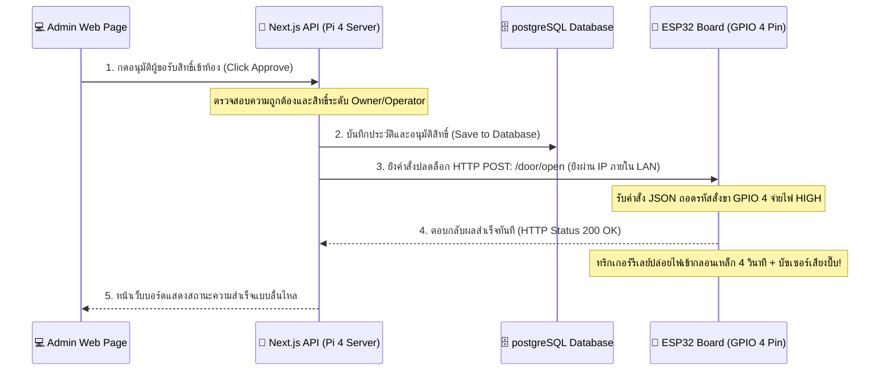

# คู่มือการออกแบบสถาปัตยกรรมเครือข่ายและการเลือกเซิร์ฟเวอร์ (ACCS IoT System Design)

รายงานการวิเคราะห์เปรียบเทียบเชิงวิศวกรรมระหว่างการจัดตั้งเซิร์ฟเวอร์ด้วยบอร์ด **Raspberry Pi 4** กับ **ระบบคลาวด์ (Cloud Deployment)** และเทคนิคการตั้งค่าให้บอร์ด **ESP32** ทำงานแบบ **เสียบปลั๊กไฟแล้วพร้อมใช้งานทันที (Plug & Play)** อย่างมีประสิทธิภาพสูงสุด

---

## 💻 ส่วนที่ 1: เปรียบเทียบสถาปัตยกรรม (Raspberry Pi 4 vs. Cloud)

สำหรับการใช้งานระบบควบคุมประตูเข้าออกห้อง (เช่น ห้องปฏิบัติการครุศาสตร์ หรือห้องเรียนเฉพาะทาง) สภาพแวดล้อมทางเครือข่ายและการเข้าถึงฮาร์ดแวร์จริงคือปัจจัยหลักในการตัดสินใจเลือกเซิร์ฟเวอร์:

| ปัจจัยเปรียบเทียบ | 🍓 Local Server: Raspberry Pi 4 (แนะนำ) | ☁️ Cloud Server (Vercel, AWS, Railway) |
|---|---|---|
| **ความเร็วและความลื่นไหล** | **ดีเลิศสูงสุด (Latency < 5ms)**<br>เนื่องจากเซิร์ฟเวอร์และบอร์ด ESP32 คุยกันเองภายในวง Wi-Fi ท้องถิ่นโดยตรง ไม่ต้องผ่านอินเทอร์เน็ตข้างนอก | **ปานกลาง (Latency 100ms - 300ms)**<br>สัญญาณต้องวิ่งออกเน็ตภายนอกไปยัง Cloud แล้วค่อยวิ่งสะท้อนกลับมาที่ประตูห้อง |
| **การทนทานต่อเน็ตล่ม (Offline Resilience)** | **สูงมาก**<br>หากอินเทอร์เน็ตหลักของมหาวิทยาลัยล่ม ระบบกลอนประตูกับเว็บแอดมินยังเปิดใช้งานได้ตามปกติผ่าน Wi-Fi ภายในห้อง | **ต่ำ**<br>หากอินเทอร์เน็ตล่ม เว็บบอร์ดแอดมินจะเข้าใช้งานไม่ได้ และไม่สามารถส่งสัญญาณมาสั่งปลดล็อกประตูได้ |
| **การเข้าถึงบอร์ด ESP32** | **ง่ายและปลอดภัย**<br>Next.js ยิงหา IP ภายในห้องของ ESP32 ได้โดยตรงโดยไม่ต้องตั้งค่าความปลอดภัยใดๆ เพิ่มเติม | **ซับซ้อน**<br>Cloud อยู่ภายนอก ไม่สามารถเจาะเข้ามาสั่งการ ESP32 ที่อยู่หลังเราเตอร์ปกติได้ (ต้องใช้ Tunnel เช่น Ngrok/Cloudflare หรือปรับบอร์ดมาใช้ Websocket) |
| **ค่าใช้จ่ายในการดูแล** | **จ่ายครั้งเดียวจบ (One-Time Cost)**<br>ซื้อบอร์ด Pi 4 และไม่มีค่าบริการรายเดือนสำหรับเว็บโฮสติ้งและดาต้าเบส | **มีค่าบริการรายเดือน**<br>ฟรีในช่วงแรก (Free Tier) แต่หากใช้งานปริมาณมากจะมีค่าบริการคลาวด์และฐานข้อมูลรายเดือน |
| **ความสะดวกในการดูแล** | **ปานกลาง**<br>ต้องติดตั้งระบบปฏิบัติการ Linux, Node.js และเปิด postgreSQL ด้วยตัวเองในบอร์ด | **สะดวกสบายสูง**<br>เพียงกด `git push` โค้ดจะได้รับการ deploy และอัปเดตให้อัตโนมัติทันที |

> [!TIP]
> **สรุปคำแนะนำเชิงวิชาชีพ (Verdict):**
> แนะนำให้ใช้ **Raspberry Pi 4** ประจำการภายในห้องเรียน/ตึกเรียนนั้นๆ เนื่องจากตัวเว็บและบอร์ดประตูต้องทำงานร่วมกันแบบเรียลไทม์ การควบคุมภายในเครือข่ายภายใน (LAN/Intranet) ให้การตอบสนองที่ **เสถียรที่สุด เร็วที่สุด และปลอดภัยที่สุด** สำหรับงาน IoT ระดับองค์กร

---

## 📡 ส่วนที่ 2: วิธีทำระบบ "เสียบไฟอย่างเดียวแล้วเชื่อมต่อ API ทันที" (Plug & Play)

หากต้องการให้ผู้ใช้งานหรือแอดมินนำกล่องควบคุม ESP32 ไปเสียบปลั๊กไฟ (Adapter 5V/9V) แล้วบอร์ดค้นหาไวไฟและเตรียมรับคำสั่งปลดล็อกได้ทันทีโดยไม่ต้องตั้งค่าใดๆ อีก ให้ดำเนินการดังนี้:

### 1. การฝังรหัส Wi-Fi ถาวร (Compiled Hardcoding)
ในไฟล์สเก็ตช์ `esp32-door-controller.ino` รหัสเครือข่าย SSID และรหัสผ่านจะถูกคอมไพล์ลงในชิปโดยตรง:
* เมื่อบอร์ดได้รับพลังงาน ขา `setup()` จะสั่งงานชิปโมเด็ม Wi-Fi ในตัวให้เชื่อมต่อเข้าหาเราเตอร์เป้าหมายโดยอัตโนมัติภายใน 3-5 วินาที
* สัญญาณไฟ LED (GPIO 2) จะกะพริบถี่ระหว่างเชื่อมต่อ และ **ติดค้างคงที่** ทันทีเมื่อออนไลน์สำเร็จ เป็นการยืนยันสถานะพร้อมรบ

### 2. การจองเลข IP ถาวรบนเราเตอร์ (IP Address DHCP Reservation)
สิ่งสำคัญคือ **"ต้องไม่ปล่อยให้ IP ของบอร์ดเปลี่ยนไปตามเวลา"** เพราะจะทำให้ Next.js ยิงคำสั่งผิดเครื่อง วิธีทำให้ IP บอร์ดคงที่ทำได้ 2 วิธี:
1. **วิธีจองในเราเตอร์ (แนะนำสูงสุด)**: เข้าหน้าตั้งค่าเราเตอร์ Wi-Fi ของคณะ ไปที่เมนู **DHCP Reservation** หรือ **Static IP Binding** จากนั้นกรอก **MAC Address** ของบอร์ด ESP32 และผูกเลข IP ที่ระบุใน `.env.local` (เช่น `192.168.1.100`) ไว้ถาวร
2. **วิธีฝัง Static IP ในโค้ดบอร์ด**: โค้ดของเรารองรับการประกาศ Static IP อยู่แล้วในตัวแปร `local_IP` บรรทัดที่ 25 ซึ่งบอร์ดจะบังคับเราเตอร์ให้แจกเลข IP นี้ให้ตัวเองทันทีเมื่อล็อกอินเข้าระบบ

### 3. แผนภาพการส่งผ่านข้อมูลที่เร็วและคึกคักที่สุด (Ultra-Fast Topology)



---

## 🚀 ส่วนที่ 3: ขั้นตอนการจัดเตรียม Raspberry Pi 4 เป็นเครื่องเซิร์ฟเวอร์หลัก

หากต้องการขึ้นระบบกับ Raspberry Pi 4 ให้ทำตามขั้นตอนการเซ็ตอัพอย่างมืออาชีพดังนี้ครับ:

1. **ติดตั้ง OS**: อัปโหลดตัว **Raspberry Pi OS (64-bit Lite)** ลงใน MicroSD Card
2. **ติดตั้งสภาพแวดล้อมทางโปรแกรม**: เข้าไปในเครื่อง Pi ผ่าน SSH หรือหน้าจอตรง แล้วรันคำสั่งลงโปรแกรม:
   ```bash
   # ลง Node.js เวอร์ชันเสถียร
   curl -fsSL https://deb.nodesource.com/setup_20.x | sudo -E bash -
   sudo apt-get install -y nodejs
      # ลงฐานข้อมูล postgreSQL
    sudo apt-get install -y postgresql postgresql-contrib
    ```
3. **กำหนดค่าความปลอดภัยของ Database**:
    ```bash
    sudo -u postgres psql -c "ALTER USER postgres PASSWORD 'yourpassword';"
    ```
4. **โคลนและนำขึ้นระบบ**: ดึงโฟลเดอร์ `my-app` มาวางไว้ใน Pi สั่งรันบิลด์ระบบเว็บ:
   ```bash
   cd my-app
   npm install
   npm run build
   ```
5. **รันการทำงานเบื้องหลังตลอด 24 ชั่วโมง**: ติดตั้งตัวจัดการโพรเซส `PM2` เพื่อคุมให้ระบบเว็บเปิดค้างแม้จะปิดคอมพิวเตอร์หลักหรือไฟตกดับชั่วคราว:
   ```bash
   sudo npm install -g pm2
   pm2 start npm --name "smartaccess-app" -- run start
   pm2 startup
   pm2 save
   ```
6. **เสียบปลั๊กพร้อมใช้**: นำบอร์ด Raspberry Pi 4 และกล่องกลอนประตู ESP32 เสียบปลั๊กไฟ (ใช้ไฟเลี้ยงของตนเอง) ทั้งคู่จะเชื่อม Wi-Fi และเริ่มดักจับคำสั่งพร้อมทำงานเคียงคู่กันไปตลอด 24 ชั่วโมงอย่างคล่องตัว รวดเร็ว และเป็นส่วนตัวที่สุดภายในสถาบันการศึกษาของคุณครับ!
