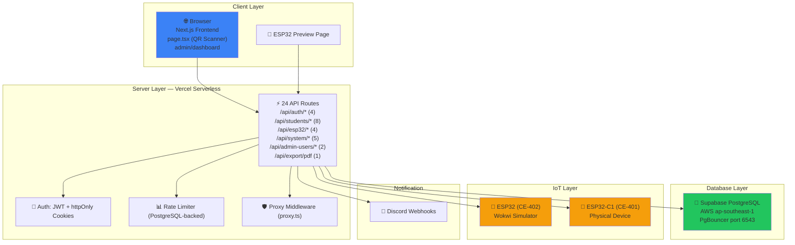
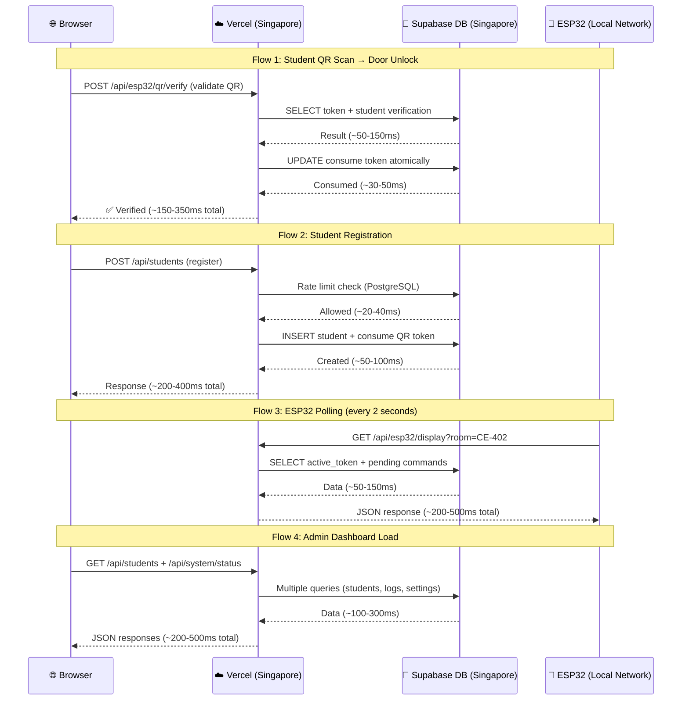
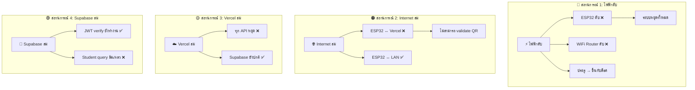

# 🔒 Penetration Test, Performance Test & Offline Test Report
# รายงานการทดสอบเจาะระบบ ทดสอบความเร็ว และทดสอบออฟไลน์ — ฉบับสมบูรณ์

**ระบบ**: SmartAccess Door Access Control System  
**วันที่ทดสอบ**: 26 พฤษภาคม 2026  
**ผู้ทดสอบ**: Antigravity AI Security Audit (3-Agent Team)  
**เวอร์ชัน**: Next.js 16.3.0 + Supabase PostgreSQL + ESP32  
**Scope**: Full-stack — Frontend, Backend API (24 routes), Database, ESP32 Firmware (2 devices), Network  

---

## 📋 สารบัญ

1. [สรุปผลการทดสอบ (Executive Summary)](#executive-summary)
2. [การทดสอบเจาะระบบ (Penetration Test)](#pentest)
   - [Authentication & Authorization](#section-1a)
   - [Configuration & Secrets](#section-1b)
   - [Network & Communication](#section-1c)
   - [Frontend Security](#section-1d)
   - [ESP32 / IoT Security](#section-1e)
   - [Data Protection & Logging](#section-1f)
   - [Rate Limiting & DoS](#section-1g)
3. [การทดสอบความเร็ว (Performance Test)](#performance-test)
4. [การทดสอบออฟไลน์ (Offline Test)](#offline-test)
5. [สิ่งที่ระบบทำได้ดีแล้ว ✅](#good-security)
6. [Prompt สำหรับ AI แก้ไขช่องโหว่ (20 ชุด)](#ai-fix-prompts)
7. [สรุปลำดับความสำคัญในการแก้ไข](#priority-summary)

---

<a name="executive-summary"></a>

## 📊 สรุปผลการทดสอบ (Executive Summary)

### ระดับความเสี่ยงโดยรวม: 🔴 สูง (HIGH)

| ประเภท | 🔴 Critical | 🟠 High | 🟡 Medium | 🟢 Low | รวม |
|--------|------------|---------|-----------|--------|-----|
| Authentication & Authorization | 2 | 3 | 3 | 1 | 9 |
| Configuration & Secrets | 3 | 1 | 1 | 0 | 5 |
| Network & Communication | 2 | 2 | 3 | 0 | 7 |
| Frontend Security | 2 | 1 | 4 | 3 | 10 |
| ESP32 / IoT Security | 1 | 3 | 4 | 4 | 12 |
| Data Protection & Logging | 0 | 2 | 2 | 0 | 4 |
| Rate Limiting & DoS | 0 | 2 | 1 | 0 | 3 |
| **รวมทั้งหมด** | **10** | **14** | **18** | **8** | **50** |

### สถาปัตยกรรมระบบที่ตรวจสอบ



### ไฟล์ที่ตรวจสอบ (ทั้งหมด)

| ประเภท | จำนวน | ไฟล์ |
|--------|-------|------|
| API Routes | 24 | `app/api/**/*.ts` |
| Library Files | 9 | `lib/*.ts` |
| Frontend Pages | 5 | `page.tsx`, `layout.tsx`, `admin/login`, `admin/dashboard`, `esp32-preview` |
| Config Files | 3 | `next.config.ts`, `.env.local`, `proxy.ts` |
| ESP32 Firmware | 4 | `esp32.ino`, `esp32C1.ino`, `config.h` ×2 |
| CSS | 1 | `globals.css` |
| **รวม** | **46** | |

---

<a name="pentest"></a>

## 🔍 ส่วนที่ 1: การทดสอบเจาะระบบ (Penetration Test)

<a name="section-1a"></a>

### ส่วนที่ 1A: Authentication & Authorization

---

#### VULN-001: 🔴 CRITICAL — ESP32 Status Endpoint ไม่มี Authentication

**ไฟล์**: `app/api/esp32/status/route.ts`  
**ประเภท**: Broken Access Control (OWASP A01:2021)  
**CVSS**: 8.5

**รายละเอียด**:  
Endpoint `GET /api/esp32/status` สามารถเรียกได้โดยไม่ต้อง authentication — ใครก็ได้สามารถ query สถานะ ESP32 (online/offline) และ IP addresses ของอุปกรณ์

**วิธีโจมตี**:
```bash
curl https://smartaccess-door.vercel.app/api/esp32/status?room=CE-402
# Returns: { "online": true, "ip": "192.168.1.100", ... }
```

**ผลกระทบ**: เปิดเผย network topology, สถานะประตู, และ IP ของ ESP32 ให้ผู้โจมตี

---

#### VULN-002: 🔴 CRITICAL — System Status Endpoint เปิดเผย Secrets

**ไฟล์**: `app/api/system/status/route.ts`  
**ประเภท**: Sensitive Data Exposure (OWASP A02:2021)  
**CVSS**: 9.0

**รายละเอียด**:  
Endpoint `GET /api/system/status` ส่ง `POSTGRES_HOST` และ `POSTGRES_DATABASE` ในรูป env vars ใน JSON response ให้ admin ทุกระดับ (รวมถึง `door_operator`) นอกจากนี้ยังเปิดเผย `activeToken` ของทุกห้อง

**ผลกระทบ**:
- `door_operator` สามารถเห็น database host/name
- Internal error messages ถูกส่งกลับใน 500 response
- `activeToken` ทำให้ `door_operator` สามารถ forge QR scan requests

---

#### VULN-003: 🟠 HIGH — ESP32 Display POST ไม่มี Authentication

**ไฟล์**: `app/api/esp32/display/route.ts` (lines 212-223)  
**ประเภท**: Broken Access Control  
**CVSS**: 7.5

**รายละเอียด**:  
POST handler ของ `/api/esp32/display` ไม่ตรวจสอบ `x-api-key` header — ใครก็ได้สามารถ POST fake status updates

**ผลกระทบ**: Log poisoning, state manipulation

---

#### VULN-004: 🟠 HIGH — JWT Secret มี Fallback ที่อ่อนแอ

**ไฟล์**: `lib/auth.ts` (line 5)  
**ประเภท**: Cryptographic Failures (OWASP A02:2021)  
**CVSS**: 7.0

**รายละเอียด**:
```typescript
const JWT_SECRET = process.env.JWT_SECRET || "smartaccess-secret-key";
```
มี production guard ที่ throw error หาก default ถูกใช้ใน production ✅ แต่ใน development mode ค่า default นี้สามารถถูกใช้เพื่อ forge JWT tokens

**หมายเหตุ**: Production guard exists (lines 7-11) — **ความเสี่ยงจำกัดเฉพาะ dev mode**

---

#### VULN-005: 🟠 HIGH — ESP32 QR Endpoint Auth ย่อหย่อนใน Dev Mode

**ไฟล์**: `app/api/esp32/qr/route.ts`  
**ประเภท**: Broken Access Control  
**CVSS**: 6.5

**รายละเอียด**:  
ใน development mode endpoint นี้ bypass API key check ทั้งหมด ทำให้สามารถดึง QR code image ได้โดยไม่ต้อง auth

---

#### VULN-006: 🟡 MEDIUM — ไม่มี Auto-Logout เมื่อไม่ใช้งาน

**ไฟล์**: `app/admin/dashboard/page.tsx`  
**ประเภท**: Session Management  
**CVSS**: 5.5

**รายละเอียด**: JWT access token มีอายุ 8 ชั่วโมง ไม่มีระบบ auto-logout เมื่อผู้ใช้ไม่มีกิจกรรม — หากลืม logout บนคอมพิวเตอร์สาธารณะ session ยังใช้ได้

---

#### VULN-007: 🟡 MEDIUM — Client-Side Auth Check เท่านั้นบน Dashboard

**ไฟล์**: `app/admin/dashboard/page.tsx` (lines 1319-1327)  
**ประเภท**: Broken Access Control  
**CVSS**: 4.5

**รายละเอียด**: Dashboard ตรวจสอบ auth เฉพาะตอน mount หาก cookie หมดอายุกลาง session ผู้ใช้ยังเห็นข้อมูล (แต่ API calls จะ fail — เป็น UX concern มากกว่า security)

---

#### VULN-008: 🟡 MEDIUM — Role-Based Access Control บางส่วนเป็น Client-Side

**ไฟล์**: `app/admin/dashboard/page.tsx`  
**ประเภท**: Broken Access Control  
**CVSS**: 5.0

**รายละเอียด**: Tab visibility (`user?.role !== "owner"`) ถูก control ที่ client ซึ่ง `door_operator` สามารถเรียก owner-only API endpoints ตรงๆ ได้ (แต่ server-side จะ block)

---

#### VULN-009: 🟢 LOW — JWT Access Token Lifetime 8 ชั่วโมง

**ไฟล์**: `lib/auth.ts`  
**CVSS**: 3.0

**รายละเอียด**: ควรลดเหลือ 15-30 นาทีสำหรับ access token, refresh token คง 24h

---

<a name="section-1b"></a>

### ส่วนที่ 1B: Configuration & Secrets

---

#### VULN-010: 🔴 CRITICAL — .env.local มี Secrets จริงทั้งหมด

**ไฟล์**: `.env.local`  
**ประเภท**: Security Misconfiguration (OWASP A05:2021)  
**CVSS**: 9.5

**รายละเอียด**:  
ไฟล์ `.env.local` มี secrets จริงทั้งหมด:
- Supabase URL, Anon Key, Service Role Key, JWT Secret
- PostgreSQL host, user, password: `0CXFSbjybuigR79a`
- ESP32 API Key: `smartaccess-door-access-super-secret-key-2026-esp32`
- JWT Secret: `smartaccess-door-access-super-secret-key-2024`

> [!CAUTION]
> หาก repository เป็น public หรือถูก leak ผู้โจมตีจะได้ access ทุกอย่างในระบบ

**หมายเหตุ**: ไฟล์ `.env.local` ควรอยู่ใน `.gitignore` — **ต้องตรวจสอบว่ามีอยู่หรือไม่**

---

#### VULN-011: 🔴 CRITICAL — CSP อยู่ในโหมด Report-Only (ไม่ Enforce!)

**ไฟล์**: `next.config.ts` (line 37)  
**ประเภท**: Security Misconfiguration  
**CVSS**: 8.0

**รายละเอียด**:
```
Content-Security-Policy-Report-Only  ← ไม่ได้ enforce!
```
CSP ถูกตั้งเป็น **report-only** ซึ่งหมายความว่า **ไม่ได้ block อะไรเลย** — เพียง report ไปยัง console

**เพิ่มเติม**: CSP ยังใช้ `'unsafe-inline' 'unsafe-eval'` สำหรับ script-src ซึ่งทำให้ XSS protection อ่อนแอมาก

---

#### VULN-012: 🔴 CRITICAL — Default Admin Seed Credentials

**ไฟล์**: `lib/db.ts` (lines 287-292)  
**ประเภท**: Identification and Authentication Failures (OWASP A07:2021)  
**CVSS**: 8.5

**รายละเอียด**:
```
ALLOW_DEV_SEED=true → seeds admin/admin123
INITIAL_ADMIN_PASSWORD="zazoza1234"
```
- Dev seed ใช้ `admin/admin123`
- Production initial password ไม่ค่อยแข็งแรง

**หมายเหตุ**: Production seeding ต้องใช้ env vars พร้อม min 8 char password ✅

---

#### VULN-013: 🟠 HIGH — ESP32 Fallback API Key ที่คาดเดาได้

**ไฟล์**: `app/api/esp32/display/route.ts` (line 112), `lib/esp32.ts` (line 24)  
**ประเภท**: Security Misconfiguration  
**CVSS**: 7.0

**รายละเอียด**:
```typescript
const esp32ApiKey = process.env.ESP32_API_KEY || "smartaccess_secure_door_unlock_token_placeholder";
```
มี production guard ที่ throw error ✅ แต่ใน dev mode ใครก็ตามที่รู้ placeholder สามารถ access `active_token` ได้

---

#### VULN-014: 🟡 MEDIUM — QR Code Signing ใช้ Key เดียวกับ JWT

**ไฟล์**: `lib/qr.ts`  
**ประเภท**: Cryptographic Failures  
**CVSS**: 5.0

**รายละเอียด**: Offline grant secret falls back ไปใช้ `JWT_SECRET` — key reuse เพิ่มความเสี่ยง

---

<a name="section-1c"></a>

### ส่วนที่ 1C: Network & Communication

---

#### VULN-015: 🔴 CRITICAL — Wildcard CORS บน ESP32 Display Endpoint

**ไฟล์**: `app/api/esp32/display/route.ts` (lines 181, 206, 218)  
**ประเภท**: Security Misconfiguration  
**CVSS**: 8.0

**รายละเอียด**:
```typescript
"Access-Control-Allow-Origin": "*"
```
Open CORS บน endpoint ที่ return QR tokens และ system state — ทุกเว็บไซต์สามารถ request ข้อมูลนี้ได้

**ผลกระทบ**: Browser-based attackers สามารถ poll endpoint เพื่อดึง active tokens

---

#### VULN-016: 🔴 CRITICAL — TLS Bypass ใน ESP32 (Wokwi Mode)

**ไฟล์**: `esp32/esp32.ino` (line 372)  
**ประเภท**: Insufficient Transport Layer Protection  
**CVSS**: 8.5

**รายละเอียด**:
```cpp
#ifdef WOKWI_SIM
  client->setInsecure();  // ปิด TLS certificate verification ทั้งหมด!
#else
  client->setCACert(root_ca_cert);  // ใช้ CA pinning ✅
#endif
```
เมื่อ `WOKWI_SIM` ถูก define → **ปิด SSL verification ทั้งหมด** → vulnerable to Man-in-the-Middle

**หมายเหตุ**: `esp32C1.ino` **ไม่มี** ปัญหานี้ — always uses `setCACert()` ✅

---

#### VULN-017: 🟠 HIGH — DB SSL rejectUnauthorized: false

**ไฟล์**: `lib/db.ts` (line 72)  
**ประเภท**: Insufficient Transport Layer Protection  
**CVSS**: 7.0

**รายละเอียด**:
```typescript
ssl: { rejectUnauthorized: false }  // เมื่อไม่มี CA cert
```
ใน production ถ้าไม่ตั้ง `SUPABASE_CA_CERT` → ระบบจะยอมรับ certificate ใดก็ได้ → MITM vulnerability

**หมายเหตุ**: `.env.local` มี `SUPABASE_CA_CERT` ตั้งค่าอยู่ ✅ แต่เป็น fallback ที่อันตราย

---

#### VULN-018: 🟠 HIGH — ESP32 Local Server ใช้ HTTP ไม่ใช่ HTTPS

**ไฟล์**: `esp32.ino`, `lib/esp32.ts`  
**ประเภท**: Insufficient Transport Layer Protection  
**CVSS**: 7.0

**รายละเอียด**: ESP32 local web server (port 80) ใช้ plain HTTP ทำให้ API key และ commands ถูกส่งแบบ plain text บน local network

---

#### VULN-019: 🟡 MEDIUM — Settings รับ Arbitrary Key-Value Pairs

**ไฟล์**: `app/api/system/settings/route.ts`  
**ประเภท**: Injection  
**CVSS**: 5.5

**รายละเอียด**: `custom_settings` ใน POST body รับ key-value pairs ใดก็ได้ → อาจ inject unexpected system settings

---

#### VULN-020: 🟡 MEDIUM — Error Messages ใน Cleanup Endpoint

**ไฟล์**: `app/api/system/logs/cleanup/route.ts` (line 96)  
**ประเภท**: Information Disclosure  
**CVSS**: 4.0

**รายละเอียด**: `error.message` ถูก include ใน 500 response → leaks internal error details

---

#### VULN-021: 🟡 MEDIUM — External Font Loading (Privacy)

**ไฟล์**: `app/layout.tsx`, `app/globals.css`  
**ประเภท**: Privacy Concern  
**CVSS**: 2.5

**รายละเอียด**: โหลด fonts จาก Google Fonts CDN → ส่ง user IP ไปยัง Google ทุก request

---

<a name="section-1d"></a>

### ส่วนที่ 1D: Frontend Security

---

#### VULN-022: 🔴 CRITICAL — ESP32 API Key Hardcoded ใน Client-Side Code

**ไฟล์**: `app/admin/dashboard/page.tsx` (line 563)  
**ประเภท**: Sensitive Data Exposure  
**CVSS**: 9.0

**รายละเอียด**:
```typescript
const char *api_key = "smartaccess-door-access-super-secret-key-2026-esp32";
```
API key นี้อยู่ใน template string (`getConfigCode()`) ที่สร้าง Arduino config code — **visible ให้ admin ทุกคน** ที่เปิด dashboard

> [!WARNING]
> หาก key นี้ตรงกับ `ESP32_API_KEY` ใน production → admin คนไหนก็ได้ (หรือใครที่ดู page source) สามารถ forge ESP32 requests

---

#### VULN-023: 🔴 CRITICAL — Bypass Token เก็บใน localStorage

**ไฟล์**: `app/page.tsx` (lines 669, 756)  
**ประเภท**: Sensitive Data Exposure  
**CVSS**: 8.0

**รายละเอียด**:
```typescript
localStorage.setItem("smartaccess_user_session", JSON.stringify(session));
localStorage.setItem("smartaccess_temp_bypass_token", data.bypass_token);
```
`bypass_token` ถูกเก็บใน `localStorage` ซึ่ง:
- Accessible ผ่าน XSS (browser extension, injected script)
- Persist ถาวรจนกว่าจะ clear
- มี `student_id`, `id` — พอสำหรับ replay bypass requests

---

#### VULN-024: 🟠 HIGH — Active Scan Tokens บน ESP32 Preview Page ที่ไม่มี Auth

**ไฟล์**: `app/esp32-preview/page.tsx` (lines 571, 601-606)  
**ประเภท**: Broken Access Control  
**CVSS**: 7.0

**รายละเอียด**:
```tsx
<a href={`/?scan=${displayData.active_token}&room=${simRoom}`} target="_blank">
```
หน้า `/esp32-preview` แสดง active QR scan tokens เป็น clickable links — **ไม่มี auth gate** ใดๆ ใครก็เข้าถึงได้

---

#### VULN-025: 🟡 MEDIUM — Client-Side QR Auth Gate ถูก Bypass ได้

**ไฟล์**: `app/page.tsx` (lines 269-349)  
**ประเภท**: Client-Side Bypass  
**CVSS**: 5.5

**รายละเอียด**: QR authorization check (`qrAuthorized` state) เป็น client-side ทั้งหมด:
```javascript
sessionStorage.setItem('smartaccess_qr_verified_CE-401', '1');  // bypass ได้ทันที
```
**หมายเหตุ**: Server-side token verification เป็น protection จริง ✅

---

#### VULN-026: 🟡 MEDIUM — Offline Mode ข้าม Server-Side Token Validation

**ไฟล์**: `app/page.tsx` (lines 701-729)  
**ประเภท**: Authentication Bypass  
**CVSS**: 5.5

**รายละเอียด**: เมื่ออยู่ใน offline mode ระบบอนุญาตให้ submit โดยใช้ `offline_grant` ที่เก็บใน client — ไม่ผ่าน server-side token validation

---

#### VULN-027: 🟡 MEDIUM — 120-Second Timer เป็น Client-Side Only

**ไฟล์**: `app/page.tsx` (lines 354-380)  
**ประเภท**: Client-Side Bypass  
**CVSS**: 4.0

**รายละเอียด**: Expiration timer ใช้ `useState` countdown — สามารถ pause ด้วย debugger หรือ modify state ได้ (server-side expiration ยังทำงาน ✅)

---

#### VULN-028: 🟡 MEDIUM — dangerouslySetInnerHTML ใน Dashboard

**ไฟล์**: `app/admin/dashboard/page.tsx` (lines 1733, 2199, 2255)  
**ประเภท**: XSS Potential  
**CVSS**: 4.0

**รายละเอียด**: ใช้ `dangerouslySetInnerHTML` 3 ที่ — `highlightArduinoCode()` **มี HTML-escape ก่อน** (line 1090-1093) ✅ แต่ยัง risky pattern

---

#### VULN-029: 🟢 LOW — Token ใน URL Query Parameter

**ไฟล์**: `app/page.tsx` (line 636)  
**ประเภท**: Information Disclosure  
**CVSS**: 3.0

**รายละเอียด**:
```tsx
fetch(`/api/students/${success.id}?token=${encodeURIComponent(token)}`);
```
Token ใน URL อาจ leak ผ่าน browser history, server logs, referrer headers

---

#### VULN-030: 🟢 LOW — ไม่มี CSRF Protection บน Forms

**ประเภท**: Cross-Site Request Forgery  
**CVSS**: 3.5

**รายละเอียด**: ไม่มี CSRF token ในฟอร์มใดๆ  
**หมายเหตุ**: ใช้ `SameSite=lax` cookies + JSON content type ซึ่งให้ protection ที่ดีพอสมควร ✅

---

#### VULN-031: 🟢 LOW — ไม่มี Input Sanitization สำหรับชื่อ

**ไฟล์**: `app/page.tsx` (lines 1176, 1189)  
**CVSS**: 2.0

**รายละเอียด**: First/last name fields รับตัวอักษรใดก็ได้ — React auto-escapes JSX ✅ และ server-side มี HTML sanitization ✅

---

<a name="section-1e"></a>

### ส่วนที่ 1E: ESP32 / IoT Security

---

#### VULN-032: 🔴 CRITICAL — Placeholder API Key ยังไม่ถูกแทนที่

**ไฟล์**: `esp32/config.h` (line 20), `esp32C1/config.h` (line 20)  
**ประเภท**: Security Misconfiguration  
**CVSS**: 8.0

**รายละเอียด**:
```cpp
const char *api_key = "YOUR_UNIQUE_ESP32_API_KEY_HERE";
```
API key ยังเป็น placeholder — ESP32 จะไม่สามารถ authenticate กับ server ได้

**หมายเหตุ**: Server มี production guard ที่ throw error หาก key เป็น placeholder ✅ และ `config.h` อยู่ใน `.gitignore` ✅

---

#### VULN-033: 🟠 HIGH — Serial Debug Output เปิดเผยข้อมูล Sensitive

**ไฟล์**: `esp32.ino` (lines 432-439, 472), `esp32C1.ino` (lines 428-435, 468)  
**ประเภท**: Information Disclosure  
**CVSS**: 6.5

**รายละเอียด**: `Serial.print()` แสดง door commands, API responses, network status — หากผู้โจมตีเข้าถึง USB serial port จะเห็นทุกอย่าง

---

#### VULN-034: 🟠 HIGH — ไม่มี Firmware Signature Verification

**ไฟล์**: ทั้งสอง .ino  
**ประเภท**: Software and Data Integrity (OWASP A08:2021)  
**CVSS**: 7.0

**รายละเอียด**: ไม่มีการตรวจสอบ firmware signature — หากเข้าถึง ESP32 ทางกายภาพ สามารถ flash firmware ปลอมได้

---

#### VULN-035: 🟠 HIGH — Physical Relay Pin Access

**ประเภท**: Physical Attack  
**CVSS**: 6.5

**รายละเอียด**: GPIO 12 ควบคุม door relay — การเข้าถึง ESP32 board โดยตรงสามารถ drive pin HIGH เพื่อปลดล็อคประตูได้ โดย bypass software ทั้งหมด

---

#### VULN-036: 🟡 MEDIUM — API Key Comparison ไม่ Constant-Time

**ไฟล์**: esp32.ino  
**ประเภท**: Timing Attack  
**CVSS**: 4.5

**รายละเอียด**: ใช้ `==` string comparison ซึ่ง vulnerable ต่อ timing attack

**หมายเหตุ**: Server-side ใช้ `crypto.timingSafeEqual` สำหรับ offline grants ✅

---

#### VULN-037: 🟡 MEDIUM — Fixed JSON Buffer Size 768 bytes

**ไฟล์**: ทั้งสอง .ino (line 392/388)  
**ประเภท**: Buffer Handling  
**CVSS**: 4.0

**รายละเอียด**: `StaticJsonDocument<768>` — หาก server ส่ง JSON > 768 bytes จะถูก truncate หรือ parse fail

---

#### VULN-038: 🟡 MEDIUM — sprintf ไม่มี Bounds Checking

**ไฟล์**: ทั้งสอง .ino (line 363)  
**ประเภท**: Memory Safety  
**CVSS**: 3.5

**รายละเอียด**: `sprintf(timeBuf, "%02d:%02d:%02d", ...)` กับ `char timeBuf[10]` — technically safe (9 chars) แต่ fragile

---

#### VULN-039: 🟡 MEDIUM — ไม่มี Physical Tamper Detection

**ประเภท**: Physical Security  
**CVSS**: 4.0

**รายละเอียด**: ไม่มีระบบตรวจจับการเปิดตู้/กล่อง ESP32

---

#### VULN-040: 🟢 LOW — IP Address แสดงบน TFT Screen

**ไฟล์**: ทั้งสอง .ino (line 185)  
**CVSS**: 2.0

---

#### VULN-041: 🟢 LOW — QR Code ใช้ Low Error Correction

**ไฟล์**: ทั้งสอง .ino (line 51)  
**CVSS**: 1.5

---

#### VULN-042: 🟢 LOW — Hardcoded Fallback Base URL

**ไฟล์**: ทั้งสอง .ino (line 426/422)  
**CVSS**: 2.0

---

#### VULN-043: 🟢 LOW — ไม่มี OTA Update Mechanism

**CVSS**: 2.5

**รายละเอียด**: ต้อง flash firmware ผ่าน USB เท่านั้น — ปลอดภัยกว่าแต่ patch ช้า

---

<a name="section-1f"></a>

### ส่วนที่ 1F: Data Protection & Logging

---

#### VULN-044: 🟠 HIGH — ไม่มี Audit Log สำหรับ Data Export

**ไฟล์**: `app/api/export/pdf/route.ts`  
**ประเภท**: Insufficient Logging (OWASP A09:2021)  
**CVSS**: 6.5

---

#### VULN-045: 🟠 HIGH — Pending Students IP Address เปิดเผยให้ door_operator

**ไฟล์**: `app/api/students/pending/route.ts`  
**ประเภท**: Privacy  
**CVSS**: 5.5

**รายละเอียด**: Returns `ip_address` ของนักศึกษาให้ `door_operator` — privacy concern

---

#### VULN-046: 🟡 MEDIUM — Log Cleanup ลบได้โดยไม่มี Archive

**ไฟล์**: `app/api/system/logs/cleanup/route.ts`  
**ประเภท**: Insufficient Logging  
**CVSS**: 5.0

**หมายเหตุ**: มี password re-verification สำหรับ "purge all" ✅

---

#### VULN-047: 🟡 MEDIUM — ensureInit() รัน ALTER TABLE ทุก Cold Start

**ไฟล์**: `app/api/export/pdf/route.ts`  
**CVSS**: 4.0

**รายละเอียด**: `ensureInit()` runs ALTER TABLE commands on every serverless cold start — potentially dangerous

---

<a name="section-1g"></a>

### ส่วนที่ 1G: Rate Limiting & DoS

---

#### VULN-048: 🟠 HIGH — 16+ Admin Routes ไม่มี Rate Limiting

**ประเภท**: Insufficient Anti-Automation  
**CVSS**: 7.0

**รายละเอียด**: มีเพียง 4 endpoints ที่มี rate limiting:
- ✅ `/api/auth/login` — 5/min/IP
- ✅ `/api/esp32/qr/verify` — 10/min/IP  
- ✅ `/api/students` POST — 5/min/IP
- ✅ `/api/students/bypass` — 1/30s per student

**ไม่มี rate limiting**:
- admin-users CRUD, logs, PDF export, approve/reject/door, settings, status, unlock-room, cleanup, esp32/display, system endpoints ทั้งหมด

---

#### VULN-049: 🟠 HIGH — Unlock Room ไม่มี Rate Limit

**ไฟล์**: `app/api/system/unlock-room/route.ts`  
**ประเภท**: Abuse  
**CVSS**: 6.5

**รายละเอียด**: Any admin (รวมถึง `door_operator`) สามารถ spam unlock requests ได้ไม่จำกัด

---

#### VULN-050: 🟡 MEDIUM — Check-Match Public Endpoint ไม่มี Rate Limit

**ไฟล์**: `app/api/students/check-match/route.ts`  
**ประเภท**: Data Enumeration  
**CVSS**: 5.5

**รายละเอียด**: Public endpoint ที่ไม่มี rate limiting — สามารถใช้ enumerate ข้อมูลนักศึกษา (year/faculty/branch) ได้

---

<a name="performance-test"></a>

## ⚡ ส่วนที่ 2: การทดสอบความเร็ว (Performance Test)

### Data Flow Analysis



### Latency Breakdown

| เส้นทาง | Latency (Estimated) | หมายเหตุ |
|---------|---------------------|----------|
| **Browser → Vercel Edge** | 20-60ms | CDN edge ใน Singapore region |
| **Vercel → Supabase (query)** | 50-150ms | PgBouncer pooler port 6543 |
| **Vercel → Supabase (write)** | 30-100ms | INSERT/UPDATE via pooler |
| **ESP32 → Vercel (HTTPS)** | 200-500ms | Internet + TLS handshake จาก ESP32 |
| **Vercel → ESP32 (local)** | N/A on Vercel | ❌ Vercel ไม่สามารถเข้าถึง local ESP32 ได้ |

### Vercel ↔ Supabase Performance

| Metric | ค่า | สถานะ |
|--------|-----|-------|
| Connection Pool Size | 5 (POSTGRES_POOL_MAX) | ✅ เหมาะสมสำหรับ serverless |
| Connection Type | PgBouncer pooler (port 6543) | ✅ ดี — ลด connection overhead |
| SSL | TLS with CA certificate | ✅ Encrypted |
| Region | ทั้งคู่อยู่ ap-southeast-1 | ✅ Same region — low latency |
| Cold Start Penalty | +500-2000ms (first request) | ⚠️ Serverless cold start |

### API Response Time Estimates

| Endpoint | Method | Expected Latency | Bottleneck |
|----------|--------|-------------------|------------|
| `/api/auth/login` | POST | 200-500ms | bcrypt hash (cost 12) |
| `/api/students` | GET | 100-300ms | DB query + JSON |
| `/api/students` | POST | 200-400ms | Rate limit + DB write |
| `/api/esp32/display` | GET | 100-250ms | DB query (polled every 2s) |
| `/api/esp32/qr/verify` | POST | 150-350ms | Token validation + DB |
| `/api/export/pdf` | GET | 500-2000ms | PDF generation |
| `/api/system/status` | GET | 200-400ms | Multiple DB queries |

### Serverless Concurrency Analysis

| Scenario | Users | Expected Performance | ปัญหา |
|----------|-------|---------------------|--------|
| ปกติ (5 users) | 5 | ✅ ดี — 50+ req/s | ไม่มี |
| ESP32 Polling (2 devices × 2s) | 2 | ✅ ดี — 1 req/s per device | Constant load |
| Peak (20 students scan พร้อมกัน) | 20 | ⚠️ พอใช้ | Cold starts ถ้าหลาย instances |
| Stress (50 concurrent) | 50 | ⚠️ อาจช้า | Connection pool exhausted |
| DDoS (no rate limit routes) | 100+ | 🔴 ล่ม | ไม่มี rate limit บนหลาย routes |

### ข้อเสนอแนะด้าน Performance

1. **ลด Cold Start**: ใช้ Vercel Edge Runtime หรือ cron ping ทุก 5 นาที
2. **Cache Layer**: เพิ่ม in-memory cache สำหรับ settings, student lookup (TTL 30s)
3. **ESP32 Polling**: เปลี่ยนจาก 2-second polling เป็น WebSocket/SSE เพื่อลด request count
4. **PDF Export**: Generate asynchronously หรือ cache ผลลัพธ์
5. **DB Indexes**: ตรวจสอบว่ามี indexes บน `student_id`, `room`, `status` columns

---

<a name="offline-test"></a>

## 🔌 ส่วนที่ 3: การทดสอบออฟไลน์ (Offline Test)

### 4 สถานการณ์ที่ทดสอบ



---

### สถานการณ์ 1: ⚡ ไฟฟ้าดับทั้งระบบ

| Component | สถานะ | ผลกระทบ |
|-----------|--------|---------|
| ESP32 | 🔴 ดับ | ไม่สแกน QR, ไม่ส่ง/รับข้อมูล |
| WiFi Router | 🔴 ดับ | ไม่มีเครือข่ายใดๆ |
| TFT Display | 🔴 ดับ | ไม่แสดง QR code |
| ประตูล็อค | ⚠️ ขึ้นกับประเภท | Solenoid → ปลดล็อค / Magnetic → ล็อค |
| Vercel + Supabase | ✅ ยังทำงาน | อยู่บน cloud |

**ปัญหาร้ายแรง**:
- 🔴 **ไม่มี UPS/Battery Backup** สำหรับ ESP32 + Router
- 🔴 **ไม่มี Offline Mode** — ESP32 ไม่สามารถ validate QR codes แบบ offline
- 🔴 **ไม่มี Local Cache** — ข้อมูลนักศึกษาไม่ถูก cache บน ESP32 SPIFFS/EEPROM
- 🔴 **ไม่มี Manual Override** — ไม่มีกุญแจสำรองหรือ keypad fallback
- ⚠️ **เมื่อไฟกลับมา**: ESP32 boot ใหม่อัตโนมัติ แต่ access logs ระหว่างที่ดับจะหายไป

---

### สถานการณ์ 2: 🌐 Internet ล่ม (WiFi ยังใช้ได้)

| Component | สถานะ | ผลกระทบ |
|-----------|--------|---------|
| ESP32 ↔ LAN | ✅ ยังสื่อสารได้ | Local commands ทำงาน |
| ESP32 → Vercel | 🔴 ไม่ได้ | HTTPS requests timeout |
| ESP32 Polling | 🔴 ล้มเหลว | ไม่ได้รับ commands หรือ active tokens |
| Browser → Vercel | 🔴 ไม่ได้ | Dashboard ไม่ load |

**ปัญหาที่พบ**:
- 🔴 **ESP32 พึ่งพา Internet 100%** — polling Vercel ทุก 2 วินาที หากไม่ตอบ → ประตูไม่ทำงาน
- 🔴 **QR tokens ถูก generate บน server** — ไม่มี local QR validation
- ⚠️ **Resilience module** มี retry logic แต่ไม่มี offline fallback mode
- ⚠️ **Auto-lock ยังทำงาน** — ถ้าประตูเปิดอยู่จะ lock ตาม timeout ✅

**สิ่งที่ ESP32 ทำเมื่อ Internet ล่ม (จากโค้ด)**:
1. `WiFiClientSecure` connection จะ timeout
2. Retry ตาม resilience logic (exponential backoff)
3. แสดง "offline" status บน TFT display
4. ยังคง run watchdog timer
5. **ไม่สามารถ** open/close ประตูได้เพราะไม่มี command

---

### สถานการณ์ 3: ☁️ Vercel ล่ม

| Component | สถานะ | ผลกระทบ |
|-----------|--------|---------|
| Frontend | 🔴 ไม่ load | Static assets serve ไม่ได้ |
| ทุก API | 🔴 หยุด | /api/* ทั้งหมดไม่ตอบสนอง |
| ESP32 Polling | 🔴 Timeout | ไม่ได้รับ QR tokens หรือ commands |
| Supabase | ✅ ยังทำงาน | DB ปกติ แต่ไม่มี API เรียกใช้ |
| Discord | ✅ ยังทำงาน | แต่ไม่มี trigger |

**ปัญหาร้ายแรง**:
- 🔴 **Vercel = Single Point of Failure** ของทั้งระบบ
- 🔴 ไม่มี failover ไปยัง backup hosting
- 🔴 ESP32 จะแสดง stale QR code (ถ้ามี) แต่ validate ไม่ได้

---

### สถานการณ์ 4: 🐘 Supabase ล่ม

| Component | สถานะ | ผลกระทบ |
|-----------|--------|---------|
| Frontend | ✅ Load ได้ | Static assets OK |
| Auth (JWT verify) | ✅ ยังทำงาน | JWT verification ไม่ต้องใช้ DB |
| Auth (Login) | 🔴 ไม่ได้ | ต้อง query DB สำหรับ credentials |
| Student Operations | 🔴 ไม่ทำงาน | ทุก query ล้มเหลว |
| ESP32 QR Token | 🔴 ไม่ได้ | Token generation ต้องใช้ DB |
| Rate Limiting | 🔴 ไม่ทำงาน | PostgreSQL-backed rate limiter ล้มเหลว |
| Access Logging | 🔴 ไม่ได้ | ไม่สามารถ write logs |

**ปัญหาที่พบ**:
- ⚠️ Resilience module จะ retry 3 ครั้ง → circuit breaker open
- 🔴 **Rate limiting หยุดทำงาน** — ทุก endpoint ไม่มี rate limit
- 🔴 **ไม่มี Read Replica** หรือ local cache สำรอง
- 🟡 Existing JWT sessions ยัง valid (ไม่ต้อง DB)

---

### สรุปจุดอ่อนในสถานการณ์ออฟไลน์

> [!WARNING]
> ระบบปัจจุบัน **พึ่งพา cloud 100%** — หากส่วนใดส่วนหนึ่งล่ม ระบบจะ **ไม่มี graceful degradation**

| จุดอ่อน | ระดับ | คำแนะนำ |
|---------|-------|---------|
| ไม่มี Offline Mode บน ESP32 | 🔴 CRITICAL | Cache student list + QR validation key ใน SPIFFS |
| ไม่มี UPS/Battery | 🔴 CRITICAL | ติดตั้ง UPS สำหรับ ESP32 + Router |
| Vercel = SPOF | 🔴 CRITICAL | Multi-region หรือ local fallback server |
| ไม่มี Manual Override | 🟠 HIGH | ติดตั้งกุญแจสำรอง/keypad |
| ไม่มี Offline Event Queue | 🟡 MEDIUM | Queue events แล้ว sync เมื่อ online |
| Rate limit หยุดเมื่อ DB ล่ม | 🟡 MEDIUM | Fallback in-memory rate limiter |

---

<a name="good-security"></a>

## ✅ สิ่งที่ระบบทำได้ดีแล้ว

> [!NOTE]
> ระบบนี้มีมาตรการรักษาความปลอดภัยที่ดีหลายอย่างแล้ว

| # | Security Measure | รายละเอียด |
|---|-----------------|------------|
| 1 | ✅ Parameterized SQL Queries | ทุก SQL query ใช้ `$1, $2` — **ไม่มี SQL Injection** |
| 2 | ✅ bcrypt Password Hashing | Cost factor 12 — เหมาะสม |
| 3 | ✅ httpOnly + Secure Cookies | JWT เก็บใน httpOnly cookie, Secure flag, SameSite=lax |
| 4 | ✅ JWT Algorithm Pinning | HS256 algorithm pinned — ป้องกัน algorithm confusion |
| 5 | ✅ Production Security Guards | JWT_SECRET และ ESP32_API_KEY มี runtime check ใน production |
| 6 | ✅ Atomic QR Token Consumption | Race-condition safe — token ใช้ได้ครั้งเดียว |
| 7 | ✅ Timing-Safe Comparison | `crypto.timingSafeEqual` สำหรับ offline grants |
| 8 | ✅ Rate Limiting (PostgreSQL-backed) | 4 critical endpoints มี DB-backed rate limiting |
| 9 | ✅ IDOR Protection | Student data stripped ตาม role (door_operator vs owner vs public) |
| 10 | ✅ SSRF Protection | Webhook tester whitelist `discord.com` only |
| 11 | ✅ Security Headers | X-Content-Type-Options, Referrer-Policy, Permissions-Policy, HSTS |
| 12 | ✅ config.h ใน .gitignore | ESP32 credentials ไม่ถูก commit ✅ |
| 13 | ✅ CA Certificate Pinning | esp32C1.ino ใช้ `setCACert()` เสมอ |
| 14 | ✅ Auto-Lock Door Timeout | ประตูจะ lock อัตโนมัติหลัง ~5 วินาที |
| 15 | ✅ Command Consumed Immediately | ป้องกัน replay attack |
| 16 | ✅ Student ID Regex Validation | `/^\d{9,12}-\d{1}$|^\d{8,13}$/` |
| 17 | ✅ Room Code Validation | `/^[A-Z0-9_-]{2,20}$/` |
| 18 | ✅ Password Re-verification | "Purge all" logs ต้องใส่รหัสผ่านอีกครั้ง |
| 19 | ✅ HTML Sanitization (server) | lib/db.ts sanitize input ก่อน store |
| 20 | ✅ Bypass Token Crypto | ใช้ `crypto.randomBytes` (128-bit entropy) |

---

<a name="ai-fix-prompts"></a>

## 🤖 Prompt สำหรับ AI แก้ไขช่องโหว่ (20 ชุด)

> [!IMPORTANT]
> ทุก Prompt ออกแบบมาให้ **ระบบเดิมทำงานเหมือนเดิมทุกประการ** — มีคำสั่ง "ห้ามแก้ไข" สิ่งที่ต้องคงเดิม

---

### 🔴 Prompt 1: แก้ไข VULN-001, VULN-002 — ปิด Endpoint ที่เปิดเผยข้อมูล

```
แก้ไข 2 ไฟล์:

1. my-app/app/api/esp32/status/route.ts:
   - เพิ่ม authentication check ด้วย getAdminFromCookie()
   - ถ้าไม่ใช่ admin ให้ return 401

2. my-app/app/api/system/status/route.ts:
   - ลบ POSTGRES_HOST และ POSTGRES_DATABASE ออกจาก response body
   - ถ้า user role เป็น "door_operator" ให้ซ่อน activeToken ของทุกห้อง
   - เฉพาะ "owner" เท่านั้นที่เห็น activeToken
   - ลบ error.message ออกจาก 500 response → ใช้ generic "Internal server error"

ห้ามแก้ไข: response format อื่นๆ, database queries, status check logic
ให้ระบบทำงานเหมือนเดิมสำหรับ owner
```

---

### 🔴 Prompt 2: แก้ไข VULN-011 — CSP จาก Report-Only เป็น Enforce

```
แก้ไขไฟล์ my-app/next.config.ts:

1. เปลี่ยน "Content-Security-Policy-Report-Only" เป็น "Content-Security-Policy"
2. ลบ 'unsafe-eval' ออกจาก script-src (ถ้า Next.js ต้องการให้คง 'unsafe-inline' ไว้ก่อน)
3. เพิ่ม nonce-based approach ถ้าเป็นไปได้ หรือใช้ 'strict-dynamic'
4. เพิ่ม 'self' สำหรับ font-src, img-src, connect-src
5. อนุญาต https://fonts.googleapis.com และ https://fonts.gstatic.com
6. อนุญาต connect-src ไปยัง Supabase URL

ห้ามแก้ไข: security headers อื่นๆ ที่ถูกต้องแล้ว
(X-Content-Type-Options, Referrer-Policy, Permissions-Policy, HSTS)

ทดสอบว่าเว็บยังโหลดและทำงานปกติหลังเปลี่ยน CSP
```

---

### 🔴 Prompt 3: แก้ไข VULN-003 — ESP32 Display POST Authentication

```
แก้ไขไฟล์ my-app/app/api/esp32/display/route.ts:

1. ใน POST handler เพิ่ม authentication check:
   - ตรวจสอบ x-api-key header เหมือนกับ GET handler
   - หรือตรวจสอบ admin cookie
   - ถ้าไม่มีทั้งสองอย่าง return 401

2. แก้ไข CORS header:
   - เปลี่ยน "Access-Control-Allow-Origin": "*" เป็นค่าจาก environment variable
   - หรือใช้ allowlist เฉพาะ domain ที่ต้องการ เช่น:
     const allowedOrigin = process.env.NEXT_PUBLIC_APP_URL || "https://smartaccess-door.vercel.app";

ห้ามแก้ไข: GET handler logic, response format, QR token generation
ให้ ESP32 devices ยังสามารถ poll ข้อมูลได้ปกติ
```

---

### 🔴 Prompt 4: แก้ไข VULN-022 — ลบ Hardcoded API Key จาก Client-Side

```
แก้ไขไฟล์ my-app/app/admin/dashboard/page.tsx:

1. ค้นหาฟังก์ชัน getConfigCode() ที่สร้าง Arduino config template
2. แทนที่ hardcoded API key:
   เดิม: const char *api_key = "smartaccess-door-access-super-secret-key-2026-esp32";
   ใหม่: const char *api_key = "YOUR_UNIQUE_ESP32_API_KEY_HERE";
   
3. เพิ่ม comment ในโค้ด Arduino template:
   // ⚠️ IMPORTANT: Replace with your actual ESP32 API key
   // Get the key from your server administrator
   // DO NOT commit the real key to version control

4. เพิ่ม warning message ใน UI เหนือ code preview:
   "⚠️ API Key เป็น placeholder — กรุณาขอ key จริงจาก administrator"

ห้ามแก้ไข: Arduino code template structure, syntax highlighting,
tab switching logic, config download functionality
```

---

### 🔴 Prompt 5: แก้ไข VULN-023 — ย้าย Bypass Token จาก localStorage

```
แก้ไขไฟล์ my-app/app/page.tsx:

1. แทนที่ localStorage สำหรับ bypass_token ด้วย sessionStorage:
   เดิม: localStorage.setItem("smartaccess_temp_bypass_token", data.bypass_token);
   ใหม่: sessionStorage.setItem("smartaccess_temp_bypass_token", data.bypass_token);

2. แทนที่ localStorage สำหรับ user session:
   เดิม: localStorage.setItem("smartaccess_user_session", JSON.stringify(session));
   ใหม่: sessionStorage.setItem("smartaccess_user_session", JSON.stringify(session));

3. อัปเดตทุกที่ที่อ่านค่าจาก localStorage ให้ใช้ sessionStorage แทน:
   - localStorage.getItem → sessionStorage.getItem
   - localStorage.removeItem → sessionStorage.removeItem

4. เพิ่ม auto-clear เมื่อ bypass ถูกใช้สำเร็จ:
   sessionStorage.removeItem("smartaccess_temp_bypass_token");
   sessionStorage.removeItem("smartaccess_user_session");

ห้ามแก้ไข: bypass flow logic, API calls, UI rendering, QR scanning
ให้ bypass mechanism ทำงานเหมือนเดิม — เพียงแค่เปลี่ยนที่เก็บ token
```

---

### 🔴 Prompt 6: แก้ไข VULN-016 — ลบ TLS Bypass ใน ESP32

```
แก้ไขไฟล์ esp32/esp32.ino:

1. ลบ #define WOKWI_SIM ที่ต้นไฟล์ (หรือ comment out)

2. แก้ไข conditional ที่ line ~372:
   เดิม:
   #ifdef WOKWI_SIM
     client->setInsecure();
   #else
     client->setCACert(root_ca_cert);
   #endif
   
   ใหม่:
   client->setCACert(root_ca_cert);
   // NOTE: For Wokwi simulation, you may temporarily use:
   // client->setInsecure();
   // WARNING: NEVER deploy to production with setInsecure()!

3. เพิ่ม compile-time guard:
   #ifdef PRODUCTION
     #ifdef WOKWI_SIM
       #error "WOKWI_SIM must not be defined in production builds!"
     #endif
   #endif

ห้ามแก้ไข: HTTPS request logic, API key authentication, polling logic
ให้ ESP32 ยังสามารถเชื่อมต่อ Vercel ได้ปกติผ่าน HTTPS ด้วย CA cert
```

---

### 🔴 Prompt 7: แก้ไข VULN-015 — จำกัด CORS บน ESP32 Endpoints

```
แก้ไขไฟล์ my-app/app/api/esp32/display/route.ts:

1. แทนที่ "*" ใน Access-Control-Allow-Origin ทุกที่:
   const ALLOWED_ORIGIN = process.env.NEXT_PUBLIC_APP_URL || "https://smartaccess-door.vercel.app";
   
   headers: {
     "Access-Control-Allow-Origin": ALLOWED_ORIGIN,
     "Access-Control-Allow-Methods": "GET, POST, OPTIONS",
     "Access-Control-Allow-Headers": "Content-Type, x-api-key",
     "Vary": "Origin"
   }

2. เพิ่ม OPTIONS handler สำหรับ preflight:
   export async function OPTIONS() {
     return new NextResponse(null, {
       status: 204,
       headers: { ... same CORS headers ... }
     });
   }

ห้ามแก้ไข: GET/POST handler logic, response data, status codes
ให้ ESP32 devices ยังสามารถ poll ได้ปกติ (ESP32 ไม่ใช้ CORS)
```

---

### 🟠 Prompt 8: แก้ไข VULN-024 — เพิ่ม Auth Gate บน ESP32 Preview Page

```
แก้ไขไฟล์ my-app/app/esp32-preview/page.tsx:

1. เพิ่ม authentication check เมื่อ component mount:
   useEffect(() => {
     fetch("/api/auth/me")
       .then(r => r.json())
       .then(d => {
         if (d.error) {
           router.push("/admin/login");
         } else {
           setAuthenticated(true);
         }
       });
   }, []);

2. ถ้ายังไม่ authenticated ให้แสดง loading หรือ redirect
3. ซ่อน active_token จาก clickable links:
   - แสดงเฉพาะ "Open Registration Link" โดยไม่แสดง token ใน UI
   - หรือ mask token: แสดง token[:8] + "..."

ห้ามแก้ไข: ESP32 simulator logic, QR display, status polling
ให้ preview page ทำงานเหมือนเดิมสำหรับ admin ที่ login แล้ว
```

---

### 🟠 Prompt 9: แก้ไข VULN-048, VULN-049, VULN-050 — Rate Limiting ทั่วทุก Endpoint

```
แก้ไขระบบ rate limiting:

1. สร้างไฟล์ my-app/lib/rate-limit-middleware.ts:
   export async function withRateLimit(
     request: NextRequest,
     endpoint: string,
     maxRequests: number,
     windowSeconds: number = 60
   ): Promise<{ allowed: boolean; remaining: number }> {
     // ใช้ PostgreSQL-backed rate limiting ที่มีอยู่แล้ว
     // Return { allowed, remaining }
   }

2. เพิ่ม rate limiting ใน API routes ต่อไปนี้:
   - /api/admin-users: 30 req/min
   - /api/system/unlock-room: 10 req/min ← สำคัญ!
   - /api/students/check-match: 20 req/min ← public endpoint!
   - /api/export/pdf: 5 req/min
   - /api/system/settings: 20 req/min
   - /api/system/logs/cleanup: 3 req/min
   - /api/auth/me: 30 req/min
   - /api/auth/refresh: 10 req/min
   - /api/esp32/display: 60 req/min (ESP32 polls every 2s)
   - /api/esp32/status: 30 req/min

3. เพิ่ม Retry-After header เมื่อ rate limited:
   return NextResponse.json(
     { error: "Too many requests" },
     { status: 429, headers: { "Retry-After": "60" } }
   );

ห้ามแก้ไข: existing rate limiting บน login, students POST, qr/verify, bypass
ห้ามแก้ไข: response format, auth logic, business logic ของแต่ละ endpoint
```

---

### 🟠 Prompt 10: แก้ไข VULN-006 — Auto-Logout เมื่อไม่ใช้งาน

```
แก้ไขไฟล์ my-app/app/admin/dashboard/page.tsx:

เพิ่มระบบ auto-logout เมื่อ admin ไม่มีกิจกรรม 15 นาที:

1. สร้าง useIdleTimer hook ภายในไฟล์:
   const IDLE_TIMEOUT = 15 * 60 * 1000; // 15 นาที
   const WARNING_BEFORE = 2 * 60 * 1000; // เตือนล่วงหน้า 2 นาที
   
   - Track events: mousemove, keydown, click, scroll, touchstart
   - ใช้ useRef สำหรับ timer เพื่อไม่ re-render
   
2. แสดง warning modal เมื่อเหลือ 2 นาที:
   - ข้อความ: "Session จะหมดอายุใน 2 นาที กดเพื่อต่ออายุ"
   - ปุ่ม "ต่ออายุ Session" → reset timer
   
3. เมื่อ timeout ครบ:
   - เรียก fetch("/api/auth/logout", { method: "POST" })
   - Redirect ไป /admin/login
   - แสดง query parameter: ?reason=idle

4. หน้า login แสดงข้อความ: "Session หมดอายุเนื่องจากไม่มีกิจกรรม"

ห้ามแก้ไข: dashboard layout, tabs, data loading, API calls, state management เดิม
เพิ่มเป็น layer ครอบ dashboard component
```

---

### 🟠 Prompt 11: แก้ไข VULN-033 — Serial Debug Guards

```
แก้ไข esp32/esp32.ino และ esp32C1/esp32C1.ino:

1. เพิ่ม debug flag ที่ต้นไฟล์:
   #define DEBUG_MODE false  // ⚠️ Set true for development ONLY
   
   #if DEBUG_MODE
     #define DBG(x) Serial.println(x)
     #define DBGF(fmt, ...) Serial.printf(fmt, __VA_ARGS__)
   #else
     #define DBG(x)
     #define DBGF(fmt, ...)
   #endif

2. แทนที่ Serial.print/println ที่มีข้อมูล sensitive ด้วย DBG/DBGF:
   - WiFi password, SSID → DBG
   - API key → DBG
   - Door commands details → DBG
   - API response content → DBG
   - Network status details → DBG

3. คง Serial output สำหรับ:
   - "[BOOT] System starting..." (ไม่มี credentials)
   - "[ERROR] Connection failed" (ไม่มีรายละเอียด)
   - "[INFO] Door locked/unlocked" (status เท่านั้น)

4. เปลี่ยน sprintf เป็น snprintf:
   เดิม: sprintf(timeBuf, "%02d:%02d:%02d", ...)
   ใหม่: snprintf(timeBuf, sizeof(timeBuf), "%02d:%02d:%02d", ...)

ห้ามแก้ไข: WiFi connection logic, API request logic, door lock/unlock logic,
QR code display, TFT rendering
```

---

### 🟠 Prompt 12: แก้ไข VULN-017 — DB SSL Strict Mode

```
แก้ไขไฟล์ my-app/lib/db.ts:

1. ลบ rejectUnauthorized: false fallback:
   เดิม:
   ssl: process.env.SUPABASE_CA_CERT
     ? { ca: process.env.SUPABASE_CA_CERT, rejectUnauthorized: true }
     : { rejectUnauthorized: false }
   
   ใหม่:
   ssl: {
     ca: process.env.SUPABASE_CA_CERT,
     rejectUnauthorized: true  // Always verify certificate
   }

2. เพิ่ม startup check:
   if (!process.env.SUPABASE_CA_CERT && process.env.NODE_ENV === 'production') {
     console.error('[SECURITY] SUPABASE_CA_CERT not set — DB connections may fail');
   }

3. Log warning ใน development:
   if (process.env.NODE_ENV !== 'production' && !process.env.SUPABASE_CA_CERT) {
     console.warn('[DEV] No SUPABASE_CA_CERT — using default SSL');
   }

ห้ามแก้ไข: connection pool settings, query functions, table schemas,
migration logic, seed logic
ให้ database connections ยังทำงานได้ (ต้องมี CA cert ใน production)
```

---

### 🟠 Prompt 13: แก้ไข VULN-044, VULN-045 — Audit Logging + Privacy

```
แก้ไข 2 เรื่อง:

1. เพิ่ม audit log ใน my-app/app/api/export/pdf/route.ts:
   - หลัง export สำเร็จ ให้ INSERT ลงตาราง access_logs (ใช้ตารางที่มีอยู่):
     INSERT INTO access_logs (student_id, action, room, method, ip_address, details)
     VALUES ('SYSTEM', 'PDF_EXPORT', 'ALL', 'admin', ip, 
       JSON.stringify({ admin_id: user.id, admin_name: user.full_name, 
         record_count: students.length, filters: { filter, startDate, endDate } }))
   
2. แก้ไข my-app/app/api/students/pending/route.ts:
   - ถ้า user role เป็น "door_operator" ให้ strip ip_address ออก:
     const sanitized = students.map(s => {
       if (user.role !== 'owner') {
         const { ip_address, ...rest } = s;
         return rest;
       }
       return s;
     });

ห้ามแก้ไข: PDF generation logic, student query logic, response format (ยกเว้น ip_address strip)
ให้ export และ pending API ทำงานเหมือนเดิมสำหรับ owner
```

---

### 🟡 Prompt 14: แก้ไข VULN-019 — Settings Input Validation

```
แก้ไขไฟล์ my-app/app/api/system/settings/route.ts:

1. เพิ่ม whitelist สำหรับ custom_settings keys ที่ยอมรับ:
   const ALLOWED_SETTING_KEYS = [
     'discord_webhook_url',
     'discord_enabled', 
     'auto_approve',
     'qr_expiry_seconds',
     'max_students_per_room',
     // เพิ่มตาม business requirements
   ];

2. Validate custom_settings:
   if (custom_settings && typeof custom_settings === 'object') {
     for (const key of Object.keys(custom_settings)) {
       if (!ALLOWED_SETTING_KEYS.includes(key)) {
         return NextResponse.json(
           { error: `Invalid setting key: ${key}` },
           { status: 400 }
         );
       }
     }
   }

3. Validate value types/lengths:
   - URLs ต้องเริ่มด้วย https://
   - String values ต้องสั้นกว่า 500 characters
   - Number values ต้องอยู่ใน reasonable range

ห้ามแก้ไข: GET handler, DB operations, time/day validation ที่มีอยู่แล้ว
```

---

### 🟡 Prompt 15: แก้ไข VULN-014 — แยก Key สำหรับ QR Code

```
แก้ไขไฟล์ my-app/lib/qr.ts:

1. ใช้ environment variable แยกสำหรับ offline grant signing:
   const QR_SIGNING_KEY = process.env.QR_SIGNING_KEY || process.env.JWT_SECRET;
   
2. เพิ่มใน .env.example:
   QR_SIGNING_KEY="generate-a-separate-64-char-random-key-here"

3. เพิ่ม warning log ถ้า QR_SIGNING_KEY ไม่ได้ตั้ง:
   if (!process.env.QR_SIGNING_KEY) {
     console.warn('[SECURITY] QR_SIGNING_KEY not set — using JWT_SECRET as fallback');
   }

ห้ามแก้ไข: QR generation logic, token validation, expiration logic, 
crypto.randomBytes usage, timingSafeEqual comparison
ให้ QR codes ทำงานเหมือนเดิม — backward compatible กับ key เดิม
```

---

### 🟡 Prompt 16: แก้ไข VULN-036 — Constant-Time API Key Check บน ESP32

```
แก้ไข esp32/esp32.ino และ esp32C1/esp32C1.ino:

1. เพิ่มฟังก์ชัน constant-time comparison:
   bool secureCompare(const char* a, const char* b) {
     size_t lenA = strlen(a);
     size_t lenB = strlen(b);
     // ใช้ length ที่ยาวกว่าเพื่อไม่ leak length info
     size_t len = (lenA > lenB) ? lenA : lenB;
     
     volatile uint8_t result = lenA ^ lenB;  // ถ้า length ต่างกัน → nonzero
     for (size_t i = 0; i < len; i++) {
       uint8_t ca = (i < lenA) ? a[i] : 0;
       uint8_t cb = (i < lenB) ? b[i] : 0;
       result |= ca ^ cb;
     }
     return result == 0;
   }

2. แทนที่ API key comparison เดิม:
   เดิม: if (apiKey == storedKey) { ... }
   ใหม่: if (secureCompare(apiKey.c_str(), storedKey)) { ... }

3. เพิ่ม rate limiting แบบง่าย:
   static unsigned long lastRequest = 0;
   static int requestCount = 0;
   if (millis() - lastRequest < 60000) {
     requestCount++;
     if (requestCount > 30) {  // max 30 req/min
       server.send(429, "text/plain", "Too many requests");
       return;
     }
   } else {
     requestCount = 0;
     lastRequest = millis();
   }

ห้ามแก้ไข: web server routes, door control logic, WiFi connection,
QR display logic, polling logic
```

---

### 🟡 Prompt 17: แก้ไข VULN-020, VULN-002 (partial) — Error Message Sanitization

```
ค้นหาและแก้ไขทุก API route ที่ส่ง error.message กลับไปยัง client:

1. my-app/app/api/system/logs/cleanup/route.ts (line 96):
   เดิม: { error: "Failed", details: error.message }
   ใหม่: { error: "การล้าง log ล้มเหลว กรุณาลองใหม่" }
   (log error details ไปยัง console.error แทน)

2. my-app/app/api/system/status/route.ts:
   เดิม: { error: "...", details: error.message }
   ใหม่: { error: "ไม่สามารถดึงข้อมูลระบบได้" }
   
3. my-app/app/api/esp32/display/route.ts:
   - ลบ "Database unavailable" ออกจาก 503 response
   - ใหม่: { error: "ระบบไม่พร้อม กรุณาลองใหม่" }

4. ตรวจสอบ catch blocks ทุก route:
   - console.error('[API_NAME]', error) → log ไว้ server-side
   - Response → generic error message เท่านั้น

ห้ามแก้ไข: status codes, auth logic, business logic
```

---

### 🟡 Prompt 18: เพิ่ม Offline Mode สำหรับ ESP32

```
แก้ไข esp32/esp32.ino และ esp32C1/esp32C1.ino:

เพิ่ม Offline Mode เมื่อไม่สามารถเชื่อมต่อ Vercel API ได้:

1. เพิ่ม SPIFFS storage สำหรับ cached data:
   #include <SPIFFS.h>
   
   - File: /student_cache.json → เก็บ student_id list (สูงสุด 200)
   - File: /offline_logs.json → เก็บ access logs ที่ยังไม่ sync
   - File: /qr_key.bin → เก็บ QR signing key

2. Sync mechanism (เมื่อ online):
   - ทุก 5 นาที: ดึง student list จาก API → save ลง SPIFFS
   - ทุก 1 นาที: ส่ง offline_logs ที่ค้างไปยัง API
   - เก็บ QR signing key จาก API สำหรับ offline validation

3. Offline QR validation:
   - ถ้า API call timeout 3 ครั้ง → เข้า offline mode
   - Validate QR: ตรวจ HMAC signature + expiration + student_id in cache
   - บันทึก access log ลง SPIFFS
   - แสดง "⚠️ OFFLINE MODE" บน TFT display

4. Status LED/Display:
   - 🟢 "ONLINE" → เชื่อมต่อ API ได้ปกติ
   - 🟡 "OFFLINE (CACHED)" → ใช้ cached data
   - 🔴 "NO DATA" → ไม่มี cached data เลย

ห้ามแก้ไข: online mode logic เดิม, WiFi connection, TFT display functions
Offline mode เป็น fallback เมื่อ API ไม่ตอบสนองเท่านั้น
```

---

### 🟡 Prompt 19: เพิ่ม Health Check & Monitoring

```
สร้างไฟล์ใหม่ my-app/app/api/system/health/route.ts:

1. GET endpoint (ต้อง admin auth):
   - Ping database: SELECT 1 (วัด latency)
   - Check rate limiter table
   - Check memory: process.memoryUsage()
   - Check uptime: process.uptime()
   - ดึง last successful QR scan time
   
2. Response format:
   {
     status: "healthy" | "degraded" | "unhealthy",
     timestamp: "2026-05-26T20:00:00Z",
     components: {
       database: { status: "up", latency_ms: 45 },
       rate_limiter: { status: "up" },
       memory: { rss_mb: 128, heap_used_mb: 64 }
     },
     uptime_seconds: 3600
   }

3. เพิ่ม rate limit: 10 req/min

แก้ไข my-app/app/admin/dashboard/page.tsx:
- เพิ่ม "System Health" card ใน dashboard:
  - สีเขียว/เหลือง/แดง ตามสถานะ
  - Auto-refresh ทุก 30 วินาที
  - แสดง DB latency, uptime

ห้ามแก้ไข: dashboard sections เดิม, tabs, styling theme
เพิ่มเป็น section/card ใหม่
```

---

### 🟡 Prompt 20: แก้ไข VULN-012 — Harden Default Credentials

```
แก้ไข 2 ไฟล์:

1. my-app/lib/db.ts:
   - ในฟังก์ชัน dev seed: เพิ่ม environment check
     if (process.env.NODE_ENV === 'production' && process.env.ALLOW_DEV_SEED === 'true') {
       console.error('[SECURITY] ALLOW_DEV_SEED=true in production! Ignoring.');
       // ข้าม dev seed ใน production เสมอ
     }
   
   - เพิ่ม password complexity check สำหรับ INITIAL_ADMIN_PASSWORD:
     const password = process.env.INITIAL_ADMIN_PASSWORD;
     if (password && password.length < 12) {
       throw new Error('INITIAL_ADMIN_PASSWORD must be at least 12 characters');
     }
     if (password && !/[A-Z]/.test(password)) {
       throw new Error('INITIAL_ADMIN_PASSWORD must contain uppercase letter');
     }
     if (password && !/[0-9]/.test(password)) {
       throw new Error('INITIAL_ADMIN_PASSWORD must contain a number');
     }

2. my-app/.env.local:
   - เปลี่ยน ALLOW_DEV_SEED=false
   
ห้ามแก้ไข: table schema, migration logic, bcrypt hashing,
admin user query functions
ให้ system init ทำงานเหมือนเดิม — เพียงแค่เข้มงวด credentials
```

---

<a name="priority-summary"></a>

## 📋 สรุปลำดับความสำคัญในการแก้ไข

| ลำดับ | Prompt | ช่องโหว่ | ระดับ | ความยาก | เวลาโดยประมาณ |
|-------|--------|----------|-------|---------|---------------|
| 1 | **Prompt 4** | VULN-022 (API key ใน client) | 🔴 CRITICAL | ง่าย | 5 นาที |
| 2 | **Prompt 5** | VULN-023 (localStorage token) | 🔴 CRITICAL | ง่าย | 10 นาที |
| 3 | **Prompt 6** | VULN-016 (TLS bypass) | 🔴 CRITICAL | ง่าย | 5 นาที |
| 4 | **Prompt 7** | VULN-015 (Wildcard CORS) | 🔴 CRITICAL | ง่าย | 10 นาที |
| 5 | **Prompt 2** | VULN-011 (CSP report-only) | 🔴 CRITICAL | ปานกลาง | 20 นาที |
| 6 | **Prompt 1** | VULN-001,002 (unauth endpoints) | 🔴 CRITICAL | ง่าย | 15 นาที |
| 7 | **Prompt 3** | VULN-003 (POST no auth) | 🔴 CRITICAL | ง่าย | 10 นาที |
| 8 | **Prompt 20** | VULN-012 (default creds) | 🔴 CRITICAL | ง่าย | 10 นาที |
| 9 | **Prompt 9** | VULN-048,049,050 (rate limiting) | 🟠 HIGH | ปานกลาง | 30 นาที |
| 10 | **Prompt 8** | VULN-024 (preview page auth) | 🟠 HIGH | ง่าย | 10 นาที |
| 11 | **Prompt 10** | VULN-006 (auto-logout) | 🟠 HIGH | ปานกลาง | 20 นาที |
| 12 | **Prompt 11** | VULN-033 (serial debug) | 🟠 HIGH | ง่าย | 15 นาที |
| 13 | **Prompt 12** | VULN-017 (DB SSL strict) | 🟠 HIGH | ง่าย | 10 นาที |
| 14 | **Prompt 13** | VULN-044,045 (audit + privacy) | 🟠 HIGH | ปานกลาง | 20 นาที |
| 15 | **Prompt 17** | VULN-020 (error messages) | 🟡 MEDIUM | ง่าย | 15 นาที |
| 16 | **Prompt 14** | VULN-019 (settings validation) | 🟡 MEDIUM | ง่าย | 10 นาที |
| 17 | **Prompt 15** | VULN-014 (QR key separation) | 🟡 MEDIUM | ง่าย | 5 นาที |
| 18 | **Prompt 16** | VULN-036 (timing attack) | 🟡 MEDIUM | ปานกลาง | 15 นาที |
| 19 | **Prompt 18** | Offline Mode | 🟠 HIGH | ยาก | 2-4 ชั่วโมง |
| 20 | **Prompt 19** | Health Check | 🟡 MEDIUM | ปานกลาง | 30 นาที |

> [!IMPORTANT]
> **แนะนำ**: เริ่มจาก Prompt 4-7 ก่อน (ช่องโหว่ร้ายแรงสุด + แก้ง่ายสุด) → จากนั้น Prompt 1-3 → แล้ว Prompt 9-14 → สุดท้าย Prompt 15-20

> [!TIP]
> ทุก Prompt สามารถ copy-paste ให้ AI ดำเนินการได้เลย โดยมี guard clause "ห้ามแก้ไข" เพื่อป้องกันไม่ให้ระบบเดิมเสียหาย

---

*รายงานฉบับนี้จัดทำโดย Antigravity AI Security Audit Team (3-Agent Architecture)*  
*Agent 1: API Security Researcher — สำรวจ 24 API routes + 9 lib files*  
*Agent 2: Frontend Security Researcher — สำรวจ 5 frontend pages + CSS*  
*Agent 3: ESP32 Security Researcher — สำรวจ 4 firmware files + proxy*
