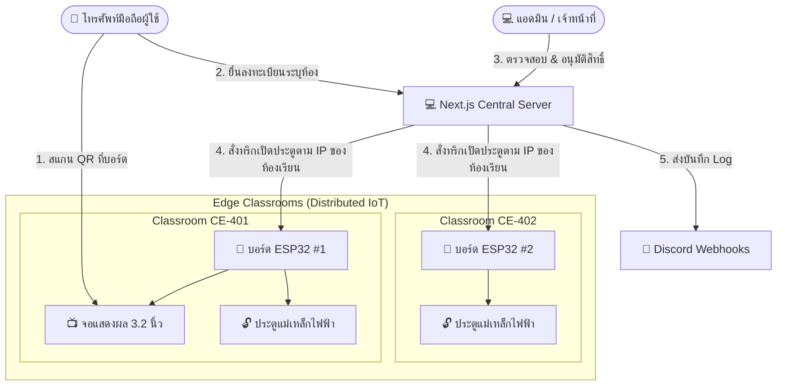

# 📘 คู่มือระบบควบคุมประตูอัจฉริยะ (RMUTP Door Access System Manual)
### ระบบบริหารจัดการสิทธิ์เข้าออกห้องปฏิบัติการเรียนการสอน คณะครุศาสตร์ มทร.พระนคร
*สถาปัตยกรรม 1 เครื่องเซิร์ฟเวอร์ส่วนกลาง เชื่อมต่อและแบ่งปันการใช้งานบอร์ดควบคุม ESP32 ได้หลายห้องพร้อมกัน*
---
> [!NOTE]
> คู่มือฉบับนี้จัดทำขึ้นโดยละเอียดเพื่อเป็นเอกสารอ้างอิงอย่างเป็นทางการสำหรับผู้ใช้งาน (Students), ผู้ดูแลระบบ (Admins), นักพัฒนาซอฟต์แวร์ (Developers) และวิศวกรระบบสมองกลฝังตัว (IoT Engineers)
---
## 📌 สารบัญ
1. [สถาปัตยกรรมและภาพรวมของระบบ (System Architecture Overview)](#1-สถาปัตยกรรมและภาพรวมของระบบ)
2. [คู่มือสำหรับผู้ใช้งานทั่วไป (User Guide)](#2-คู่มือสำหรับผู้ใช้งานทั่วไป-user-guide)
3. [คู่มือสำหรับผู้ดูแลระบบ (Admin Dashboard Guide)](#3-คู่มือสำหรับผู้ดูแลระบบ-admin-dashboard-guide)
4. [คู่มือสำหรับนักพัฒนาซอฟต์แวร์ (Developer Guide)](#4-คู่มือสำหรับนักพัฒนาซอฟต์แวร์-developer-guide)
5. [คู่มือสำหรับวิศวกร IoT และฮาร์ดแวร์ (IoT & Embedded Hardware Guide)](#5-คู่มือสำหรับวิศวกร-iot-และฮาร์ดแวร์-iot--embedded-hardware-guide)
---
## 1. สถาปัตยกรรมและภาพรวมของระบบ
ระบบ **RMUTP Door Access** ได้รับการพัฒนาขึ้นภายใต้แนวคิด **"Single Centralized Server, Distributed Edge Nodes"** เพื่อแก้ปัญหาข้อจำกัดเดิมที่ต้องติดตั้งเซิร์ฟเวอร์แยกทีละห้องเรียน ปัจจุบันเซิร์ฟเวอร์เพียงเครื่องเดียวสามารถควบคุมและส่งผ่านสัญญาณเปิดประตูไปยังบอร์ด ESP32 ได้อย่างอิสระไร้ขีดจำกัด (>2 ห้องขึ้นไป)

### คอนเซปต์ความปลอดภัยแบบแยกห้องเรียน (Room Traffic Isolation):
1. **Dynamic QR Code:** บอร์ด ESP32 แต่ละบอร์ดจะดึง Token มาสร้าง QR Code แยกกัน ข้อมูลจะแยกตามรหัสห้องเรียน (`room_code`) ในตาราง `dynamic_qr_tokens` 
2. **Isolated Registration:** นักศึกษาลงทะเบียนเข้าใช้งานของห้องไหน ข้อมูลคำขอจะไปตกคิวที่ห้องเรียนนั้นโดยเฉพาะ
3. **Targeted Door Unlock:** เมื่อแอดมินอนุมัติ ระบบจะค้นหา IP ของห้องเรียนนั้นใน `system_settings` (เช่น `room_ip_CE-401`) และส่งคำสั่งปลดล็อกไปยัง IP เฉพาะห้องอย่างแม่นยำ
---
## 2. คู่มือสำหรับผู้ใช้งานทั่วไป (User Guide)
สำหรับนักศึกษาหรือผู้ประสงค์เข้าใช้งานห้องปฏิบัติการเรียนการสอน สามารถขออนุญาตเปิดประตูแม่เหล็กไฟฟ้าได้ง่าย ๆ ผ่านโทรศัพท์มือถือเพียงเครื่องเดียว
### ขั้นตอนการขอเข้าใช้ห้องปฏิบัติการ:
1. **สแกน QR Code หน้าห้องปฏิบัติการ:**
   - ใช้กล้องถ่ายรูปของโทรศัพท์มือถือสแกนภาพ QR Code ที่กำลังเคลื่อนไหวอยู่บนหน้าจอ LCD 3.2" ข้างประตูห้องปฏิบัติการ
   - กดลิงก์เพื่อเข้าสู่หน้าจอลงทะเบียนหลัก
2. **การกรอกข้อมูลและระบบช่วยกรอกอัตโนมัติ (Intelligent Auto-fill):**
   - กรอก **ชื่อจริง, นามสกุล และ รหัสประจำตัวนักศึกษา** (เช่น `076158050650-8`)
   - **กรณีเปิดระบบ Auto-fill Mode "Auto":** หากคุณเคยใช้ระบบนี้และประวัติอยู่ในฐานข้อมูล คณะและสาขาวิชาจะเด้งขึ้นมาเติมในฟิลด์ให้อัตโนมัติทันที พร้อมข้อความแจ้งเตือนสีเขียว 
   - **กรณีเปิดระบบ Auto-fill Mode "Manual":** ฟิลด์คณะและสาขาจะไม่เติมทันที แต่จะมีกล่องแนะนำสีม่วงหรูหราขึ้นมาว่า `พบประวัติการใช้ห้องเดิมของคุณ! [คลิกเพื่อกรอกอัตโนมัติ]` หากต้องการใช้ข้อมูลเดิมให้กดปุ่ม ข้อมูลจะลงฟอร์มทันที
   - เลือก คณะ และ สาขาวิชาของคุณให้ถูกต้อง (หากเพิ่งใช้งานครั้งแรก)
3. **ส่งข้อมูลคำขอ:**
   - กดปุ่ม **"ส่งข้อมูลขอเปิดประตูผ่านระบบ"**
   - ระบบจะเข้าสู่หน้าจอรอคอยแบบ Real-time ซึ่งจะสอบถามคิวอนุมัติไปยังฝั่งแอดมินทุก ๆ 3 วินาที
4. **การอนุมัติและเปิดประตู:**
   - เมื่ออาจารย์ผู้สอนหรือเจ้าหน้าที่ประจำห้องกดยอมรับคำขอ หน้าเว็บของคุณจะเด้งเป็นสีเขียวทันทีแจ้งเตือนว่า **"อนุมัติสำเร็จ (ประตูเปิดแล้ว)"**
   - ประตูแม่เหล็กไฟฟ้าหน้าห้องจะปลดล็อกอัตโนมัติ คุณสามารถเปิดประตูเข้าไปในห้องเรียนได้เลย
---
### ⚡ สิทธิ์พิเศษ Bypass อัตโนมัติ ( scan ซ้ำภายใน 5 นาที )
หากคุณได้รับอนุมัติให้เข้าห้องเรียนเรียบร้อยแล้ว แต่ต้องเดินออกนอกห้องชั่วคราว (เช่น ไปเข้าห้องน้ำ หรือรับโทรศัพท์) ภายในระยะเวลาไม่เกิน **5 นาที** นับจากการอนุมัติล่าสุด:
- คุณสามารถเดินไปสแกน QR Code ที่ติดตั้งอยู่หน้าประตูห้องเดิมอีกครั้งหนึ่ง
- ระบบโทรศัพท์จะตรวจจับ session เดิมในเครื่องอัตโนมัติ และสั่งการปลดล็อกประตูห้องให้ทันทีโดย **ไม่ต้องกรอกข้อมูลลงทะเบียนใหม่และไม่ต้องรอแอดมินกดอนุมัติซ้ำ!**
- **ความปลอดภัยเชิงห้อง:** สิทธิ์ Bypass นี้จะแยกตามห้องเรียนอย่างชัดเจน หากคุณได้รับอนุมัติห้อง `CE-401` แล้วเดินไปสแกนห้อง `CE-402` ระบบจะบังคับให้คุณกรอกข้อมูลใหม่เพื่อยื่นขอสิทธิ์ในห้องที่สองอย่างถูกต้อง ป้องกันช่องโหว่ความปลอดภัย
---
## 3. คู่มือสำหรับผู้ดูแลระบบ (Admin Dashboard Guide)
ผู้ดูแลระบบมีหน้าที่ควบคุมคิวคำขอ ตรวจสอบความถูกต้องของนักศึกษา กำหนดค่าระบบ และจัดการอุปกรณ์ IOT ของทุกห้องเรียน
### 1. การล็อกอินและการจัดการคิวตรวจสอบ (Pending Queue)
* เข้าสู่ระบบผ่าน URL `/admin/login` (ผู้ดูแลระบบหลัก Username: `admin`, Password: `admin123` หรือบัญชีที่คุณสร้างขึ้นแยกสิทธิ์)
* หน้าแรกคือแถบ **"รอตรวจสอบ" (Pending Requests)**:
  - หน้าต่างคำขอใหม่จะเด้งขึ้นมาแบบ Real-time ทุก 10 วินาทีอัตโนมัติ
  - แต่ละการ์ดคำขอจะแสดงตราสติ๊กเกอร์สีม่วงระบุห้องชัดเจน เช่น `🚪 คำขอเข้าห้อง: CE-401` ช่วยให้คุณวิเคราะห์ได้ทันทีว่าผู้ใช้กำลังยืนรออยู่ที่หน้าห้องปฏิบัติการห้องใด
  - กดปุ่ม **"อนุมัติ + สั่งเปิดประตู"** เพื่อปล่อยสัญญาณไฟปลดล็อกประตูของห้องเป้าหมาย
  - กดปุ่ม **"ปฏิเสธคำขอ"** เพื่อแสดงกล่องพิมพ์ข้อความระบุเหตุผลในการปฏิเสธ (เช่น ข้อมูลเท็จ หรือไม่ใช่เวลาเรียน)
---
### 2. การจัดการประวัติความปลอดภัยย้อนหลัง (Dynamic Audit Logs)
ในแถบ **"ประวัติ & ทำเนียบ"** ด้านล่าง จะเป็นส่วนควบคุมจราจรคอมพิวเตอร์ที่จัดทำขึ้นให้มีความปลอดภัยสูงและอ่านง่าย:
* **ตราสัญลักษณ์แยกห้องเรียน:** ในตาราง Audit Logs ทุกประวัติจะติดแท็กระบุตัวตนห้องเรียนที่เกิดกิจกรรมขึ้นอย่างโปร่งใส เช่น `🚪 ห้อง: CE-401`
* **บันทึกรายละเอียดประวัติแบบ Webhook:** Notes ของ Log ระบบไม่ได้แสดงเพียงแค่ตัวอักษรธรรมดาแล้ว แต่ได้รับการออกแบบ UI เป็นการ์ดข้อความสลับสีหรูหรา:
  - ข้อความปกติจะแสดงตัวอักษรสีขาวสไตล์กระดานชนวน
  - บันทึกการ Bypass 5 นาที จะแสดงแถบสีส้มเหลืองเด่นชัดพร้อมหัวข้อ `⚡ ผ่านเข้าห้องเรียนสำเร็จด้วยสิทธิ์ Bypass อัตโนมัติ (สแกนซ้ำภายใน 5 นาที)`
  - รายละเอียด bullet point `•` ทุกแถวจะถูกจัดเยื้องและใส่สีอย่างสวยงาม ทำให้อ่านผลการจับส่วนต่างเวลาเป็นวินาทีได้อย่างราบรื่น
```
[ตัวอย่างการแสดงประวัติ Log บนหน้าเว็บแอดมิน]
⚡ ผ่านเข้าห้องเรียนสำเร็จด้วยสิทธิ์ Bypass อัตโนมัติ (สแกนซ้ำภายใน 5 นาที)
   • มีประวัติเปิดประตูหรือได้รับอนุมัติล่าสุดเมื่อเวลา: 15:45:12 น.
   • ระยะเวลาที่ผ่านไป: 1 นาที 14 วินาที (ไม่เกิน 300 วินาที)
   • ระบบอนุญาตให้ปลดล็อกประตูได้ทันทีโดยไม่ต้องลงทะเบียนซ้ำ
```
* **พ.ร.บ. คอมพิวเตอร์ มาตรา 26 (Log Compliance Hub):**
  - ระบบบันทึก Log การจราจรคอมพิวเตอร์ครบถ้วน ไม่น้อยกว่า 90 วัน
  - แอดมินระดับสูงสุด (Owner) สามารถกดปุ่ม **"ล้างข้อมูล Log หมดอายุ (>90 วัน)"** เพื่อบำรุงรักษาพื้นที่ดิสก์ได้อย่างปลอดภัย
  - ปุ่ม **"ล้างประวัติทั้งหมด"** จะถูกป้องกันด้วยระบบยืนยันรหัสผ่านเพื่อป้องกันภัยคุกคามและการลบประวัติโดยไม่ได้ตั้งใจ
---
### 3. การใช้งานศูนย์ควบคุมห้องเรียนและบอร์ด (Multi-Room Control & Settings Panel)
นี่คือจุดเด่นใหม่ของระบบ แอดมินสามารถเปิดและตั้งค่าการทำงานได้ 3 บล็อกใหญ่:
#### 1) ⚙️ อนุมัติ & กรอกฟอร์มอัตโนมัติ (Automated Control):
- **ระบบเข้าห้องอัตโนมัติ (Auto-Approve):** คลิกเปิดเพื่อให้ระบบวิเคราะห์วันและเวลา หากนักศึกษายื่นขอในเวลาปฏิบัติการเรียนการสอน (เช่น จันทร์ - ศุกร์, 09:00 - 16:00 น.) ประตูจะเปิดให้ทันทีโดยอัตโนมัติ ไม่ต้องมีแอดมินคอยกดเฝ้าหน้าจอ
- **โหมดกรอกฟอร์มประวัติเดิม (Auto-fill):** สวิตช์ปิด/เปิดระบบ พร้อมวิทยุเลือกรูปแบบ (Auto Pop-up เด้งขึ้นมาทันที หรือ Manual Confirmation แสดงปุ่มให้ตัดสินใจเลือกคลิก)
#### 2) 🏢 บอร์ดควบคุม & ห้องปฏิบัติการ (Multi-Room ESP32s):
- **รายชื่อห้องเรียนที่เปิดใช้บริการ:** หน้าจอจะลิสต์ห้องปฏิบัติการทั้งหมดพร้อมที่อยู่ IP ของบอร์ด IoT ประจำห้องนั้น ๆ ยืดหยุ่นสูง รองรับการขยายได้ไม่จำกัด
- **Live Connection Test (Ping Test):** บอร์ดตัวจริงหรือจำลองเชื่อมต่อเครือข่ายอยู่หรือไม่? แอดมินสามารถกดปุ่ม **"📡 ทดสอบ"** ข้างรายชื่อห้องได้ทันที ระบบจะทำการทดสอบคุยกับเครื่องปลายทางแบบเรียลไทม์ และรายงานสเตตัสออนไลน์/ออฟไลน์ทันทีโดยไม่ต้องเดินไปเช็คที่หน้าห้องเรียนจริง!
- **การเพิ่มห้องเรียนใหม่:** พิมพ์รหัสห้อง (เช่น `CE-403`) และ IP address ของบอร์ด (เช่น `192.168.1.102`) ในช่องเพิ่มห้อง แล้วกด **เพิ่มลงในรายการ**
- **การลบห้องเรียน:** กดไอคอนถังขยะสีแดงข้างห้องที่ต้องการยกเลิก
- **การเซฟบันทึก:** เมื่อเพิ่มหรือลบห้องเรียนเสร็จแล้ว ให้กดปุ่ม **"💾 บันทึกการตั้งค่าระบบทั้งหมด"** เพื่อเซฟผลเข้าสู่ฐานข้อมูล
#### 3) 🔔 บูรณาการระบบแจ้งเตือน (Discord Webhooks Hub):
- สามารถตั้งค่า Discord Webhook แยก 3 แชนเนลอิสระ เพื่อให้การแจ้งเตือนงานลงทะเบียนงาน อนุมัติการเปิดประตู และ Audit logs วิ่งเข้าดิสคอร์ดแบบเรียลไทม์
---
## 4. คู่มือสำหรับนักพัฒนาซอฟต์แวร์ (Developer Guide)
ในส่วนนี้นักพัฒนาซอฟต์แวร์สามารถเข้ามาดูแล โคลนโปรเจกต์ หรือเขียน API เพิ่มเติมได้อย่างปลอดภัย
### 1. เทคโนโลยีหลักที่เลือกใช้ (Technology Stack)
* **Framework:** Next.js 16 (App Router) บิวด์ด้วย Turbopack เพื่อความเร็วในการคอมไพล์สูง
* **Database Driver:** Connection Pool ของ `mysql2/promise` ป้องกันการเชื่อมต่อล้น
* **Styling System:** Vanilla CSS สไตล์ Glassmorphism ออกแบบเป็นระบบ Token โทนสีม่วง-ชมพู หรูหรา
* **Security:** `bcryptjs` เข้ารหัสความปลอดภัยสูง, ระบบ Rate Limiting ป้องกันการ Guessing, SQL Injection protection
---
### 2. โครงสร้างฐานข้อมูลอย่างเป็นทางการ (Database Schema Overview)
```sql
-- 1. ตารางเก็บสิทธิ์บัญชีผู้ดูแลระบบ
CREATE TABLE admin_users (
  id INT PRIMARY KEY AUTO_INCREMENT,
  username VARCHAR(50) UNIQUE NOT NULL,
  password_hash VARCHAR(255) NOT NULL,
  full_name VARCHAR(100) NOT NULL,
  role ENUM('owner', 'door_operator') NOT NULL DEFAULT 'door_operator',
  is_active BOOLEAN DEFAULT TRUE,
  created_at DATETIME DEFAULT NOW(),
  last_login DATETIME
) ENGINE=InnoDB DEFAULT CHARSET=utf8mb4;
-- 2. ตารางเก็บประวัติคำขอและระเบียนนักศึกษา
CREATE TABLE students (
  id INT PRIMARY KEY AUTO_INCREMENT,
  title VARCHAR(20) NOT NULL DEFAULT 'นาย',
  first_name VARCHAR(100) NOT NULL,
  last_name VARCHAR(100) NOT NULL,
  student_id VARCHAR(30) UNIQUE NOT NULL,
  year TINYINT NOT NULL,
  faculty VARCHAR(150) NOT NULL,
  branch VARCHAR(150) NOT NULL,
  status ENUM('pending', 'approved', 'rejected') DEFAULT 'pending',
  approved_by INT,
  approved_at DATETIME,
  rejection_reason VARCHAR(500),
  ip_address VARCHAR(50),
  requested_room VARCHAR(50) NOT NULL DEFAULT 'default',
  registered_at DATETIME DEFAULT NOW(),
  last_door_open DATETIME,
  bypass_token VARCHAR(64) DEFAULT NULL,
  FOREIGN KEY (approved_by) REFERENCES admin_users(id) ON DELETE SET NULL
) ENGINE=InnoDB DEFAULT CHARSET=utf8mb4;
-- 3. ตารางเก็บบันทึกเหตุการณ์จราจรและความปลอดภัยของระบบ
CREATE TABLE access_logs (
  id INT PRIMARY KEY AUTO_INCREMENT,
  student_id INT,
  action ENUM('registered', 'approved', 'rejected', 'door_opened', 'door_failed') NOT NULL,
  performed_by INT,
  timestamp DATETIME DEFAULT NOW(),
  esp32_response VARCHAR(500),
  notes TEXT,
  FOREIGN KEY (student_id) REFERENCES students(id) ON DELETE SET NULL,
  FOREIGN KEY (performed_by) REFERENCES admin_users(id) ON DELETE SET NULL
) ENGINE=InnoDB DEFAULT CHARSET=utf8mb4;
-- 4. ตารางคีย์ธุรกรรมสแกน QR Code หน้าห้องแบบใช้ครั้งเดียวทิ้ง (Dynamic One-Time Tokens)
CREATE TABLE dynamic_qr_tokens (
  id INT PRIMARY KEY AUTO_INCREMENT,
  token VARCHAR(64) UNIQUE NOT NULL,
  room_code VARCHAR(50) NOT NULL DEFAULT 'default',
  created_at DATETIME DEFAULT NOW(),
  is_consumed BOOLEAN DEFAULT FALSE,
  INDEX idx_active_token (is_consumed, room_code, created_at)
) ENGINE=InnoDB DEFAULT CHARSET=utf8mb4;
-- 5. ตารางเก็บตัวแปรการตั้งค่าระบบไดนามิก
CREATE TABLE system_settings (
  setting_key VARCHAR(100) PRIMARY KEY,
  setting_value TEXT,
  updated_at DATETIME DEFAULT NOW() ON UPDATE NOW()
) ENGINE=InnoDB DEFAULT CHARSET=utf8mb4;
```
---
### 3. สรุปเส้นทาง API ที่เปิดให้บริการ (Backend Web API Routes)
#### 🔘 ส่วนจัดการคำขอและอนุมัติสิทธิ์:
- `POST /api/students` - ส่งใบสมัครรับสิทธิ์เข้าห้อง (ยื่นขอ `requested_room` เข้าตาราง)
- `POST /api/students/[id]/approve` - สั่งทริกเปิดบอร์ดประตูห้องเป้าหมายตาม IP จาก DB
- `POST /api/students/[id]/reject` - ปฏิเสธการเข้าใช้ห้องพร้อมกรอกเหตุผลจำกัดสิทธิ์
- `POST /api/students/bypass` - ลิงก์ตรวจสอบ Bypass 5 นาที บันทึกสถิติความละเอียดลง SQL Notes
- `POST /api/students/check-match` - ตรวจสอบข้อมูลเก่าส่งสถานะ Mode เพื่อทริกปุ่ม Auto-fill บนเบราว์เซอร์
#### 🔘 ส่วนติดต่อกับอุปกรณ์ฮาร์ดแวร์ IoT (ESP32 Polling Routes):
- `GET /api/esp32/display?room=<room_code>` - สตรีมข้อความ บันทึกเวลา คิวที่ค้าง และ Token ประจำห้องให้บอร์ดมาดึงไปวาดบน LCD
- `GET /api/esp32/qr?room=<room_code>` - สร้างคีย์ One-time ล่าสุด และเรนเดอร์ภาพ QR Code รูปแบบ PNG ให้ ESP32 ไปดาวน์โหลดวาดบนจอทันที
- `POST /api/esp32/qr/verify` - หน้าเว็บโทรศัพท์เรียกเพื่อ Validate และ Consume สแกนคีย์ เพื่อปลดล็อกอนุญาตให้กรอกแบบฟอร์มได้
- `GET /api/esp32/status?room=<room_code>` - ยิงทดสอบเครือข่ายไปยัง IP ปลายทางบอร์ด ส่งผลสเตตัส Online/Offline กลับมาแสดงผลหน้าจอ Dashboard
#### 🔘 ส่วนควบคุมตั้งค่าระบบ:
- `POST /api/system/settings` - บันทึกตัวแปรหลัก พร้อมระบบรองรับ `custom_settings` บันทึก IP ห้องยืดหยุ่น
---
## 5. คู่มือสำหรับวิศวกร IoT และฮาร์ดแวร์ (IoT & Embedded Hardware Guide)
สำหรับทีมช่างเทคนิคและวิศวกรไฟฟ้าที่รับผิดชอบการเดินสายไฟ ติดตั้ง และเขียนโค้ดเฟิร์มแวร์ให้กับบอร์ดควบคุมประตูห้องแต่ละห้อง
### 1. อุปกรณ์ที่จำเป็นสำหรับ 1 ห้องปฏิบัติการ (Classroom Hardware BOM)
1. **บอร์ดควบคุม:** ESP32 Development Board (เช่น ESP32-WROOM-32D)
2. **จอแสดงผล LCD:** จอขนาด 3.2 นิ้ว (ความละเอียด 320x240 พิกเซล ตัวขับคอนโทรลเลอร์ ILI9341 เชื่อมต่อผ่าน SPI) หรือจอ LAFVIN LCD Simulator
3. **อุปกรณ์ควบคุมทางกายภาพ:**
   - 1x Relay Module 5V High/Low Level Trigger (สวิตช์รีเลย์)
   - 1x Magnetic Solenoid Door Lock 12V (กลอนประตูแม่เหล็กไฟฟ้า)
   - 1x Switching Power Supply 12V 5A (แหล่งจ่ายไฟสำหรับกลอนแม่เหล็ก)
   - 1x Step-Down Buck Converter (ปรับลดไฟ 12V ลงมา 5V เพื่อป้อนเลี้ยง ESP32)
---
### 2. แผนผังการเชื่อมต่อวงจร (Wiring & Circuit Diagram Guide)
```
       +-------------------------------------------------------------+
       |                  Switching Power Supply 12V                 |
       +-------+-----------------------------+-----------------------+
               | (12V+)                      | (GND)
               |                             |
               |     +------------------+    |
               |     |  Magnetic Lock   |    |
               |     +--------+---------+    |
               |              |              |
               |              | (Lock ground |
               |              |  routed via  |
               |              |  NO contact) |
               |              |              |
          +-----+------+       |              |
          | Buck Conv. |       |              |
          | (12V to 5V)|       |              |
          +--+------+--+       |              |
      (5V)   |      | (GND)    |              |
             |      |          |              |
     +-------+------+----+     |              |
     |    ESP32 Board    |     |              |
     +---+-----------+---+     |              |
         |           |         |              |
         | (GPIO2)   | (GPIO12)|              |
         |           |         |              |
   +-----+---+   +---+---------+---+          |
   | LCD SPI |   | 5V Relay Module |          |
   | ILI9341 |   +---+---------+---+          |
   +---------+       | (COM)   | (NO)         |
                     |         +--------------+
                     |
                     +------------------------+
```
#### รายละเอียดพินเชื่อมต่อ (Pin Configurations):
* **Relay Control Input (IN):** ต่อเข้ากับ **GPIO 12** ของ ESP32
* **จอแสดงผล LCD (ILI9341 SPI):**
  - MOSI -> GPIO 23
  - MISO -> GPIO 19
  - SCLK -> GPIO 18
  - CS -> GPIO 5
  - D/C -> GPIO 2
  - RST -> GPIO 4
  - LED (Backlight) -> 3.3V
---
### 3. ตรรกะการทำงานของเฟิร์มแวร์ ESP32 (Firmware State Machine)
เฟิร์มแวร์บนบอร์ด ESP32 ประจำแต่ละห้องเรียน จะต้องเขียนขึ้นตามลูปการทำงานดังนี้:
#### 1) ลูปดึงค่าสเตตัสแสดงผลส่วนกลาง (Polling Task - GET):
* ทุกๆ **3-5 วินาที** บอร์ด ESP32 จะยิง HTTP GET Request ไปยังเซิร์ฟเวอร์ส่วนกลาง:
  `http://<SERVER_IP>:3000/api/esp32/display?room=CE-401`
  *(ระบุ Query parameter รหัสห้องของตนเอง)*
* เซิร์ฟเวอร์จะตอบกลับเป็น JSON ส่งตัวแปรหลัก:
  - `active_token`: คีย์ Token ดั้งเดิมล่าสุด
  - `qr_url`: ลิงก์ดาวน์โหลดรูป QR Code
  - `pending_count`: จำนวนนักศึกษาที่กำลังยืนรอแอดมินกดอนุมัติหน้าห้อง
  - `last_approved`: ประวัติผู้ใช้งานที่เพิ่งได้รับอนุมัติล่าสุด
* **การวาดหน้าจอ:** บอร์ดจะวิเคราะห์ JSON หากมี Token ใหม่ บอร์ดจะแปลง URL ของลิงก์ลงทะเบียน `${appUrl}/?scan=${activeToken}&room=CE-401` ไปเป็นภาพ QR Code และเรนเดอร์วาดลงบนหน้าจอ LCD ด้านขวา ส่วนด้านซ้ายจะวาดประวัติตัวเลขนักศึกษาที่รอคิวอยู่ เพื่อเพิ่มสุนทรียศาสตร์ทางสายตาและประสบการณ์ใช้งานที่ดี
#### 2) ขาเปิดเซิร์ฟเวอร์รับคำสั่งปลดล็อก (Door Lock Server Task - POST):
* ตัวบอร์ด ESP32 จะต้องเปิดฟังก์ชัน **Web Server ขนาดเล็ก** ภายในตัวเองเอาไว้ (ใช้ไลบรารี `WebServer` ใน ESP32 Arduino Core) รอสแตนด์บายรับทริกคำสั่งจาก Next.js เซิร์ฟเวอร์:
* **Endpoint บนบอร์ด:** `POST /door/open`
* **ระบบความปลอดภัย:** บอร์ดจะต้องบังคับให้ Next.js ส่งหัวข้อ `X-API-Key` หรือ `Authorization` ที่กำหนดค่ารหัสผ่านร่วมกัน (เช่น `rmutp_secure_door_unlock_token_2026`) เพื่อตรวจสอบสิทธิ์การปลดล็อก ป้องกันแฮกเกอร์แอบยิงไอพีเพื่อเปิดประตูเองโดยตรง
* **การทำงานเมื่อได้รับคำขอถูกลิขสิทธิ์:**
  1. บอร์ดจะปรับ GPIO 12 เป็น `HIGH` (หรือ `LOW` แล้วแต่ชนิดรีเลย์) เพื่อสั่งทริกรีเลย์ให้ตัดวงจรไฟฟ้าของ Magnetic Lock ประตูจะคลายแรงดูดทันที
  2. สตรีมข้อความสีเขียวและเสียงออดบนหน้าจอ LCD: `"ACCESS APPROVED / ยินดีต้อนรับ เข้าใช้ห้องเรียนได้"`
  3. หน่วงเวลาไว้ **5 วินาที** (เพื่อให้ผู้ใช้ออกแรงผลักประตูเข้าห้องเรียน)
  4. ปล่อยกระแสไฟฟ้าคืนสู่กลอนรีเลย์เพื่อให้กลอนแม่เหล็กดูดล็อกประตูอีกครั้งหนึ่ง
  5. วาดหน้าจอหลักและสตรีม QR Code กลับมาให้บริการใหม่อีกครั้งอย่างปลอดภัย
---
> [!TIP]
> **การบำรุงรักษาและการสตรีม QR ไร้สาย:**
> ลิงก์สแกน QR Code หน้าห้อง จะผูกรหัสห้อง `&room=CE-401` แนบไปเสมอ ทำให้เมื่อนักศึกษาสแกนและสมัคร ข้อมูลจะไหลเวียนอยู่ในการตรวจสอบที่ถูกต้องแบบปิดรอบ (Closed loop) ไม่มีวันปะปนกับห้องอื่นอย่างเด็ดขาด!
