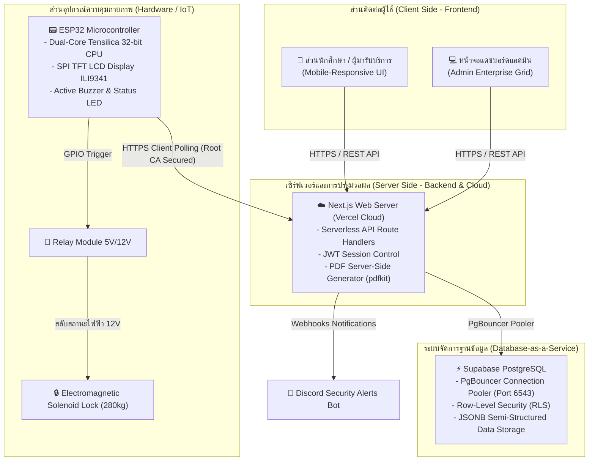

# เอกสารข้อมูลโครงการระบบควบคุมการเข้าออกห้องปฏิบัติการอัจฉริยะ (RMUTP ACCS)
> **สำหรับนำไปใช้งานประกอบการจัดทำเล่มวิจัย/วิทยานิพนธ์ (ระดับมหาวิทยาลัย)**

---

## 1. ข้อมูลภาพรวมโครงการ (Project Overview)

* **ชื่อโครงการอย่างเป็นทางการ (Official Project Name)**: 
  * **ภาษาไทย**: ระบบควบคุมการเข้าออกห้อง คณะครุศาสตร์ มหาวิทยาลัยเทคโนโลยีราชมงคลพระนคร
  * **ภาษาอังกฤษ**: RMUTP ACCS — IoT-Based Door Access Control System
* **ลักษณะระบบ**: ระบบควบคุมการเข้าใช้ห้องเรียนและห้องปฏิบัติการผ่านการสแกนคิวอาร์โค้ด (Dynamic QR Code) บนพื้นฐานเทคโนโลยี Full-Stack Web Application ร่วมกับบอร์ดสมองกลฝังตัว (IoT Microcontroller) ที่มีการเชื่อมโยงฐานข้อมูลแบบเรียลไทม์ และระบบรักษาความปลอดภัยตามมาตรฐานกฎหมายคอมพิวเตอร์และ PDPA

---

## 2. สถาปัตยกรรมเทคโนโลยีระบบ (Technology Stack)

ระบบได้รับการพัฒนาและออกแบบโดยอ้างอิงสถาปัตยกรรมซอฟต์แวร์ยุคใหม่ (Modern Web Architecture) เพื่อความคล่องตัว ความปลอดภัย และรองรับการขยายตัวในอนาคต (Scalability) ดังนี้:

### 2.1 ส่วนควบคุมผู้ใช้งาน (Frontend Technology)
* **Next.js 15+ (App Router)**: ใช้เฟรมเวิร์ก Next.js ในการสร้างหน้าเว็บแอปพลิเคชันแบบ Single Page Application (SPA) ที่โหลดได้รวดเร็วและสนับสนุนการเรนเดอร์ทั้งฝั่งเซิร์ฟเวอร์ (Server-Side Rendering) และฝั่งไคลเอนต์ (Client-Side Rendering) อย่างเหมาะสม
* **React 19**: คอร์ไลบรารีสำหรับสร้างคอมโพเนนต์หน้าเว็บที่ทำงานได้อย่างรวดเร็วและเป็นระบบระเบียบ
* **TypeScript**: ภาษาคอมพิวเตอร์ที่นำเอา Static Type checking เข้ามาผสานร่วมกับ JavaScript ทำให้โค้ดมีความถูกต้อง แม่นยำ ปราศจากบั๊กของการประกาศค่าและส่งผ่านตัวแปร
* **Tailwind CSS v4 & Vanilla CSS (Harmony Palette Design System)**: ระบบการจัดวางเลย์เอาต์และการออกแบบหน้าจอที่มีสไตล์เรียบหรู ทันสมัย (Minimalist & Premium Glassmorphism) ใช้ชุดคู่สีที่เป็นแบรนด์ของสถาบัน (สีม่วงประจำมหาวิทยาลัย `#7C3AED` และสีชมพูประจำคณะครุศาสตร์ `#DB2777`) พร้อม Micro-animations ที่มอบการตอบสนองที่นุ่มนวล

### 2.2 ส่วนประมวลผลหลังบ้าน (Backend & Service Layer)
* **Node.js Runtime Environment**: เป็นระบบสภาพแวดล้อมหลัก (Runtime) สำหรับการประมวลผลโค้ดฝั่งหลังบ้านทั้งหมดของระบบ โดยทำงานบนสถาปัตยกรรมแบบ Event-Driven และ Non-blocking I/O ซึ่งช่วยให้ระบบสามารถรองรับการส่งคำขอเชื่อมต่อพร้อมกัน (Concurrency) จากอุปกรณ์ฝั่งผู้ใช้และบอร์ด ESP32 ได้อย่างรวดเร็วและมีประสิทธิภาพสูง
* **Next.js API Route Handlers (Serverless Backend)**: ตัวให้บริการ Endpoint/REST API ที่พัฒนาขึ้นภายใต้สภาพแวดล้อมของ Node.js และประมวลผลในรูปแบบ Serverless Functions บนระบบคลาวด์ของ **Vercel** ทำให้ไม่ต้องบริหารจัดการและดูแลเซิร์ฟเวอร์กายภาพแบบดั้งเดิม ช่วยลดค่าใช้จ่ายและภาระในการบำรุงรักษาระบบ (Zero Server Management)
* **บอทแจ้งเตือนภัยผ่าน Discord Webhook**: ระบบหลังบ้านที่รันบน Node.js จะใช้ HTTP client ในการส่งคำขอ HTTPS POST เพื่อส่งข้อมูลรายงานความปลอดภัยเรียลไทม์ไปยัง Discord Webhook Server เมื่อมีการตรวจจับการเปลี่ยนแปลงสิทธิ์ หรือสถานะออนไลน์/ออฟไลน์ของฮาร์ดแวร์
* **Server-Side PDF Exporter (`pdfkit`)**: เครื่องมือประมวลผลฝั่งเซิร์ฟเวอร์ที่ทำงานบนสภาพแวดล้อม Node.js โดยเขียนโปรแกรมสร้างเอกสารความปลอดภัยและประวัติการเข้าใช้งานออกเป็นไฟล์ PDF แบบแนวนอน (Landscape) เพื่อนำมาทำรายงานทางราชการ
* **ระบบความปลอดภัยทางข้อมูลและการเข้ารหัส (Cryptography on Node.js)**:
  * **JSON Web Token (JWT)**: ใช้ไลบรารีบนระบบ Node.js ในการสร้าง รักษาเซสชัน และถอดรหัส Token ของแอดมิน เพื่อป้องกันการสวมรอยช่องทางควบคุมประตู (Session Hijacking)
  * **`bcryptjs`**: อัลกอริทึมเข้ารหัสและแฮชความปลอดภัยรหัสผ่านระดับสูงสุดบนสภาพแวดล้อม Node.js เพื่อป้องกันภัยจากการโจมตีเชิงรหัสผ่าน (Brute Force)

### 2.3 ระบบฐานข้อมูล (Cloud Database Architecture)
* **Supabase PostgreSQL**: ระบบฐานข้อมูลเชิงสัมพันธ์แบบคลาวด์ประสิทธิภาพสูง (Database-as-a-Service - DBaaS) ที่เข้ามาแทนที่ระบบฐานข้อมูล MySQL เดิม เพื่อรองรับการทำงานกับระบบ Serverless ได้อย่างสมบูรณ์แบบ (รายละเอียดทางสถาปัตยกรรมจะชี้แจงในหัวข้อที่ 4)

---

## 3. สถาปัตยกรรมด้านฮาร์ดแวร์ฝังตัว (IoT Hardware Engineering)

ระบบทางกายภาพควบคุมกลอนประตูใช้ชุดอุปกรณ์สมองกลฝังตัวและเซนเซอร์ต่อพ่วง ดังรายละเอียดสเปกและหลักการเชื่อมต่อดังนี้:

1. **บอร์ดประมวลผลหลัก (ESP32 MCU)**: บอร์ดสมองกลฝังตัว Tensilica 32-bit Dual-Core มียูนิต Wi-Fi 2.4GHz ในตัว ทำหน้าที่ส่งร้องขอ (HTTPS Web Client Secured) ไปยังฝั่ง API บนเซิร์ฟเวอร์ Vercel เพื่อสตรีมสถานะและประมวลผลการสั่งเปิดล็อก
2. **จอแสดงผลระบบ TFT LCD (ILI9341 3.2 นิ้ว 320x240 px)**: เชื่อมต่อผ่านโปรโตคอล SPI เพื่อแสดงผลข้อความ สถานะกลอนประตู คิวลำดับผู้ใช้ และแสดงผลไดนามิกคิวอาร์โค้ด (Dynamic QR Code) ที่เปลี่ยนไปตามเซสชันความปลอดภัย
3. **วงจรสวิตช์อิเล็กทรอนิกส์ (Relay Module 5V/12V)**: รับสัญญาณ GPIO 4 จากบอร์ด ESP32 เพื่อทำหน้าที่สลับสะพานไฟหน้าสัมผัสจ่ายกระแสไฟ
4. **ลำโพงส่งเสียงเตือน (Active Buzzer)**: ควบคุมระดับเสียงผ่านสัญญาณ Pulse ทางพิน GPIO 5 เพื่อแจ้งเตือนการตอบรับ เช่น ดังบี๊บสั้น 2 ครั้ง เมื่อสิทธิ์ผ่าน และดังยาว 3 ครั้ง เมื่อสิทธิ์ถูกปฏิเสธ
5. **กลอนแม่เหล็กไฟฟ้าทนแรงดึงสูง (Electromagnetic Solenoid Lock 280kg / 600lbs)**: ใช้สำหรับการยึดประตูกลอนเข้ากับวงกบประตูเหล็กหรือกระจกของห้องปฏิบัติการ ทำงานในสถาปัตยกรรมแบบ Fail-Safe (เปิดปล่อยล็อกทันทีที่ไม่มีกระแสไฟจ่าย เพื่อความปลอดภัยในกรณีเกิดเพลิงไหม้หรือไฟฟ้าดับฉุกเฉิน)

---

## 4. วิเคราะห์เทคโนโลยีและแพลตฟอร์มคลาวด์พิเศษ (Specialized Cloud Platforms)

### 4.1 แพลตฟอร์มให้บริการระบบคลาวด์เว็บแอปพลิเคชัน: Vercel คืออะไร?
**Vercel** คือ แพลตฟอร์มคลาวด์ยอดนิยมสำหรับนักพัฒนาเว็บยุคใหม่ (Modern Web Hosting Platform) ที่ออกแบบมาเพื่อการ Deploy เว็บแอปพลิเคชันและเฟรมเวิร์กประเภท React และ Next.js โดยเฉพาะ มีคุณลักษณะเด่นดังนี้:
* **Serverless Functions**: Vercel จะไม่ทำงานในลักษณะเซิร์ฟเวอร์ที่เปิดแช่ตลอดเวลา แต่เมื่อมีการเรียกใช้งานหน้าเว็บหรือ API ตัวโค้ดจะถูกโหลดขึ้นมาทำงานในลักษณะ "ไมโครคอนเทนเนอร์ขนาดเล็ก" ทันที และจะสลายตัวไปเองเมื่อส่งข้อมูลคืนผู้ใช้เสร็จสิ้น ช่วยประหยัดทรัพยากรการประมวลผลและลดภาระการดูแลรักษาระบบลงจนเป็นศูนย์
* **Global Edge Network (CDN)**: หน้าเว็บของโครงการจะถูกกระจายและจัดเก็บแคชไว้ในเซิร์ฟเวอร์ทั่วโลก ทำให้โหลดหน้าลงทะเบียนได้ไวและลดค่าหน่วงเวลา (Latency) ลงอย่างมาก
* **HTTPS & SSL Automatic**: มอบความปลอดภัยระดับสูงสุดด้วยการจัดเตรียม SSL Certificate ให้กับโดเมนโครงการโดยอัตโนมัติ

### 4.2 ระบบจัดการฐานข้อมูล Supabase PostgreSQL: Supabase และ PostgreSQL คืออะไร?
**Supabase** คือ บริการหลังบ้านกึ่งสำเร็จรูปบนคลาวด์แบบโอเพนซอร์ส (Open-source Backend-as-a-Service: BaaS) ที่ใช้ฐานข้อมูล **PostgreSQL** เป็นตัวขับเคลื่อนหลัก:
* **PostgreSQL (Postgres) คืออะไร?**: คือ ระบบจัดการฐานข้อมูลเชิงสัมพันธ์เชิงวัตถุ (Object-Relational Database Management System - ORDBMS) ที่มีความเสถียร มีชื่อเสียงในด้านความถูกต้อง แม่นยำของข้อมูล และความสามารถในการรองรับฟังก์ชันการคำนวณขั้นสูง มีความยืดหยุ่นสูงกว่าระบบ MySQL แบบเดิม

#### ทำไมโครงการจึงตัดสินใจย้ายจาก Aiven MySQL มาเป็น Supabase PostgreSQL?
1. **แก้ปัญหา Connection Overload บน Serverless (PgBouncer Connection Pooler)**:
   เนื่องจากหน้าเว็บ Next.js รันอยู่บน Vercel Serverless ซึ่งจะทำการสร้าง Connection ใหม่ขึ้นมาจำนวนมากในเวลาสั้นๆ หากใช้ MySQL ธรรมดา ฐานข้อมูลจะเกิดอาการทรัพยากรเต็ม (Error: "Too many connections") และระบบจะล่มทันทีในชั่วโมงเร่งด่วน แต่ Supabase มี **Connection Pooler (PgBouncer บนพอร์ต 6543)** ที่ทำหน้าที่เป็นตัวพักและจัดแจงการเชื่อมต่อแบบไร้สถานะ ช่วยให้ Serverless นับพันเชื่อมต่อเข้าฐานข้อมูลได้อย่างเสถียร
2. **ยกระดับความปลอดภัยชั้นข้อมูลสูงสุดด้วย Row-Level Security (RLS)**:
   ใน MySQL ความปลอดภัยจะขึ้นอยู่กับความรัดกุมในการเขียนโค้ดหลังบ้านเท่านั้น แต่ใน Supabase PostgreSQL มีฟีเจอร์ **RLS** ที่ทำงานตรวจสอบสิทธิ์ผู้ใช้โดยตรงที่แถวข้อมูลในฐานข้อมูล (Database level) ช่วยป้องกันการโจมตีประเภท SQL Injection หรือความพยายามขโมยข้อมูลนักศึกษาได้อย่างเด็ดขาด
3. **ความยืดหยุ่นในการจัดเก็บประวัติล็อกด้วยคอลัมน์ข้อมูล JSONB**:
   ข้อมูลประวัติการทำรายการหรือสถานะฮาร์ดแวร์มักมีความผันแปรตามเวอร์ชันของเฟิร์มแวร์ Supabase PostgreSQL รองรับคอลัมน์ชนิด **JSONB** ที่สามารถจัดเก็บชุดข้อมูลแบบโครงสร้างยืดหยุ่น (Semi-structured data) ได้ในคอลัมน์เดียว และสามารถสร้างดัชนี (GIN Index) ช่วยให้แอดมินค้นหาประวัติการทำงานของกลอนประตูย้อนหลังได้อย่างรวดเร็วในระดับมิลลิวินาที
4. **ระบบอัปเดตแบบเรียลไทม์ (Native Real-time Engine)**:
   มีระบบกระจายข้อมูลทันทีผ่านทาง Database Event (WAL - Write-Ahead Logging) ทำให้ทันทีที่ผู้ดูแลระบบกดยืนยันคำขอในหน้าจอ แอดมิน หรือ Discord สัญญาณการปลดล็อกจะถูกส่งตรงไปทริกบอร์ด ESP32 เพื่อปลดประตูได้ทันทีโดยไม่ต้องเขียนสคริปต์ Polling ถามฐานข้อมูลแบบเดิมให้เปลืองทรัพยากร

---

## 5. กระบวนการออกแบบเพื่อสอดคล้องกับข้อกฎหมาย (Legal & Compliance Design)

ตัวระบบได้รับการคำนึงถึงข้อบังคับทางกฎหมายอย่างเป็นทางการ เพื่ออำนวยความสะดวกให้ผู้ใช้งานและนำไปอ้างอิงในผลงานทางวิจัยได้อย่างสมบูรณ์แบบ:

1. **สอดคล้องตาม พ.ร.บ. ว่าด้วยการกระทำความผิดเกี่ยวกับคอมพิวเตอร์ พ.ศ. 2550 มาตรา 26**:
   * กฎหมายบังคับให้มีการเก็บบันทึกประวัติการจราจรทางข้อมูล (Traffic logs) ไว้เป็นเวลาไม่น้อยกว่า 90 วัน
   * ระบบติดตั้งส่วนการเก็บประวัติและล้างประวัติ (Secure Log Compliance)
   * **การป้องกันความปลอดภัยระดับสูง**: บัญชีแอดมินชั่วคราวจะไม่ได้รับสิทธิ์ในการลบประวัติการเข้าใช้งานแต่อย่างใด หากต้องการล้างข้อมูลเพื่อเพิ่มพื้นที่ จะต้องเป็นระดับผู้ดูแลระบบสูงสุด (Owner) และต้องทำการยืนยันสิทธิ์ด้วยรหัสผ่านส่วนตัวควบคู่กับการกรอกเหตุผลในการบำรุงรักษา (Audit Trail) เสมอ เพื่อทิ้งประวัติการสั่งลบเพื่อตรวจสอบย้อนกลับได้ทางกฎหมาย
2. **สอดคล้องตาม พ.ร.บ. คุ้มครองข้อมูลส่วนบุคคล พ.ศ. 2562 (PDPA Compliance)**:
   * หน้าลงทะเบียนของนักศึกษาจะเก็บข้อมูลเฉพาะส่วนที่จำเป็นต่อการบริหารจัดการสิทธิ์ขอเข้าใช้สถานที่เท่านั้น
   * ตารางข้อมูล `students` มีการแยกส่วนและควบคุมระดับการเข้าถึงอย่างแน่นหนาผ่านนโยบายความปลอดภัย RLS ของ PostgreSQL เพื่อให้มั่นใจว่าข้อมูลส่วนบุคคลของผู้ใช้งานจะไม่รั่วไหลหรือถูกเข้าถึงโดยผู้ดูแลระบบชั่วคราวที่ไม่มีความเกี่ยวข้อง

---
